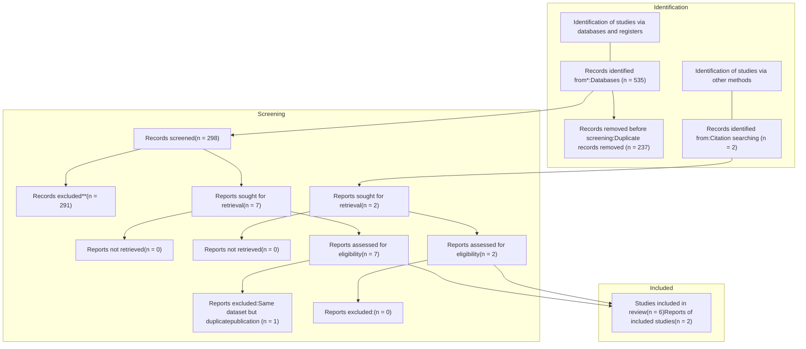

Sports Medicine and Health Science 8 (2026) 34–42

Contents lists available at ScienceDirect
# Sports Medicine and Health Science
journal homepage: www.keaipublishing.com/smhs

Review Article

# Does longer-muscle length resistance training cause greater longitudinal growth in humans? A systematic review

Milo Wolf a, Patroklos Androulakis Korakakis a, Michael D. Roberts b, Daniel L. Plotkin b, Martino V. Franchi c, Bret Contreras d, Menno Henselmans e, Stian Larsen f, Brad J. Schoenfeld a,*

a Department of Exercise Science and Recreation, Applied Muscle Development Laboratory, CUNY Lehman College, Bronx, NY, USA
b School of Kinesiology, Auburn University, Auburn, AL, USA
c Department of Biomedical Sciences, University of Padua, Padua, Italy
d BC Strength, San Diego, CA, USA
e Navarrabiomed, Complejo Hospitalario de Navarra (CHN), Universidad Pública de Navarra (UPNA), Pamplona, Spain
f Department of Sport Sciences and Physical Education, Nord University, Levanger, Norway

## ARTICLE INFO
## ABSTRACT

**Keywords:**
sarcomerogenesis
Lengthened partials
Range of motion
Strength training

**Background:** This paper aimed to systematically review the literature regarding the effects of resistance training (RT) performed at longer-muscle length (LML) versus shorter-muscle length (SML) on proxy measurements for longitudinal hypertrophy.

**Methods:** We included studies that satisfied the following criteria: (1) be a resistance training intervention with a comparison of LML vs SML-RT; (2) assess both fascicle length (FL) and muscle size pre- and post-intervention; (3) involve healthy adults aged $\ge$ 18 years; (4) be published in an English-language journal, and; (5) have a minimum training intervention duration of 4 weeks. Three databases were searched in February 2024 (Google Scholar, PubMed/Medline, Scopus) for relevant articles, alongside 'forward' and 'backward' citation searching of articles included and additions via authors' personal knowledge. The results of studies were described narratively, compared, and contrasted. Eight studies met the inclusion criteria, totaling a sample size of 120.

**Results:** Our results suggest that both muscle size and fascicle length increases may be greater following LML-RT versus SML-RT, suggesting LML-RT may lead to greater longitudinal hypertrophy than SML-RT. Notably, evidence is largely mixed; no studies to date have attempted to estimate serial sarcomere number changes from LML versus SML-RT, and all but one study used linear extrapolation methods to estimate FL, which has questionable validity. Therefore, the structural adaptations underlying hypertrophy from LML-RT remain undetermined.

**Conclusion:** In conclusion, results suggest that LML-RT may be superior to SML-RT for inducing muscle hypertrophy and, more specifically, longitudinal growth, though evidence is mixed.

## 1. Introduction

Resistance training (RT) is the primary exercise strategy used to enhance muscular size in humans.1 Though a consensus is still developing, RT is thought to induce hypertrophy primarily through mechanical overload and possibly other mechanisms.2 Repeated mechanical overload leads to transient increases in mammalian target of rapamycin complex 1 (mTORC1) signaling, as well as mTORC1-independent pathways, eventually causing muscle growth via elevations in protein synthesis.2 Of note, both active and passive tension have been shown to similarly elevate p70S6 kinase, a downstream effector of mTORC1,  suggesting that tension per se drives the anabolic response to mechanical stimuli.3 These findings raise the possibility that the combination of active and passive tension may confer a synergistic effect on RT-induced hypertrophy. Hypertrophy is typically defined as an increase in muscle size, often inferred through measures of anatomical cross-sectional area (CSA). While adding sarcomeres in series (longitudinal hypertrophy) may not directly enhance force production, geometric modeling suggests it may increase anatomical CSA through architectural remodeling.4 This contrasts with radial hypertrophy, which increases physiological CSA and force-generating potential. By including both types of hypertrophy, we adopt a broader perspective on muscular adaptation.

One variable that may modulate the muscle hypertrophy response

\* Corresponding author. Department of Exercise Science and Recreation, Applied Muscle Development Laboratory, CUNY Lehman College, Bronx, NY, USA
E-mail address: brad.schoenfeld@lehman.cuny.edu (B.J. Schoenfeld).
Peer review under the responsibility of Editorial Board of Sports Medicine and Health Science
https://doi.org/10.1016/j.smhs.2025.03.001
Received 1 August 2024; Received in revised form 22 February 2025; Accepted 3 March 2025
Available online 6 March 2025
2666-3376/© 2025 Chengdu Sport University. Publishing services by Elsevier B.V. on behalf of KeAi Communications Co. Ltd. This is an open access article under the CC BY-NC-ND license (http://creativecommons.org/licenses/by-nc-nd/4.0/).

M. Wolf et al.

<page_header>
Sports Medicine and Health Science 8 (2026) 34–42
</page_header>

<table>
  <thead>
    <tr>
        <th colspan="2">Abbreviations</th>
    </tr>
  </thead>
  <tbody>
    <tr>
        <td>1 RM</td>
        <td>One Repetition Maximum</td>
    </tr>
    <tr>
        <td>aCSA</td>
        <td>Anatomical Cross-Sectional Area</td>
    </tr>
    <tr>
        <td>CSA</td>
        <td>Cross-Sectional Area</td>
    </tr>
    <tr>
        <td>CON</td>
        <td>Concentric</td>
    </tr>
    <tr>
        <td>ECC</td>
        <td>Eccentric</td>
    </tr>
    <tr>
        <td>FL</td>
        <td>Fascicle Length</td>
    </tr>
    <tr>
        <td>IKD</td>
        <td>Isokinetic Dynamometer</td>
    </tr>
    <tr>
        <td>LBM</td>
        <td>Lean Body Mass</td>
    </tr>
    <tr>
        <td>LML</td>
        <td>Longer-Muscle Length</td>
    </tr>
    <tr>
        <td>LML-RT</td>
        <td>Longer-Muscle Length Resistance Training</td>
    </tr>
    <tr>
        <td>mTORC1</td>
        <td>Mammalian Target of Rapamycin Complex 1</td>
    </tr>
    <tr>
        <td>MT</td>
        <td>Muscle Thickness</td>
    </tr>
    <tr>
        <td>MVC</td>
        <td>Maximal Voluntary Contraction</td>
    </tr>
    <tr>
        <td>OSF</td>
        <td>Open Science Framework</td>
    </tr>
  </tbody>
</table>
<table>
  <tbody>
    <tr>
        <td>pCSA</td>
        <td>Physiological Cross-Sectional Area</td>
    </tr>
    <tr>
        <td>PRISMA</td>
        <td>Preferred Reporting Items for Systematic Reviews and Meta-Analyses</td>
    </tr>
    <tr>
        <td>RF</td>
        <td>Rectus Femoris</td>
    </tr>
    <tr>
        <td>ROM</td>
        <td>Range of Motion</td>
    </tr>
    <tr>
        <td>RPE</td>
        <td>Rating of Perceived Exertion</td>
    </tr>
    <tr>
        <td>RT</td>
        <td>Resistance Training</td>
    </tr>
    <tr>
        <td>SML</td>
        <td>Shorter-Muscle Length</td>
    </tr>
    <tr>
        <td>SML-RT</td>
        <td>Shorter-Muscle Length Resistance Training</td>
    </tr>
    <tr>
        <td>SD</td>
        <td>Standard Deviation</td>
    </tr>
    <tr>
        <td>SL</td>
        <td>Sarcomere Length</td>
    </tr>
    <tr>
        <td>SMART-LD</td>
        <td>Standards Method for Assessment of Resistance Training in Longitudinal Designs</td>
    </tr>
    <tr>
        <td>VL</td>
        <td>Vastus Lateralis</td>
    </tr>
    <tr>
        <td>VI</td>
        <td>Vastus Intermedius</td>
    </tr>
    <tr>
        <td>VM</td>
        <td>Vastus Medialis</td>
    </tr>
  </tbody>
</table>

from RT is range of motion (ROM), defined as the degree of movement that occurs at a specific joint during the execution of an RT exercise. A meta-analysis by Wolf et al.5 indicated that a full ROM appears superior to a partial ROM for eliciting whole muscle hypertrophy. However, this finding may be mediated by the muscle length at which RT is performed, such that longer-muscle length RT (LML-RT) is superior to RT performed at shorter-muscle lengths (SML-RT) for inducing muscle hypertrophy. Indeed, three studies within this meta-analysis compared a full ROM to a partial ROM performed at longer-muscle lengths or a "lengthened partials" approach. Generally, greater hypertrophy was found with lengthened partials compared to a full ROM.6–8

Since the publication of the Wolf et al.5 meta-analysis, a study by Kassiano et al.9 also found greater hypertrophy in both the medial and lateral gastrocnemius when performing lengthened partial plantarflexion vs full ROM plantarflexion. Therefore, lengthened partials appear to be a promising strategy to maximize muscle hypertrophy. However, a substantial limitation of existing data lies in its inability to inform us about the pattern of hypertrophy that occurs in response to LML-RT, thus restricting generalizability. Indeed, most measurements of muscle hypertrophy in these studies were based on B-mode ultrasonography measurements of muscle thickness.5 While ultrasound-derived muscle thickness can reliably reveal changes in muscle size, it cannot distinguish between radial and longitudinal hypertrophy.

Increases in measured fascicle length may indicate as to the degree of longitudinal hypertrophy, whereas increases in measured fascicle angle may provide a representation of radial hypertrophy. This distinction is critical because the structural patterns may conceivably differ based on the ROM used and resistance challenge within a given ROM. Thus, it remains unclear to what extent longitudinal hypertrophy - an increase in fascicle length potentially stemming from an increase in the number of sarcomeres in series and/or the lengthening of existing sarcomeres10 - may also play a role in the hypertrophy response to LML-RT.

Serial hypertrophy, or the creation and serial addition of new sarcomere units in series, is a common adaptation to limb lengthening, surgical limb/muscle lengthening, and chronic stretching protocols.11,12 Importantly, much of the foundational evidence for stretching protocols initiating sarcomerogenesis has been conducted in animal models.12,13 Recent research by Andrews et al.14 demonstrated serial sarcomere addition during eccentric training in humans. While this provides valuable insight into muscle adaptation, it is important to note that eccentric training is not synonymous with LML training, and direct evidence linking resistance training (RT) in general to serial sarcomere number increases remains limited. Damas et al.15 hypothesized that Z-band streaming, a proposed component of the muscle damage process, would lead to the addition of sarcomeres in series, resulting in reduced strain per sarcomere when the muscle is lengthened after this adaptation has

taken place. Therefore, exercise protocols that elicit greater muscle damage conceivably have the potential to enhance sarcomerogenesis, however, it is hard to distinguish between remodeling and damage at present.

Sarcomerogenesis may not be limited to stretching interventions alone. Mechanistically, muscle damage can occur as a consequence of RT, particularly when the trainee has not yet been exposed to a given protocol. Foundational work by Lieber & Fridén16 suggested that muscle length or "strain", as opposed to force, determines the degree of muscle damage caused by contraction. Consistent with this early research, a study by Nosaka et al.17 showed that eccentric RT performed at LML resulted in greater muscle damage than eccentric RT performed at SML in the elbow flexors. Notably, both SML- and LML-eccentric RT appeared to confer a protective effect, such that recovery from the second exposure to eccentric RT at LML resulted in lower elevations in creatine kinase appearance and faster recovery of force production capabilities. Given that unaccustomed LML-RT appears to lead to a greater degree of muscle damage, it is possible that LML-RT - or RT performed with greater resistance at LML - would also, therefore, lead to greater sarcomerogenesis in the early phase of training. Importantly, while the stimuli underlying longitudinal growth remain unclear, the degree to which it takes place in response to SML-vs LML-RT carries important practical implications. Since individual studies assessing sarcomerogenesis or its proxy measurements (e.g., fascicle length changes) from such interventions exist, a systematic synthesis of the literature appears important in developing a better understanding of the potential hypertrophic adaptations underlying LML-RT. This systematic review aims to examine the data comparing LML- and SML-RT and their respective effects on sarcomerogenesis, or the addition of sarcomeres in series, alongside their effect on measures of muscle hypertrophy.

## 2. Methods

### 2.1. Protocol registration

The methods and reporting of results followed guidelines set forth by the Preferred Reporting Items for Systematic Reviews and Meta-Analyses (PRISMA). This systematic review was pre-registered on the Open Science Framework site (doi:%2010.17605/OSF.IO/3D9EZ).

### 2.2. Search syntax

The search was performed using the following combination of terms: ("resistance training" OR "resistance exercise" OR "resistive exercise" OR "strength training" OR "strength exercise" OR "weight training" OR "weight lifting" OR "weightlifting" OR "range of motion" OR "muscle

35

M. Wolf et al.
Sports Medicine and Health Science 8 (2026) 34–42

length” OR “resistance profile“ OR “resistance curve“) AND ("fascicle length" OR “sarcomere“ OR “longitudinal hypertrophy“) AND (“muscle thickness” OR “cross-sectional area” OR “cross sectional area“ OR “muscle growth” OR “muscle volume” OR “hypertrophy“ OR “muscle size” or “muscle area”).

Three databases were searched from inception to February 2024 to locate relevant studies: PubMed/MEDLINE, Scopus, and Google Scholar. We also performed secondary “forward” and “backward” citation searches on included studies in Google Scholar as well as considered studies from the authors’ personal knowledge on the topic. Two researchers (MW and PAK) screened titles and abstracts to assess if a study met the inclusion criteria. If a paper was deemed potentially relevant, the full text was evaluated to determine whether it should be included for analysis, with any disagreement settled by a third researcher (BJS). Screening of abstracts and management of included studies was performed using the RAYYAN online software platform.

## 2.3. Inclusion criteria

We included studies that satisfied the following criteria.

a) Involved a resistance training intervention with the only independent variable being:
- i) The average joint angles at which RT is performed;
- ii) A difference in the resistance curve of RT
b) Participants were free from cardiovascular, respiratory, or musculoskeletal conditions that would alter RT capacity
c) Included a measure, pre- and post-intervention, of either:
- i) Fascicle length (FL) measured via B-Mode Ultrasonography; and/ or
- ii) Sarcomere length (SL) measured via microendoscopy
d) Included a direct measure of muscle size (muscle thickness, muscle cross-sectional area or muscle volume), pre- and post-intervention
e) Was conducted in adults aged $\ge$ 18 years
f) Was published in an English-language journal
g) Had a minimum duration of 4 weeks

## 2.4. Data coding and analysis

From each study, two researchers (MW and PAK) independently extracted the following data into a predefined coding sheet using Microsoft Excel software (Microsoft Corporation, WA, USA).

a) Lead author name and year of publication
b) Sample size
c) Participant's characteristics (e.g., sex, age, training status)
d) Intervention characteristics (e.g., duration, whether ROM/muscle length and/or resistance curve were manipulated, training volume, frequency, exercise[s] performed, proximity to failure, ROM used by the different groups/condition)
e) Imaging measurements (e.g., method and muscle group)
f) Measurement type (e.g., fascicle length, serial sarcomere number)
g) Measurement points (e.g., at which specific muscle length or region)
h) Mean pre-post study results for the LML-RT and SML-RT group/conditions at each measured point with corresponding standard deviations (SD).

In the case of missing data, we contacted the authors to obtain this information directly. If we were unable to acquire data directly from the authors, we extracted values from figures using WebPlotDigitizer online software (https://apps.automeris.io/wpd/) where applicable. Where a range of values was reported (e.g., the number of reps performed varied throughout the training intervention), an average was calculated. Any disagreements between the two researchers (MW and PAK) were resolved through discussion and mutual consensus. If consensus between the two researchers could not be reached, a third researcher (BJS)  resolved the dispute. The data used in this systematic review can be found in the supplementary materials.

## 2.5. Quality of evidence

The methodological quality of the included studies was assessed using the “Standards Method for Assessment of Resistance Training in Longitudinal Designs” (SMART-LD) scale.18 The scale is composed of 20 items that refer to study quality, statistical analysis, study reporting, and methodological rigor. Each item on the SMART-LD scale is answered “yes” or “no” if the criteria are satisfied or not satisfied, respectively. The maximum number of possible points is, therefore, 20. Based on the summary scores, we classified studies as “good quality” (16–20 points), “fair quality” (12–15 points), or "poor quality” (0–11 points). Two authors (PAK and MW) independently assessed the methodological quality. Any disagreements between the two researchers were resolved through discussion and mutual consensus. If consensus between the two researchers could not be reached, a third researcher (BJS) resolved the dispute.

## 2.6. Potential bias in the review process

To minimize the potential for bias in the search, screening, extraction, and interpretation of results, the following steps were taken. First, the methods were pre-registered to avoid the selective reporting of outcomes or unjustified changes in methods to alter outcomes. Second, the search, screening, SMART-LD rating, and extraction of data were performed in a blinded fashion by two investigators (MW and PAK). Following this, disagreements were discussed and resolved. Third, we followed the PRISMA guidelines for systematic reviews, strengthening the confidence in conclusions.

# 3. Results

The search string identified 535 publications/theses for potential inclusion, while 2 others were identified through websites and citation searching. Once duplicates were removed, 298 studies remained. The titles and abstracts were screened, and, where deemed appropriate, full-text versions were sought to determine eligibility. Ultimately, seven studies were included in the review, in addition to the two studies identified through citation searching and personal databases. One study19 was eventually excluded during the data extraction due to containing the same dataset as another already included study.20 Fig. 1 details the search process. Table 1 provides a summary data of the 8 studies that were finally included for review.

## 3.1. Summary of study characteristics

All studies included were conducted in untrained individuals, with the exception of the study by Werkhausen et al.,8 where participants were required to have at least 6 months of resistance training experience to participate. The total combined sample size of these studies was 120 participants. Four studies included a mixed-sex sample,21–23,26 one study included a female-only sample,24 and three studies included a male-only sample.8,20,25 Most studies examined morphological adaptations of the quadriceps muscle - the vastus lateralis muscle, specifically,8,20–23,25 with the exception of the study by Stasinaki et al.,24 which manipulated the exercise performed alongside the joint angles involved, all other studies manipulated joint angles. Interestingly, most operationalizations of LML-RT did not involve participants training near the extremity of joint ROM. For illustration, while full knee flexion can often exceed 150° of ROM, LML-RT joint angles for the quadriceps ranged from 87.5° to 100° of knee flexion, suggesting that LML-RT was generally not performed near maximal muscle lengths. In terms of muscle actions, three studies involved a combination of concentric and eccentric actions,21,22,24 three involved isometric-only actions,20,23,26 and two examined

36

M. Wolf et al.
Sports Medicine and Health Science 8 (2026) 34–42

Fig. 1. Prisma flow chart.

concentric-only muscle actions.8,25 Notably, no studies examined eccentric-only muscle actions, which generally appear to stimulate greater increases in fascicle length than concentric-only muscle actions.27 Intensities of load were generally moderate to high, ranging from 55% of 1 RM to maximal voluntary contractions performed using isometric dynamometry. Finally, LML-RT led to greater increases in fascicle angle in four studies,22–25 similar changes in one study,21 and SML-RT led to greater increases in fascicle angle in two studies.8,26

## 3.2. Assessment of fascicle length

With the exception of the study by Stasinaki et al.,24 all studies estimated fascicle length using linear extrapolation equations. While this method allows estimation of fascicle length using only a linear transducer with a limited field-of-view, it presents several limitations. First, it assumes that fascicles are linear and does not account for the curvature of fascicles, which is common. Second, extrapolation methods assume that fascicles are oriented homogeneously, which they usually are not.28 Previous research has suggested the use of extrapolation methods may be particularly inaccurate for muscles such as the biceps femoris' long head, wherein the architectural arrangement of fascicles may be more heterogeneous.29 Since all studies (with the exception of Stasinaki et al.24) have used linear extrapolation methods, fascicle length results should be interpreted cautiously and with limited confidence.29

## 3.3. Muscle size

Muscle size increases were typically larger in the LML-RT group/condition versus the SML-RT group/condition. McMahon et al.21 noted greater increases in vastus lateralis anatomical CSA at proximal, medial, and distal sites for the LML group (40°–90°) compared to the SML-RT group (50°–0°), with differences being largest at the distal site. Notably, McMahon et al.21 used a complex protocol with a variety of exercises involving dynamic and isometric muscle actions training the quadriceps musculature, similar to what is commonly used in ecologically valid RT programs. A second investigation by the same research group,22 using a similarly comprehensive training routine and involving the same joint angle excursions, also found greater increases in VL

anatomical CSA from LML-RT compared to SML-RT at proximal, medial, and distal measurement sites. In contrast, using concentric-only RT, Werkhausen et al.8 found similar hypertrophy following LML-RT (90°–81°) and SML-RT (90°–0°) leg press in the vastus lateralis using a within-participant design. Importantly, neither condition observed meaningful hypertrophy from pre- to post-intervention, suggesting the training intervention may have been insufficient to induce measurable hypertrophy. Since RT was performed in an explosive manner, the proximity-to-failure may have been insufficient to induce substantial muscle hypertrophy.30 In partial agreement with these results, Valamatos et al.25 also observed similar muscle hypertrophy from SML-RT vs LML-RT when examining morphological adaptations to concentric-only RT in the vastus lateralis. Using the leg extension exercise, the SML-RT limb trained through 60°–0° of knee flexion, whereas the LML-RT limb trained through 100°–0° of knee flexion. Increases in anatomical CSA were similar between the LML-RT and SML-RT limb, with slightly greater hypertrophy at the medial site for the LML-RT limb. In contrast, the SML-RT limb observed greater increases in physiological CSA of the VL compared to the LML-RT limb. Noorkoiv et al.20 measured increases of the VL, VI, RF, and VM using MRI following unilateral isometric RT of the quadriceps at 37.1° of knee flexion in the SML-RT limb versus 87.5° of knee flexion for the LML-RT limb. Both in terms of muscle volume and CSA, the SML-RT limb failed to show meaningful increases in muscle size. In contrast, the LML limb appeared to hypertrophy more substantially in the RF, VM, and VL, but not in the VI. These results may represent regional hypertrophy in response to RT, which is commonly observed,31 especially with single-exercise interventions. Finally, Alegre et al.23 examined adaptations of the VL to isometric RT at SML (50°) or LML (90°) using a between-participant design. Increases in muscle thickness of the vastus lateralis were generally larger in the LML-RT group versus the SML-RT group, with the largest difference observed at the mid-belly/medially. Overall, studies in the VL appear to favor LML-RT for muscle hypertrophy, particularly at more distal measurement sites. Limited data exists regarding the VI/VM/RF.

While most studies have examined architectural adaptations of the quadriceps/VL muscle in response to different muscle length RT, Stasinaki et al.24 examined the triceps brachii's long head. The SML-RT limb was trained using the cable pushdown exercise, with the shoulder in

37

M. Wolf et al. Sports Medicine and Health Science 8 (2026) 34–42

Table 1
Summary of studies on fascicle length, pennation angle, and muscle size adaptations from lengthened versus shortened training.

<table>
  <thead>
    <tr>
        <th>Study</th>
        <th>n</th>
        <th>Design</th>
        <th>Program duration (weeks)</th>
        <th>Contraction Types</th>
        <th>Manipulated variable</th>
        <th>Angles</th>
        <th>Intensity</th>
        <th>Muscle</th>
        <th>Summary of findings</th>
    </tr>
  </thead>
  <tbody>
    <tr>
        <td>McMahon et al.²¹</td>
        <td>21</td>
        <td>Between</td>
        <td>8</td>
        <td>ECC + CON + ISO</td>
        <td>Joint Angles</td>
        <td>50°–0° vs 90°–40° of knee flexion</td>
        <td>80% vs 55% of condition 1 RM</td>
        <td>Vastus lateralis</td>
        <td>FL: Greater increases in LML-RT vs SML-RT at proximal (+36.5% vs +19.8%), central (+24.5% vs +8.7%) and distal (+22.9% vs +10.1%) sites. aCSA: Generally greater increases for LML-RT vs SML-RT at proximal (+30.5% vs +17.4%), central (+35.8% vs +21.6%) and distal (+50.7% vs +13.4%) sites; differences larger at more distal sites.</td>
    </tr>
    <tr>
        <td>Mcmahon et al.²²</td>
        <td>16</td>
        <td>Between</td>
        <td>8</td>
        <td>ECC + CON + ISO</td>
        <td>Joint Angles</td>
        <td>50°–0° vs 90°–40° of knee flexion</td>
        <td>80% of condition 1 RM</td>
        <td>Vastus lateralis</td>
        <td>FL: Greater increases in LML-RT vs SML-RT at proximal (+28.3% vs +18.1%), central (+24.7% vs +8.8%) and distal (+19.4% vs +10.1%) sites. aCSA: Substantially greater increases in LML-RT vs SML-RT at proximal (+33.8% vs +19%) and distal (+40.1% vs +7.5%) sites. Similar increase mid-belly (+18% vs +22%).</td>
    </tr>
    <tr>
        <td>Alegre et al.²³</td>
        <td>19</td>
        <td>Between</td>
        <td>8</td>
        <td>ISO</td>
        <td>Joint Angles</td>
        <td>50° vs 90° of knee flexion</td>
        <td>60%–80% MVC</td>
        <td>Vastus lateralis</td>
        <td>FL: Slight decrease in SML-RT (−1.1%); increase in LML-RT (+3.6%). MT: Slightly greater increase in LML-RT at proximal (+9.7% vs + 5%), mid-belly (+12.8% vs 4.5%), and distal sites (+8.8% vs 7.6%), difference largest at mid-belly.</td>
    </tr>
    <tr>
        <td>Noorkõiv et al.²⁰</td>
        <td>16</td>
        <td>Between</td>
        <td>6</td>
        <td>ISO</td>
        <td>Joint Angles</td>
        <td>38.1° vs 87.5° of knee flexion</td>
        <td>80% MVC at optimal angle</td>
        <td>Vastus lateralis for FL; VL, VM, VI and RF for Muscle Volume/CSA</td>
        <td>FL: Similar at proximal site (+3.3% vs +2.3%), greater for SML-RT at mid-belly (+3.9% vs +6%), greater for LML-RT at distal site (+6.7% vs −0.7%). Muscle Volume: No meaningful change in SML-RT, generally increase in LML-RT in VL, VM and RF but not VI. CSA: Only increase in LML-RT and not SML-RT.</td>
    </tr>
    <tr>
        <td>Stasinaki et al.²⁴</td>
        <td>9</td>
        <td>Within</td>
        <td>6</td>
        <td>ECC + CON</td>
        <td>Joint Angles, Resistance Curve</td>
        <td>170°–90° vs 110°–30° of elbow extension</td>
        <td>85% exercise 1 RM</td>
        <td>Triceps brachii long head</td>
        <td>FL: Slight increase at 50% site for SML-RT (+7.7%), minimal change at 60% site (+1.8%). Minimal change at either site for LML-RT (+0.6% and −1.9% respectively). MT: Notable increases at both 50% (+13.2% vs + 8.9%) and 60% (+17.2% vs +14.8%) sites for both LML-RT and SML-RT, but slightly greater increases for LML-RT. CSA: Similar total increases in LML-RT vs SML-RT (+14.3% vs + 14.7%). No change for LML-RT at proximal site, but notable increase for SML-RT (−1.1% vs +12.1%), Increases in distal CSA for both SML-RT and LML-RT, but slightly larger, although not statistically significant, for LML-RT (+21.3% vs +17%).</td>
    </tr>
    <tr>
        <td>Valamatos et al.²⁵</td>
        <td>11</td>
        <td>Within</td>
        <td>15</td>
        <td>CON</td>
        <td>Joint Angles</td>
        <td>60°–0° vs 100°–0° of knee flexion</td>
        <td>Maximal intent on IKD</td>
        <td>Vastus lateralis</td>
        <td>FL: No change in SML-RT, modest increase in LML-RT. pCSA: Lesser increase in LML-RT vs SML-RT (+2.4% vs +7.8%). aCSA: Similar increases at proximal and distal region; slightly greater increase for LML-RT at medial region.</td>
    </tr>
  </tbody>
</table>

(continued on next page)

38

M. Wolf et al.

<page_header>
Sports Medicine and Health Science 8 (2026) 34–42
</page_header>

Table 1 (continued)

<table>
  <thead>
    <tr>
        <th>Study</th>
        <th>n</th>
        <th>Design</th>
        <th>Program duration (weeks)</th>
        <th>Contraction Types</th>
        <th>Manipulated variable</th>
        <th>Angles</th>
        <th>Intensity</th>
        <th>Muscle</th>
        <th>Summary of findings</th>
    </tr>
  </thead>
  <tbody>
    <tr>
        <td>Akagi et al.²⁶</td>
        <td>13</td>
        <td>Within</td>
        <td>8</td>
        <td>ISO</td>
        <td>Joint Angles</td>
        <td>0° vs 40° of ankle plantar flexion</td>
        <td>Maximal intent on IKD</td>
        <td>Tibialis Anterior(40% of leg length)</td>
        <td>Muscle volume: Similar increase for LML-RT vs SML-RT (+7.6% vs +6.7%) FL: Slight decrease for SML-RT (-2.1%), increase for LML-RT (+4.4%). MT 40% of leg length: Similar increases in both conditions, slightly larger, but not statistically significant, for LML-RT (+1.4% vs +0.9%).</td>
    </tr>
    <tr>
        <td>Werkhausen et al.⁸</td>
        <td>15</td>
        <td>Within</td>
        <td>10</td>
        <td>CON</td>
        <td>Joint Angles</td>
        <td>90°–0° vs 90°–81° of knee flexion</td>
        <td>4-8 RM (full ROM), adjusted by RPE &lt; 8</td>
        <td>Vastus lateralis (60% of upper-leg length)</td>
        <td>FL: Slightly larger, but not statistically significant, increases for LML-RT vs SML-RT. MT 60% of leg length: No meaningful changes pre- to post for SML-RT or LML-RT.</td>
    </tr>
  </tbody>
</table>

ECC: Eccentric-only. CON: Concentric-only. ISO: Isometric-Only. LML-RT: Longer-Muscle Length Resistance Training. SML-RT: Shorter-Muscle Length Resistance Training. IKD: Isokinetic Dynamometer. MVC: Maximal Voluntary Contraction. RPE: Rating of Perceived Exertion. RM: Repetition-Maximum. FL: Fascicle length. VL: Vastus Lateralis. VM: Vastus Medialis. RF: Rectus Femoris. VI: Vastus Intermedius. LBM: Lean Body Mass. MT: Muscle Thickness. CSA: Cross-Sectional Area. aCSA: anatomical Cross-Sectional Area.

anatomical position, from 170° to 90° of elbow extension, with the external moment arm being largest at 90°. The LML-RT limb excursion was also 30°–110° of elbow extension, but with the shoulder flexed to 180° overhead - as a result, the external moment arm may have been largest near the end of the concentric phase. As such, while the mean muscle length was likely greater in the LML-RT limb versus the SML-RT limb, the SML-RT limb likely strained against a greater external moment arm toward the start of the repetition, whereas the LML-RT limb strained against a greater external moment arm toward the end of the repetition. In terms of long head muscle thickness, both limbs showed increases in muscle size, though differences were slightly larger, but not statistically significant, in the LML-RT limb. While care should be taken not to overinterpret statistically insignificant differences, it's worth noting that triceps brachii long head CSA increases were slightly larger at the distal site with long-length training (25% vs 17%) yet larger at the proximal site with short-length training (14% vs 0%), tentatively supporting preferential distal muscle hypertrophy from long-length training. Finally, Akagi et al.²⁶ examined changes in tibialis anterior architecture in response to isometric RT at SML (0° of plantarflexion from neutral) versus LML (40° of plantarflexion). Muscle thickness was only measured at 40% of shin length; both limbs saw an increase in tibialis anterior hypertrophy, though increases were larger in the LML-RT limb.

even in the absence of appreciable muscle hypertrophy - when performing the leg press with the LML-RT limb (90°–81°) versus the SML-RT limb (90°–0°). Valamatos et al.²⁵ also used a within-participant, concentric-only study design. In agreement with Werkhausen et al.,⁸ greater increases in fascicle length were noted for the LML-RT condition, with no meaningful adaptation occurring in the SML-RT condition. In contrast, Noorkoiv et al.²⁰ found mixed results; when isometric RT of the VL was performed at 37.1° or 87.5° of knee flexion, fascicle length adaptations were similar proximally, greater for SML-RT mid-belly, and greater for LML-RT distally. Finally, Alegre et al.²³ compared the impact of isometric RT at 50° vs 90° of knee flexion on vastus lateralis FL. Interestingly, slight decreases in FL were noted in the SML-RT group, while the LML-RT group experienced modest increases in estimated FL.

Overall, existing data suggests that LML-RT leads to greater increases in muscle size than SML-RT. Most longitudinal research on the topic has been conducted in the quadriceps - and the vastus lateralis more specifically - thus limiting the generalizability of findings for other muscles.

## 3.4. Fascicle length

Fascicle length increases generally appeared to be larger in the group/ condition training at LML-RT than the group/condition training at RT. Importantly, there is substantial variance in the changes observed – perhaps owing to some of the difficulties associated with measuring fascicle length using extrapolation methods - making it difficult to draw firm conclusions as to the presence and magnitude of the potential effect. Alongside observing greater hypertrophy from LML-RT versus SML-RT, McMahon et al.²¹'²² also reported greater increases in VL FL when estimated at 25%, 50%, and 75% of muscle length in the LML-RT group than the SML-RT group. Notably, both of these investigations employed comprehensive training programs with a variety of exercises involving concentric, isometric, and eccentric muscle actions. In line with these findings, Werkhausen et al.⁸ noted greater increases in fascicle length -

Stasinaki et al.²⁴ examined muscle architectural changes of the triceps brachii long head, comparing the effect of cable pushdowns (SML-RT) from 170° to 90° of elbow extension, with the shoulder in anatomical position to cable overhead extensions (LML-RT) from 30° to 110° of elbow extension, with the shoulder flexed to 180° overhead. Long head FL increased in the SML-RT limb at the 50% site, whereas FL at the 60% muscle length site and at both sites for the LML-RT limb remained largely unchanged. Of note, Stasinaki et al.²⁴ was the only study to employ the extended field-of-view method for assessing FL, which is considered more accurate than extrapolation from conventional b-mode ultrasonography.²⁹ Finally, Akagi et al.²⁶ examined changes in tibialis anterior architecture in response to isometric RT at SML versus LML. While the SML-RT limb experienced slight decreases in tibialis anterior FL, the LML-RT condition experienced substantial increases in FL. Overall, the literature remains equivocal regarding architectural changes when training at varied muscle lengths. Some studies suggest modestly greater increases in FL following LML-RT compared to SML-RT; however, given the uncertainty of evidence and limitations of the measurement techniques employed, these findings must be interpreted with circumspection.

## 3.5. Study quality

The SMART-LD scale was used to assess the quality of all studies included. A mean score of (11.4 ± 1.9) out of 20 points (range: 9 to 14 points). Four studies were deemed of poor quality,²⁰⁻²³ and the remaining four studies were deemed of fair quality.⁸'²⁴⁻²⁶ No studies were deemed to be of good quality.

39

M. Wolf et al.
Sports Medicine and Health Science 8 (2026) 34–42

# 4. Discussion

This article aimed to systematically examine the effects of longer-muscle length RT versus shorter-muscle length RT on muscle hypertrophy and, specifically, proxy measures of longitudinal hypertrophy. The major findings from this systematic review were that (1) LML-RT consistently leads to greater muscle hypertrophy than SML-RT, and (2) LML-RT may lead to greater increases in estimated fascicle length - or longitudinal hypertrophy - than SML-RT, although this finding remains equivocal.

The finding that longer-muscle length RT leads to greater increases in measures of overall muscle hypertrophy than shorter-muscle length RT agrees with prior preliminary findings.5 Using an exploratory subgroup analysis, full ROM was compared to partial ROM at SML and partial ROM at LML. Although data were sparse and conclusions were tentative, training at LML appeared to confer a potential hypertrophic advantage. Similarly, in the present review, although muscle actions and the ROM excursion were matched between groups/conditions, training at LML appeared superior to training at SML for muscle hypertrophy. With that said, most studies involved the vastus lateralis, potentially limiting generalizability to other muscles. Overall, for resistance trainees aiming to increase muscle hypertrophy, training at LML appears advantageous.

Similarly, most included studies observed somewhat greater increases in fascicle length from LML-RT compared to SML-RT. The magnitude of differences was generally small, and within the typical coefficient of variation of the measurements shown in the literature.32 Moreover, these findings need to be interpreted cautiously for several reasons. First, as previously noted, LML-RT was generally performed at relatively moderate joint angles. In fact, the only study included that may have included excursions to particularly longer-muscle lengths was by Stasinaki et al.,24 where the LML-RT condition used a partial ROM in the overhead extension from 30° to 110° of elbow extension, finding greater increases in FL in the SML limb, but similar hypertrophy between limbs. Since only one investigation has truly examined training at long-muscle lengths, it remains unclear whether adaptations to long-muscle length training would be similar to the operationalizations of "longer-muscle length" training used within the studies included. Second, while direct measurement of musculotendinous unit length during resistance training would be required to ascertain the true difference in muscle length trained, it is assumed that there is a relationship between joint angle excursion and the mean muscle length trained.33 Therefore, while the discussion of results was predicated on this assumption, no attempt was made to quantify the exact differences in muscle length trained through between the longer- and shorter-muscle length conditions/groups. Third, as previously noted, the only study directly measuring fascicle length was performed by Stasinaki et al.,24 all other studies used linear extrapolation methods, potentially introducing error. Notably, fascicle visibility in the triceps can be mixed, further impeding fascicle length assessment. Fourth, no study to date comparing SML-vs LML-RT has sought to

measure sarcomere length and, subsequently, serial sarcomere number. The first instance of combined use of extended field-of-view ultrasonography and microendoscopy to measure these morphological adaptations is very recent10 and has not yet been used when comparing SML- and LML-RT. As such, it remains unclear whether increases in fascicle length observed herein reflect an increase in the length of individual sarcomeres, an increase in the number of sarcomeres, or a combination thereof. Notably, Pincheira et al.10 observed an increase in sarcomere length, but not serial sarcomere number, during a 3-week eccentric training intervention, which casted doubt on previous hypotheses that increases in fascicle length largely reflect increases in serial sarcomere number. However, a more recent study indicated that serial sarcomere addition may be present after a 9-week study period,14 suggesting that longer-term interventions may be necessary to observe sarcomerogenesis. Findings at this point should be considered preliminary and further study is warranted to draw stronger conclusions on the topic. Fig. 2 presents a visual representation of serial vs parallel sarcomere addition.

These limitations in our understanding notwithstanding, the potential increase in fascicle length from LML-RT could be notable, particularly as it represents a means to further enhance muscle hypertrophy. Importantly, though, all studies - with the exception of Werkhausen et al.8 - were conducted in untrained participants, which could limit generalizability to more trained populations. Indeed, while fascicle length increases contribute to muscle hypertrophy, the time course of these changes and whether/to what extent they continue occurring in well-trained individuals remains unclear. The data on this topic are relatively mixed. On one hand, several studies examining different modes of resistance training that measured fascicle length at a variety of time-points have found that adaptations diminish - if not halt altogether - after only 2–5 weeks.34–36 The rapid increase in FL early in training could partly explain why untrained populations observe rapid and dramatic hypertrophy upon first engaging in RT. In contrast, a longer-duration, 12-week study by Baroni et al.37 showed continuous and nearly linear increases in FL during eccentric-only resistance training in the quadriceps during the first eight weeks of the training intervention. From weeks 8–12, increases in fascicle length appeared to diminish, but did not cease altogether. Similarly, two studies by the same research group found notable increases in FL (+8.5% to +12.3%) in highly trained, elite throwing athletes during certain phases of their training macrocycles.38,39 Other studies have reported FL increases (+6.8% to +11.8%) in resistance-trained participants undergoing different RT protocols as estimated by the linear extrapolation method.40–42 Given the conflicting evidence and limitations of the linear extrapolation method, the degree to which adaptations in FL continue to contribute to muscle hypertrophy in trained populations remains unclear, although it appears that such adaptations can potentially continue after the initial stages of RT participation. It is possible that the rate of adaptations in FL follows a similar pattern as that of muscle hypertrophy, such that increases in FL

### A muscle fiber growing either in series or parallel

Fig. 2. A muscle fiber growing either in series or parallel.

40

M. Wolf et al.
Sports Medicine and Health Science 8 (2026) 34–42

# How muscle thickness and fascicle angle are measured during b-mode ultrasonography

Fig. 3. Measuring muscle thickness and fascicle angle during b-mode ultrasonography.

diminish as training experience increases, but do not cease altogether.

Importantly, as noted in the results section, most comparisons of SML- and LML-RT have also noted greater increases in fascicle angle from LML-RT,22–25 though some studies have failed to find a meaningful difference21 or even found slightly greater increases in fascicle angle from SML-RT.8,26 In this regard, the literature on fascicle angle parallels the literature on fascicle length: while LML-RT may enhance adaptations, data are inconsistent. Since increases in fascicle angle have been hypothesized to represent increases in radial hypertrophy,4 these results suggest that LML-RT may lead to both greater increases in longitudinal hypertrophy as well as radial hypertrophy. However, substantial variance is apparent in the measurement of the FL/fascicle angle, limiting inferential power. Moreover, all but one study employed the extrapolation technique to estimate changes in FL, the accuracy of which has been called into question.29 Notably, though, these findings are in line with findings by Ema et al.43 When performing a linear regression analysis of existing studies measuring adaptations in muscle size measurements, fascicle angle measurements, and fascicle length measurements, statistically significant (but weak) correlations were found between fascicle angle adaptations and muscle size adaptations ($r = 0.34, p < 0.001$) and fascicle length adaptations and muscle size adaptations ($r = 0.28, p = 0.014$). While these associations were statistically significant, they only explain around 9%–10% of covariance, respectively, casting doubt on the practical significance of the findings. Fig. 3 displays the measurement of fascicle angle using b-mode ultrasound.

Importantly, this review also suffers from a few meaningful limitations. First, data are relatively sparse and have predominantly been obtained in the vastus lateralis, potentially limiting generalizability. Second, while an effort was made to obtain as much of the data as possible, we were unable to acquire some of the data. Thus, it is possible that the results of this review could have been meaningfully different had all the data been available. Third, fascicle length was generally estimated using linear extrapolation methods, which is inferior to direct visualization and measurement of the entire fascicle using extended field-of-view ultrasonography.29 Fourth, a limitation in the current evidence comparing LML-RT and SML-RT is the lack of consideration for total work performed. Training at LML often involves a greater percentage of ROM, potentially increasing total work per repetition or set. As it stands, it remains unclear whether the advantages of LML-RT are due solely to muscle length or partially mediated by increased work. Future studies should quantify and control for total work to better isolate the effects of muscle length on hypertrophy. Fifth, the methodological quality of studies comparing LML-RT and SML-RT is a key limitation, with most classified as poor or fair using the SMART-LD scale. Future research should prioritize rigorous design, including better participant training descriptions, standardized protocols, and advanced imaging techniques for muscle architecture. Preclinical models, such as animal studies using

direct sarcomere measurements, may also help clarify mechanisms underlying longitudinal hypertrophy and address challenges in human research. Finally, no studies directly examined serial sarcomere number, making it impossible to draw any conclusions regarding the structural nature of the observed increases in fascicle length. Indeed, inferences about changes in serial sarcomere number cannot be drawn in the absence of the combined use of ultrasonography and micro endoscopy.

## 5. Conclusion

LML-RT appears to induce greater overall muscle hypertrophy than SML-RT; there is the suggestion of modestly greater longitudinal hypertrophy favoring LML as well, although evidence on the topic remains equivocal. Additionally, longer-muscle length RT may induce greater increases in fascicle angle/radial hypertrophy than shorter-muscle length RT. Therefore, trainees aiming to maximize muscle hypertrophy should aim to place a focus on longer-muscle length RT. With that said, many limitations of existing literature are noted. Future studies should aim to investigate LML-RT at longer muscle lengths than have hitherto been examined, and use novel imaging methods (such as the combination of extended field-of-view ultrasonography and micro endoscopy) to gain insight into the structural adaptations underlying increases in FL from LML-RT. Finally, RT studies should seek to assess FL changes from RT in more highly trained populations to gain a deeper understanding of the role of FL increases and how they relate to long-term muscle hypertrophy.

## Manuscript registration statement

The methods and reporting of results followed guidelines set forth by the Preferred Reporting Items for Systematic Reviews and Meta-Analyses (PRISMA). This systematic review was pre-registered on the Open Science Framework site (doi: 10.17605/OSF.IO/3D9EZ).

## CRediT authorship contribution statement

**Milo Wolf:** Writing – review & editing, Writing – original draft, Methodology, Conceptualization. **Patroklos Androulakis Korakakis:** Writing – review & editing, Methodology. **Michael D. Roberts:** Writing – review & editing, Methodology. **Daniel L. Plotkin:** Writing – review & editing, Methodology. **Martino V. Franchi:** Writing – review & editing, Methodology. **Bret Contreras:** Writing – review & editing, Methodology. **Menno Henselmans:** Writing – review & editing, Methodology. **Stian Larsen:** Writing – review & editing, Methodology. **Brad J. Schoenfeld:** Writing – review & editing, Writing – original draft, Methodology, Conceptualization.

41

M. Wolf et al.

Sports Medicine and Health Science 8 (2026) 34–42

## Declaration of competing interest

BJS formerly served on the scientific advisory board of Tonal poration, a manufacturer of exercise equipment. The other authors report no competing interests.

## References

1. Krzysztofik M, Wilk M, Wojdała G, Gołas A. Maximizing muscle hypertrophy: a Systematic review of advanced resistance training techniques and methods. Int J Environ Res Publ Health. 2019;16(24):4897. https://doi.org/10.3390/ ijerph16244897.

2. Roberts MD, McCarthy JJ, Hornberger TA, et al. Mechanisms of mechanical overload-induced skeletal muscle hypertrophy: current understanding and future directions. Physiol Rev. 2023;103(4):2679–2757. https://doi.org/10.1152/ physrev.00039.2022.

3. Rindom E, Kristensen AM, Overgaard K, Vissing K, de Paoli FV. Estimation of p70S6K Thr389 and 4E-BP1 Thr37/46 phosphorylation support dependency of tension per se in a dose-response relationship for downstream mTORC1 signalling. Acta Physiol. 2020;229(1):4–7. https://doi.org/10.1111/apha.13426.

4. Jorgenson KW, Phillips SM, Hornberger TA. Identifying the structural adaptations that drive the mechanical load-induced growth of skeletal muscle: a scoping review. Cells. 2020;9(7):1658. https://doi.org/10.3390/cells9071658.

5. Wolf M, Androulakis-Korakakis P, Fisher J, Schoenfeld B, Steele J. Partial vs full range of motion resistance training: a systematic review and meta-analysis. Int J Strength Cond. 2023;3(1). https://doi.org/10.47206/ijsc.v3i1.182.

6. Goto M, Maeda C, Hirayama T, et al. Partial range of motion exercise is effective for facilitating muscle hypertrophy and function through sustained intramuscular hypoxia in young trained men. J Strength Condit Res. 2019;33(5):1286–1294. https ://doi.org/10.1519/JSC.0000000000002051.

7. Pedrosa GF, Lima FV, Schoenfeld BJ, et al. Partial range of motion training elicits favorable improvements in muscular adaptations when carried out at long muscle lengths. Eur J Sport Sci. 2022;22(8):1250–1260. https://doi.org/10.1080/ 17461391.2021.1927199.

8. Werkhausen A, Solberg CE, Paulsen G, Bojsen-Møller J, Seynnes OR. Adaptations to explosive resistance training with partial range of motion are not inferior to full range of motion. Scand J Med Sci Sports. 2021;31(5):1026–1035. https://doi.org/ 10.1111/sms.13921.

9. Kassiano W, Costa D, Kunevaliki G, et al. Greater gastrocnemius muscle hypertrophy

after partial range of motion training carried out at long muscle lengths. J Strength

Condit Res. 2023;37(9):1746–1753. https://doi.org/10.1519/

JSC.0000000000004460.

10. Pincheira PA, Boswell MA, Franchi MV, Delp SL, Lichtwark GA. Biceps femoris long head sarcomere and fascicle length adaptations after 3 weeks of eccentric exercise training. J Sport Health Sci. 2022;11(1):43–49. https://doi.org/10.1016/ j.jshs.2021.09.002.

11. Warneke K, Brinkmann A, Hillebrecht M, Schiemann S. Influence of long-lasting static stretching on maximal strength, muscle thickness, and flexibility. Front Physiol. 2022;13:878955. https://doi.org/10.3389/fphys.2022.878955.

12. Williams PE, Catanese T, Lucey EG, Goldspink G. The importance of stretch and contractile activity in the prevention of connective tissue accumulation in muscle. J Anat. 1988;158:109–114.

13. Alway SE. Force and contractile characteristics after stretch overload in quail anterior latissimus dorsi muscle. J Appl Physiol (1985). 1994;77(1):135–141. https:// doi.org/10.1152/jappl.1994.77.1.135.

14. Andrews MHSAP, Gurchiek RD, et al. Multiscale hamstring muscle adaptations following 9 weeks of eccentric training. J Sport Health Sci. 2025;14:100996. https:// doi.org/10.1016/j.jshs.2024.100996.

15. Damas F, Libardi CA, Ugrinowitsch C. The development of skeletal muscle hypertrophy through resistance training: the role of muscle damage and muscle protein synthesis. Eur J Appl Physiol. 2018;118(3):485–500. https://doi.org/ 10.1007/s00421-017-3792-9.

16. Lieber RL, Friden J. Muscle damage is not a function of muscle force but active muscle strain. J Appl Physiol (1985). 1993;74(2):520–526. https://doi.org/10.1152/ jappl.1993.74.2.520.

17. Nosaka K, Newton M, Sacco P, Chapman D, Lavender A. Partial protection against muscle damage by eccentric actions at short muscle lengths. Med Sci Sports Exerc. 2005;37(5):746–753. https://doi.org/10.1249/01.mss.0000162691.66162.00.

18. Schoenfeld BJ, Androulakis-Korakakis P, Coleman M, Burke R, Pinero \~ A. SMART-LD: A tool for critically appraising risk of bias and reporting quality in longitudinal resistance training interventions. Published online February 21, 2024. https:// doi.org/10.31219/osf.io/nhva2.

19. Noorkoiv \~ M, Nosaka K, Blazevich AJ. Effects of isometric quadriceps strength training at different muscle lengths on dynamic torque production. J Sports Sci. 2015; 33(18):1952–1961. https://doi.org/10.1080/02640414.2015.1020843.

20. Noorkoiv \~ M, Nosaka K, Blazevich AJ. Neuromuscular adaptations associated with knee joint angle-specific force change. Med Sci Sports Exerc. 2014;46(8):1525–1537. https://doi.org/10.1249/MSS.0000000000000269.

21. Mcmahon G, Morse CI, Burden A, Winwood K, Onambele GL. Muscular adaptations and insulin-like growth factor-1 responses to resistance training are mediated. Muscle Nerve. 2014;49(1):108–119. https://doi.org/10.1002/mus.23884.

22. McMahon G, Morse C, Burden A, Winwood K, Onambele G. Valid resistance training protocols on muscle size,subcutaneous fat, and strength. J Int Soc Sports Nutr. 2014; 28(1):245–255. https://doi.org/10.1519/JSC.0b013e318297143a.

23. Alegre LM, Ferri-Morales A, Rodriguez-Casares R, Aguado X. Effects of isometric training on the knee extensor moment–angle relationship and vastus lateralis muscle architecture. Eur J Appl Physiol. 2014;114(11):2437–2446. https://doi.org/10.1007/ s00421-014-2967-x.

24. Stasinaki AN, Zaras N, Methenitis S, et al. Triceps brachii muscle strength and architectural adaptations with resistance training exercises at short or long fascicle length. J Funct Morphol Kinesiol. 2018;3(2):28. https://doi.org/10.3390/ jfmk3020028.

25. Valamatos MJ, Tavares F, Santos RM, Veloso AP, Mil-Homens P. Influence of full range of motion vs. equalized partial range of motion training on muscle architecture and mechanical properties. Eur J Appl Physiol. 2018;118(9):1969–1983. https:// doi.org/10.1007/s00421-018-3932-x.

26. Akagi R, Hinks A, Power GA. Differential changes in muscle architecture and neuromuscular fatigability induced by isometric resistance training at short and long muscle-tendon unit lengths. J Appl Physiol. 2020;129(1):173–184. https://doi.org/ 10.1152/japplphysiol.00280.2020.

27. Franchi MV, Atherton PJ, Reeves ND, et al. Architectural, functional and molecular responses to concentric and eccentric loading in human skeletal muscle. Acta Physiol Oxf Engl. 2014;210(3):642–654. https://doi.org/10.1111/apha.12225.

28. Sarto F, Monti E, Simunic B, Pisot R, Narici MV, Franchi MV. Changes in biceps femoris long head fascicle length after 10-day bed rest assessed with different ultrasound methods. Med Sci Sports Exerc. 2021;53(7):1529–1536. https://doi.org/ 10.1249/MSS.0000000000002614.

29. Franchi MV, Fitze DP, Raiteri BJ, Hahn D, Sporri € J. Ultrasound-derived biceps femoris long head fascicle length: extrapolation pitfalls. Med Sci Sports Exerc. 2020; 52(1):233–243. https://doi.org/10.1249/MSS.0000000000002123.

30. Robinson E, Almiron-Roig E, Rutters F, et al. A systematic review and meta-analysis examining the effect of eating rate on energy intake and hunger. Am J Clin Nutr. 2014;100(1):123–151. https://doi.org/10.3945/ajcn.113.081745.

31. Nunes JP, Blazevich AJ, Schoenfeld BJ, et al. Determining changes in muscle size and architecture after exercise training: one site does not fit all. J Strength Condit Res. 2024;38(4):787–790. https://doi.org/10.1519/JSC.0000000000004722.

32. Kwah LK, Pinto RZ, Diong J, Herbert RD. Reliability and validity of ultrasound measurements of muscle fascicle length and pennation in humans: a systematic review. J Appl Physiol. 2013;114(6):761–769. https://doi.org/10.1152/ japplphysiol.01430.2011.

33. Raiteri BJ, Beller R, Hahn D. Biceps femoris long head muscle fascicles actively lengthen during the Nordic hamstring exercise. Front Sports Act Living. 2021;3: 669813. https://doi.org/10.3389/fspor.2021.669813.

34. Blazevich AJ, Cannavan D, Coleman DR, Horne S. Influence of concentric and eccentric resistance training on architectural adaptation in human quadriceps muscles. J Appl Physiol (1985). 2007;103(5):1565–1575. https://doi.org/10.1152/ japplphysiol.00578.2007.

35. Carmichael DS, Hickey JT, Tofari PJ, Bourne MN, Ward MR, Timmins RG. Effect of an isometric or eccentric hip extension exercise intervention on hamstring strength, architecture, and morphology. Med Sci Sports Exerc. 2022;54(12):2196–2207. https://doi.org/10.1249/MSS.0000000000003012.

36. Timmins RG, Ruddy JD, Presland J, et al. Architectural changes of the biceps femoris long head after concentric or eccentric training. Med Sci Sports Exerc. 2016;48(3): 499–508. https://doi.org/10.1249/MSS.0000000000000795.

37. Baroni BM, Geremia JM, Rodrigues R, De Azevedo Franke R, Karamanidis K, Vaz MA. Muscle architecture adaptations to knee extensor eccentric training: rectus femoris vs. vastus lateralis. Muscle Nerve. 2013;48(4):498–506. https://doi.org/10.1002/ mus.23785.

38. Anousaki E, Zaras N, Stasinaki AN, Panidi I, Terzis G, Karampatsos G. Effects of a 25- week periodized training macrocycle on muscle strength, power, muscle architecture, and performance in well-trained track and field throwers. J Strength Condit Res. 2021;35(10):2728–2736. https://doi.org/10.1519/ JSC.0000000000004098.

39. Zaras ND, Stasinaki ANE, Methenitis SK, et al. Rate of force development, muscle architecture, and performance in young competitive track and field throwers. J Strength Condit Res. 2016;30(1):81. https://doi.org/10.1519/ JSC.0000000000001048.

40. Angleri V, Ugrinowitsch C, Libardi C. Crescent pyramid and drop-set systems do not promote greater strength gains, muscle hypertrophy and changes on muscle architecture compared with traditional resistance training in well-trained men. Eur J Appl Physiol. 2017;117(2):359–369. https://doi.org/10.1007/s00421-016-3529-1.

41. Pareja-Blanco F, Rodríguez-Rosell D, Aagaard P, et al. Time course of recovery from resistance exercise with different set configurations. J Strength Condit Res. 2020; 34(10):2867–2876. https://doi.org/10.1519/JSC.0000000000002756.

42. Santanielo N, Nobrega SR, Scarpelli MC, et al. Effect of resistance training to muscle failure vs non-failure on strength, hypertrophy and muscle architecture in trained individuals. Biol Sport. 2020;37(4):333–341. https://doi.org/10.5114/ biolsport.2020.96317.

43. Ema R, Akagi R, Wakahara T, Kawakami Y. Training-induced changes in architecture of human skeletal muscles: current evidence and unresolved issues. J Phys Fit Sports Med. 2016;5(1):37–46. https://doi.org/10.7600/jpfsm.5.37.

<page_number>42</page_number>