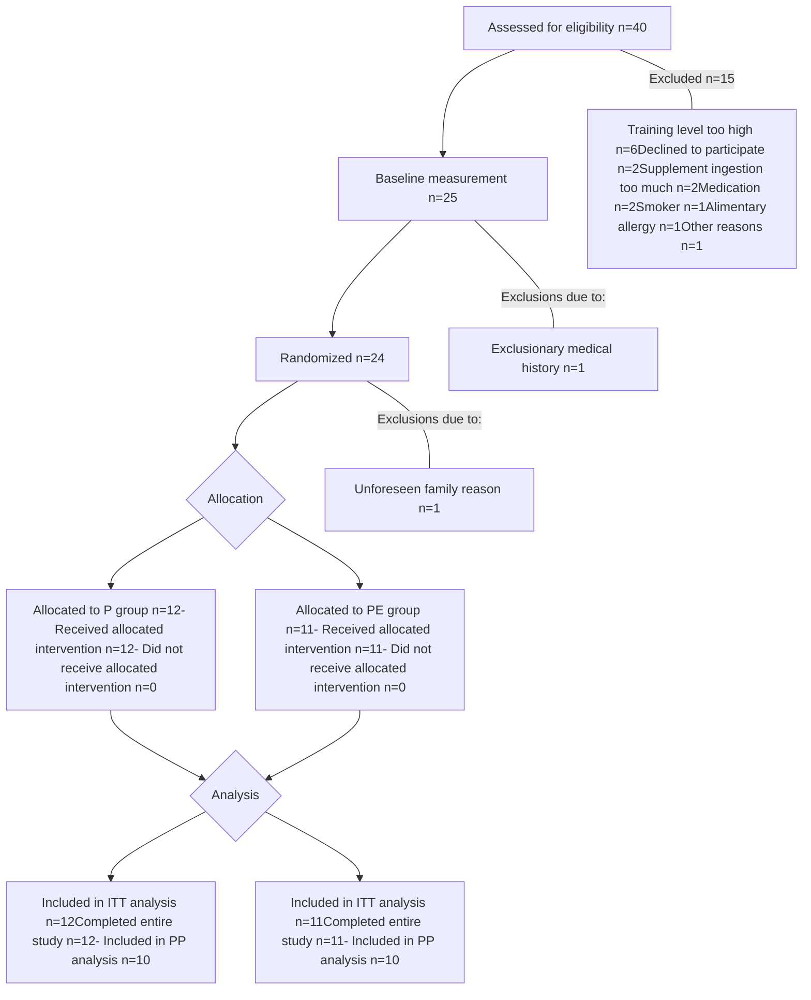

Clinical Nutrition 43 (2024) 48e60

Contents lists available at ScienceDirect

# Clinical Nutrition

journal homepage: http://www.elsevier.com/locate/clnu

Randomized Control Trials

# Greater energy surplus promotes body protein accretion in healthy young men: A randomized clinical trial

Yoichi Hatamoto a, b, Yukiya Tanoue a, c, Ryoichi Tagawa d, e, Jun Yasukata a, f, Keisuke Shiose a, g, Yujiro Kose a, h, Daiki Watanabe e, i, Shigeho Tanaka b, j, k, Kong Y. Chen l, Naoyuki Ebine m, Keisuke Ueda n, Yoshinari Uehara a, o, Yasuki Higaki a, o, Chiaki Sanbongi p, Kentaro Kawanaka a, o, *

a Institute for Physical Activity, Fukuoka University, Fukuoka, Japan

b Department of Nutrition and Metabolism, National Institute of Health and Nutrition, National Institutes of Biomedical Innovation, Health and Nutrition, Osaka, Japan

c Ritsumeikan-Global Innovation Research Organization, Ritsumeikan University, Shiga, Japan

d Wellness Science Labs, Meiji Holdings Co Ltd, Tokyo, Japan

e School of Sports Sciences, Waseda University, Saitama, Japan

f Institute for Comprehensive Education, Kagoshima University, Kagoshima, Japan

g Faculty of Education, University of Miyazaki, Miyazaki, Japan

h National Institute of Fitness and Sports in Kanoya, Kagoshima, Japan

i Department of Physical Activity Research, National Institute of Health and Nutrition, National Institutes of Biomedical Innovation, Health and Nutrition, Osaka, Japan

j Faculty of Nutrition, Kagawa Nutrition University, Saitama, Japan

k Institute of Nutrition Sciences, Kagawa Nutrition University, Saitama, Japan

l Diabetes, Endocrinology, and Obesity Branch, Intramural Research Program, National Institute of Diabetes and Digestive and Kidney Diseases, The National Institutes of Health, Bethesda, MD, USA

m Faculty of Health and Sports Science, Doshisha University, Kyoto, Japan

n Nutritionals Development Dept. Global Nutritional Business Div. Meiji Co., Ltd. Tokyo Japan, Japan

o Faculty of Sports and Health Science, Fukuoka University, Fukuoka, Japan

p Nutrition and Food Function Group Health Science Research Unit, R&D Division, Meiji Co, Ltd, Tokyo, Japan

## ARTICLE INFO

**Article history:**
Received 20 February 2024
Accepted 20 September 2024

**Keywords:**
Overfeeding
Fat-free mass
Total body protein
Total body water
4-compartment model
Leptin

## ABSTRACT

*Background & aims:* Caloric overfeeding combined with adequate protein intake increases not only body fat mass but also fat-free mass. However, it remains unclear whether the increase in fat-free mass due to overfeeding is associated with an increase in total body protein mass. We evaluated the hypothesis that overfeeding would promote an increase in total body protein mass.

*Methods:* In our randomized controlled trial, 23 healthy young men were fed a diet equivalent to their energy requirements with a +10 % energy surplus from protein alone or a +40 % energy surplus (+10 % from protein, +30 % from carbohydrate) for 6 weeks. We estimated total body protein mass by a four-compartment model using dual-energy X-ray absorptiometry, deuterium dilution, and hydrostatic underwater weighing.

*Results:* The 40 % energy surplus over 6 weeks significantly increased body protein mass compared to baseline by 3.7 % (0.44 kg; 95 % confidence interval [CI], 0.21–0.67 kg; P = 0.003); however, the 10 % energy surplus did not result in a significant change (0.00 kg; 95 % CI, -0.38–0.39 kg; P = 0.980). A significant interaction between intervention duration (time) and energy surplus (group) was observed for total body protein mass (P = 0.035, linear mixed-effects model), with a trend toward a significant difference in total body protein mass gain between groups (P = 0.059, Wilcoxon rank sum test). The increase in body protein mass due to the energy surplus was correlated with an increase in fat mass (r = 0.820, p = 0.002).

*Conclusions:* A higher energy intake was found to promote an increase in body protein mass in healthy men consuming excess protein, suggesting the importance of energy surplus in body protein

\* Corresponding author. Faculty of Sports and Health Science, Fukuoka University,

8-19-1 Nanakuma, Jonan-ku, Fukuoka 814-0180, Japan.

E-mail address: kawanaka@fukuoka-u.ac.jp (K. Kawanaka).

https://doi.org/10.1016/j.clnu.2024.09.035
0261-5614/© 2024 The Author(s). Published by Elsevier Ltd. This is an open access article under the CC BY license (http://creativecommons.org/licenses/by/4.0/).

Y. Hatamoto, Y. Tanoue, R. Tagawa et al.
Clinical Nutrition 43 (2024) 48e60

accumulation. This effect of energy surplus may be related to factors such as increased body fat mass and the associated secretion of adipokines.

Trial registration: The trial was registered with the University Hospital Medical Information Network Clinical Trial Registry as UMIN000034158.

© 2024 The Author(s). Published by Elsevier Ltd. This is an open access article under the CC BY license

(http://creativecommons.org/licenses/by/4.0/).

### Abbreviations

<table>
    <tr>
        <td>ALM</td>
        <td>appendicular lean mass</td>
    </tr>
    <tr>
        <td>BDHQ</td>
        <td>brief-type self-administered diet history questionnaire</td>
    </tr>
    <tr>
        <td>BMM</td>
        <td>bone mineral mass</td>
    </tr>
    <tr>
        <td>BMR</td>
        <td>basal metabolic rate</td>
    </tr>
    <tr>
        <td>DLW</td>
        <td>doubly-labeled water</td>
    </tr>
    <tr>
        <td>DXA</td>
        <td>dual-energy X-ray absorptiometry</td>
    </tr>
    <tr>
        <td>FM</td>
        <td>fat mass</td>
    </tr>
    <tr>
        <td>4-C model</td>
        <td>four-compartment model</td>
    </tr>
    <tr>
        <td>IGF-1</td>
        <td>insulin growth factor-1</td>
    </tr>
    <tr>
        <td>ITT analysis</td>
        <td>intention-to-treat analysis</td>
    </tr>
    <tr>
        <td>LMM</td>
        <td>linear mixed-effects model</td>
    </tr>
    <tr>
        <td>PAEE</td>
        <td>free-living physical activity energy expenditure</td>
    </tr>
    <tr>
        <td>PPS analysis</td>
        <td>per protocol set analysis</td>
    </tr>
    <tr>
        <td>TBW</td>
        <td>total body water</td>
    </tr>
    <tr>
        <td>TBV</td>
        <td>total body volume</td>
    </tr>
    <tr>
        <td>TEE</td>
        <td>total energy expenditure</td>
    </tr>
    <tr>
        <td>UWW</td>
        <td>hydrostatic underwater weighing</td>
    </tr>
</table>
However, it is unclear whether an energy surplus in addition to a certain amount of protein intake is needed to increase fat-free mass. This is because there are no randomized controlled studies that have evaluated the effects of energy surplus on body composition under tightly controlled conditions with identical protein intake in all groups.

Furthermore, overfeeding has been reported to increase total body water [10–12], since an overfeeding-associated rise in plasma sodium promotes fluid consumption to maintain fluid homeostasis [13]. In addition, since 1 g of glycogen is bound to 3 g of water [14], it might be possible that carbohydrate overfeeding increases total body water due to an increase in muscle and/or liver glycogen storage. Since fat-free mass includes body water, increases in fat-free mass during caloric overfeeding may be primarily due to increases in total body water rather than to fat-free dry solid mass (sum of body protein and bone mineral mass).

We hypothesized that a greater energy surplus would promote an increase in both total body protein mass and total body water in individuals consuming a high-protein diet exceeding their protein requirements. To evaluate this hypothesis, we conducted a randomized controlled study to compare the effects on body composition of a 40 % energy surplus diet (including +10 % from protein and +30 % from carbohydrates) against a 10 % energy surplus diet from protein alone for 6 weeks in healthy young men.

# 1. Introduction

An increase in lean body mass contributes to the development of strength and power. Higher lean body mass is also strongly associated with better survival in older adults [1,2]. Thus, maintaining or increasing lean body mass is important for both health and athletic performance. This can be achieved by maintaining or increasing skeletal muscle mass, as skeletal muscle is a large organ that accounts for about half of lean body mass [3].

Since protein intake is an important anabolic stimulus for whole-body and skeletal muscle protein synthesis, dietary strategies for optimizing lean body mass or skeletal muscle mass, such as manipulating the amount, quality, and timing of protein supplementation, are advocated [4–7]. On the other hand, in a classic study from 1937 involving a small number of participants, Cuthbertson and Munro showed that adding extra energy in the form of either carbohydrate or fat for several days to an adequate diet resulted in a positive nitrogen balance [8]. Thus, dietary energy intake possibly affects the anabolic response; however, the effect of chronic energy surplus, i.e., the strategy of intentionally consuming more calories than required to maintain body weight, on body protein mass remains unclear.

In a randomized controlled trial, sedentary adults were overfed (+40 % of energy requirements) for 8 weeks on diets supplying low (0.7 g/kg body weight), normal (1.8 g/kg body weight), or high (3.0 g/kg body weight) amounts of protein [9]. These authors showed that fat-free mass did not increase on the low-protein diet, yet significantly increased on the normal- and high-protein diets, despite a comparable energy surplus. Thus, the amount of protein intake contributes to fat-free mass gain during caloric overfeeding.

# 2. Methods and materials

## 2.1. Study design

We conducted a 6-week randomized, open-label, parallel-group, clinical trial to compare the effects of energy surplus combined with protein supplementation versus protein supplementation alone on body composition in young healthy men. The trial was conducted from September 2018 to March 2020. The study was approved by the Ethics Committee of Fukuoka University (number: 18-08-01) and was conducted in accordance with the Declaration of Helsinki. This study followed the CONSORT reporting guideline. The protocol was registered with the University Hospital Medical Information Network Clinical Trial Registry (UMIN000034158). Written informed consent was obtained from all participants before enrolment in the trial.

## 2.2. Participants

Participants were recruited mainly through the laboratory information bulletin board at the Faculty of Sports and Health Science of Fukuoka University. Exclusion criteria included a prior history of gastric surgery; diabetes; kidney or liver disease; regular consumption of medications affecting energy metabolism or >40 g per day of protein supplements; allergy to milk, soy, or some fruits (apple, mango, grape or cassis); or abnormal blood values (glucose, insulin, lipids, etc.). Those with restricted or unusual eating habits were excluded from the study.

49

Y. Hatamoto, Y. Tanoue, R. Tagawa et al. Clinical Nutrition 43 (2024) 48e60

## 2.3. Protocol

The study protocol is shown in Fig. 1. The trial employed a parallel two-group design and was not blinded to treatment. Individual participants were randomly assigned using computer-generated randomization to one of two groups: 1) the high-protein normal-energy (P group), which involved overfeeding by 10 % above energy requirements from protein alone (10 % excess energy); or 2) the high-protein high-energy (PE group), which involved overfeeding by 40 % above energy requirements, with 30 % from carbohydrates and 10 % from protein (40 % energy surplus). Allocation (1:1 ratio) was conducted using a permutated block design with random block sizes of two. Briefly, the trial consisted of a 5-day baseline weight stabilization (energy balance) period followed by a 6-week protein supplementation intervention period. The 40 % energy surplus and the 6-week time frame were chosen because a previous study demonstrated that a 40 % energy surplus combined with adequate protein intake successfully increased fat-free mass within 6 weeks [9]. Total energy expenditure (TEE) was measured over the 6-week intervention (Supplementary Methods and Materials). Body composition was estimated every 2 weeks before and during the 6-week intervention. The primary outcome measure was total body protein mass. Secondary outcomes were body weight, fat mass (FM), fat-free mass, and total body water (TBW). These were estimated by a four-compartment (4-C) model. The 4-C model divides body weight into FM, TBW, bone mineral mass (BMM), and total body protein mass.

In the overfeeding intervention, it was apparent to participants whether they were in the P group, receiving +10 % energy surplus, or the PE group, receiving +40 % energy surplus. Therefore, participants were not blinded. However, the examiners were blinded during the measurements, and outcome evaluators were blinded during the statistical analysis of the data.

## 2.4. Baseline weight stabilization period

Prior to the 5-day weight stabilization period, daily food intake was surveyed using the brief-type self-administered diet history questionnaire (BDHQ), developed to assess the dietary habits of Japanese adults [15]. In addition, basal metabolic rate (BMR) and free-living physical activity energy expenditure (PAEE) were measured to determine energy requirements for weight maintenance, which were the initial energy content of the weight stabilization diets. Energy requirements were calculated as follows:

Energy requirements = (BMR + PAEE)/0.9

The BMR was measured by indirect calorimetry, as detailed in Supplementary Methods and Materials. The PAEE was estimated by having participants wear a tri-axial accelerometer for 10 days [16]. A run-in diet equivalent to the energy requirement was first served for 5 days. Body weight was considered stable when the change in body weight during these 5 days was less than 1 kg. If the weight change exceeded 1 kg, energy intake during intervention was adjusted from the weight stabilization diets based on 1 g/1 kcal [17].

## 2.5. Diets during the 6-week intervention period

During the 6-week intervention period, P and PE groups received a menu of basal diet equivalent to their energy requirements. The menu consisted of three meals per day prepared

Fig. 1. Study timeline and assessments. After consuming a weight-stabilizing diet for 5 days, participants were randomized to high-protein diet (P) or high-protein and high-energy diet (PE) group. In the 6-week period of the intervention, both P and PE group participants received a diet equivalent to their energy requirements, plus protein supplementation equivalent to a 10 % energy surplus. Only the PE group participants received carbohydrate supplementation equivalent to a 30 % energy surplus. As a result, the P group subjects received 2.3 and 5.7 g/kg BW/day of protein and carbohydrate, respectively (10 % more energy than required), and the PE group subjects received 2.2 and 7.9 g/kg BW/day of protein and carbohydrate, respectively (40 % more energy than required). Body weight, fat mass, fat-free mass, total body water, and total body protein mass were measured every 2 weeks during the 6-week intervention by using hydrostatic underwater weighing, dual X-ray absorptiometry (DXA), and doubly labeled water (DLW). Total energy expenditure was also measured throughout the 6-week intervention using DLW.

50

Y. Hatamoto, Y. Tanoue, R. Tagawa et al. Clinical Nutrition 43 (2024) 48e60

by the study dietitian. The contribution of energy from protein, fat, and carbohydrates in the basal diet corresponding to energy requirements were 15 %, 25 %, and 60 %, respectively. The 7-day rotation menu was repeated 6 times over the 6-week intervention.

Additionally, both groups received protein supplementation equal to 10 % of their energy requirements; only the PE group received carbohydrate supplementation equivalent to 30 % of their energy requirements. As a result, the P group received 2.3 and 5.7 g/kg BW/day of protein and carbohydrate, respectively (10 % more energy than required), and the PE group received 2.2 and 7.9 g/kg BW/day of protein and carbohydrate, respectively (40 % more energy than required). The 2.2–2.3 g/kg BW/day of protein intake in this study is comparable to the 1.8–3.0 g/kg BW/day reported in a previous study, which demonstrated that a 40 % energy surplus combined with adequate protein intake successfully increased fat-free mass [9]. Although this amount of protein intake far exceeds the habitual intake for many populations, no adverse health outcomes have been reported in resistance-trained athletes consuming 2.5–3.3 g/kg/day for up to a year [18]. The protein supplement was formulated using whey protein (SAVAS® Clear Whey Protein 100, Meiji Co., Ltd., Tokyo). The nutritional composition of the protein supplement is detailed in Supplementary Table 1. The carbohydrate supplement included energy jelly (SAVAS® Energy Maker Jelly and Pit In Jelly Bar, Meiji Co., Ltd., Tokyo) and 100 % fruit juice (Tropicana®, Kirin Beverage Co., Ltd., Tokyo; Minute Maid®, Coca-Cola Japan Co., Ltd., Tokyo).

During the intervention period, participants were instructed to record daily all foods (three meals and supplements) consumed. If participants failed to complete the meals and supplements provided, they were considered non-compliant for that day. The compliance rate was calculated by dividing the number of compliant days by the total number of intervention days. Further details of dietary intervention are provided in the Supplementary Methods and Materials.

## 2.6. Body composition

Body composition was evaluated using 4-C model [19,20] every 2 weeks before and during the 6-week intervention. The 4-C model divides body weight into FM, TBW, BMM, and total body protein mass. Body composition assessment by the 4-C model requires body weight measurement, hydrostatic underwater weighing (UWW) to estimate whole-body density [21,22], stable isotope dilution using doubly-labeled water (DLW) to estimate TBW, and dual-energy X-ray absorptiometry (DXA) to estimate BMM. Body weight, whole-body density, TBW, and BMM were measured as described in Supplementary Methods and Materials. Total body volume (TBV) was calculated from body weight and whole-body density. FM was calculated using the 4-C formula as follows [20,23]:

$$ FM (kg) = 2.747 \times TBV - 0.714 \times TBW + 1.146 \times BMM - 2.050 \times body weight $$

Total body protein mass was calculated as follows [20,23]:

$$ Total body protein mass (kg) = 3.050 \times body weight - 0.286 \times TBW - 2.146 \times BMM - 2.747 \times TBV $$

Whole-body density was measured using UWW, and TBW was estimated using DLW at 0, 2, 4, and 6 weeks. DXA was used to estimate BMM at only 0 and 6 weeks because of radiation exposure, and the BMM values at 2 and 4 weeks were estimated using the average value between 0 and 6 weeks.

## 2.7. Biochemical and hormonal analyses

After >10 h of fasting (overnight) before breakfast, blood samples were obtained at 0 and 6 weeks. Serum and plasma samples were obtained after a 15-min centrifugation at 4 °C, and the samples were stored at -80 °C until analysis. Aspartate aminotransferase, alanine transaminase, and gamma-glutamyl transferase were measured using standard enzymatic methods. Creatinine, urea nitrogen, and uric acid were measured by enzymatic methods. The estimated glomerular filtration rate (eGFR) was calculated using the following formula:

$$ eGFR = 194 \times creatinine^{-1.094} \times age^{-0.287} $$

Glucose and triglycerides were measured by enzymatic methods. Total cholesterol, high-density lipoprotein-cholesterol, low density lipoprotein-cholesterol, and very low-density lipoprotein cholesterol were measured using enzymatic methods (direct assay). Insulin, testosterone, and cortisol were measured by chemiluminescent enzyme immunoassays. Insulin growth factor-1 (IGF-1) and growth hormone were measured by electrochemiluminescent immunoassays. Leptin was measured by radioimmunoassay. These measurements were outsourced to the Biochemical Blood Testing Department of LSI Medience Corporation (Tokyo, Japan).

## 2.8. Statistical analysis

The target sample size was calculated as described in Supplementary Methods and Materials. To evaluate the robustness of the results, we performed the intention-to-treat (ITT) analysis for participants in their originally assigned groups [24]. Per protocol set (PPS) analysis was also performed to assess the robustness of the ITT analysis conclusions regarding the primary outcome.

The Wilcoxon rank-sum test, a non-parametric method, was used to assess group differences in change over time. For evaluating the temporal trajectories over 6 weeks in body composition, ALM, muscle strength, and blood metabolic indicators, we employed a linear mixed-effects model (LMM) with restricted maximum likelihood estimation [25]. This model incorporated fixed effects for group and time, as well as random effects, and was able to account for repeated measures within participants. If a significant interaction between time and group was observed for body composition, a one-way analysis of variance was applied to estimate the main effect of time. If a significant main effect was observed, we used the fixed effect estimates from the LMM to examine the differences between the baseline and each subsequent time point, i.e., 2, 4, and 6 weeks for each group. Time was treated as a categorical predictor, allowing direct comparisons between baseline and each subsequent time point (2, 4, and 6 weeks) in the P and PE groups. All statistical analyses were performed using R statistical software (4.3.1 for windows) and a p-value of less than 0.05 was considered statistically significant.

# 3. Results

## 3.1. Participants

As shown in Fig. 2, 40 individuals expressed interest in the study; of these, 16 were excluded as they did not meet one or more inclusion criteria. Of the 40 individuals assessed for eligibility, 24 qualified participants were randomly assigned to the P group (n = 12) or PE group (n = 12). One participant withdrew before the

51

Y. Hatamoto, Y. Tanoue, R. Tagawa et al. Clinical Nutrition 43 (2024) 48–60

**Fig. 2.** CONSORT diagram describing recruitment and random allocation of the participants. CONSORT indicates Consolidated Standards of Reporting Trials; P, high-protein diet; PE, high-protein and high-energy diet; ITT, intension to treat; and PPS; per protocol set.

final body composition measurement. At the conclusion of the 6-week intervention, 12 participants in the P group and 11 in the PE group completed the study.

## 3.2. The 40 % energy surplus from the combined protein and carbohydrate supplementation over 6 weeks increased total body protein mass

Participants’ characteristics are shown in Table 1. During the 6-week intervention, rates of compliance with the prescribed diets averaged 98 ± 6 % in the P group and 98 ± 3 % in the PE group. Rates of compliance with supplement consumption averaged 99 ± 2 % in the P group and 95 ± 7 % in the PE group. There were no significant differences in body composition (body weight, fat mass, fat-free mass, total body water, total body protein mass, and bone mineral mass) at baseline between the P and PE groups (Table 1). There were also no significant differences in dietary intake estimated using BDHQ between groups (Table 1).

As shown in Table 2, a linear mixed-effects model revealed a significant interaction between intervention duration (time) and energy surplus degree (group) for total body protein mass (P = 0.035), body weight (P = 0.005), and fat mass (P = 0.005). PPS analysis showed similar results (Table 2). That is, the time course of changes in total body protein mass, body weight, and fat mass were influenced by energy surplus degree.

According to a one-way analysis of variance, in the P group, fed 10 % energy surplus from protein alone, there was no main effect of

52

Y. Hatamoto, Y. Tanoue, R. Tagawa et al. Clinical Nutrition 43 (2024) 48e60

**Table 1**
Participant characteristics, body composition, and food intake at baseline prior to intervention.

<table>
  <thead>
    <tr>
        <th>Variable</th>
        <th colspan="2">ITT</th>
        <th colspan="2">PPS</th>
    </tr>
    <tr>
        <th> </th>
        <th>P group (n = 12)</th>
        <th>PE group (n = 11)</th>
        <th>P group (n = 10)</th>
        <th>PE group (n = 10)</th>
    </tr>
  </thead>
  <tbody>
    <tr>
        <td>Age (years)</td>
        <td>21.6 ± 1.4</td>
        <td>21.4 ± 1.1</td>
        <td>21.8 ± 1.4</td>
        <td>21.3 ± 1.2</td>
    </tr>
    <tr>
        <td>Height (cm)</td>
        <td>173.2 ± 5.1</td>
        <td>171.9 ± 5.0</td>
        <td>172.4 ± 4.4</td>
        <td>171.9 ± 5.3</td>
    </tr>
    <tr>
        <td>Body composition</td>
        <td> </td>
        <td> </td>
        <td> </td>
        <td> </td>
    </tr>
    <tr>
        <td>Body weight (kg)</td>
        <td>62.4 ± 8.8</td>
        <td>64.5 ± 7.0</td>
        <td>61.8 ± 8.5</td>
        <td>65.0 ± 7.2</td>
    </tr>
    <tr>
        <td>BMI (kg/m²)</td>
        <td>20.7 ± 2.1</td>
        <td>21.8 ± 1.8</td>
        <td>20.7 ± 2.2</td>
        <td>22.0 ± 1.8</td>
    </tr>
    <tr>
        <td>Fat mass (kg)</td>
        <td>11.1 ± 5.6</td>
        <td>11.6 ± 2.9</td>
        <td>10.8 ± 5.4</td>
        <td>11.8 ± 3.0</td>
    </tr>
    <tr>
        <td>Fat free mass (kg)</td>
        <td>51.3 ± 5.6</td>
        <td>52.9 ± 5.8</td>
        <td>51.0 ± 5.9</td>
        <td>53.2 ± 6.0</td>
    </tr>
    <tr>
        <td>Total body water (kg)</td>
        <td>36.5 ± 4.1</td>
        <td>37.8 ± 3.8</td>
        <td>36.2 ± 4.3</td>
        <td>38.1 ± 3.9</td>
    </tr>
    <tr>
        <td>Body protein mass (kg)</td>
        <td>12.0 ± 1.3</td>
        <td>12.2 ± 1.8</td>
        <td>12.0 ± 1.4</td>
        <td>12.2 ± 1.9</td>
    </tr>
    <tr>
        <td>Bone mineral mass (kg)</td>
        <td>2.8 ± 0.4</td>
        <td>2.9 ± 0.4</td>
        <td>2.8 ± 0.3</td>
        <td>2.9 ± 0.4</td>
    </tr>
    <tr>
        <td>Energy requirement (kcal/day)</td>
        <td>2508 ± 311</td>
        <td>2432 ± 359</td>
        <td>2554 ± 277</td>
        <td>2474 ± 348</td>
    </tr>
    <tr>
        <td>Habitual dietary intakes</td>
        <td> </td>
        <td> </td>
        <td> </td>
        <td> </td>
    </tr>
    <tr>
        <td>Protein (% Energy)</td>
        <td>14.1 ± 2.8</td>
        <td>13.0 ± 1.7</td>
        <td>14.3 ± 3.0</td>
        <td>13.2 ± 1.6</td>
    </tr>
    <tr>
        <td>Protein (g/kg BW/day)</td>
        <td>1.4 ± 0.3</td>
        <td>1.2 ± 0.2</td>
        <td>1.48 ± 0.30</td>
        <td>1.28 ± 0.24</td>
    </tr>
    <tr>
        <td>Fat (% Energy)</td>
        <td>26.9 ± 6.4</td>
        <td>23.1 ± 6.3</td>
        <td>26.0 ± 6.6</td>
        <td>23.7 ± 6.3</td>
    </tr>
    <tr>
        <td>Carbohydrate (% Energy)</td>
        <td>59.0 ± 8.8</td>
        <td>63.9 ± 7.7</td>
        <td>59.7 ± 9.5</td>
        <td>63.1 ± 7.7</td>
    </tr>
  </tbody>
</table>

All values are mean ± SD. Wilcoxon rank-sum test was used to compare two groups. No significant differences were found between two groups at baseline for any variable (p > 0.05). P, high-protein diet; PE, high-protein and high-energy diet; BMI, body mass index; CHO, carbohydrate; ITT, intention-to-treat; PPS, per protocol set. Habitual dietary intakes was assessed by brief-type self-administered diet history questionnaire (BDHQ). The values of habitual dietary intakes were adjusted by energy requirement values.

**Table 2**
Changes in body composition during the 6-week intervention.

<table>
  <thead>
    <tr>
        <th colspan="8">ITT</th>
    </tr>
    <tr>
        <th>Group</th>
        <th>Baseline</th>
        <th>6wk</th>
        <th>ᵃ P (interaction)</th>
        <th>ᵇ Δ</th>
        <th>ᵇ 95 % CI</th>
        <th>ᶜ p-value</th>
        <th>ᵈ Effect size (r)</th>
    </tr>
  </thead>
  <tbody>
    <tr>
        <td>Body protein mass (kg)</td>
        <td> </td>
        <td> </td>
        <td> </td>
        <td> </td>
        <td> </td>
        <td> </td>
        <td> </td>
    </tr>
    <tr>
        <td>P</td>
        <td>12.02 ± 1.29</td>
        <td>12.02 ± 1.34</td>
        <td>0.035</td>
        <td>0.00 ± 0.61</td>
        <td>−0.38, 0.39</td>
        <td>0.059</td>
        <td>0.393</td>
    </tr>
    <tr>
        <td>PE</td>
        <td>12.20 ± 1.76</td>
        <td>12.64 ± 1.58</td>
        <td> </td>
        <td>0.44 ± 0.34</td>
        <td>0.21, 0.67</td>
        <td> </td>
        <td> </td>
    </tr>
    <tr>
        <td>Body weight (kg)</td>
        <td> </td>
        <td> </td>
        <td> </td>
        <td> </td>
        <td> </td>
        <td> </td>
        <td> </td>
    </tr>
    <tr>
        <td>P</td>
        <td>62.38 ± 8.82</td>
        <td>63.26 ± 8.76</td>
        <td>0.005</td>
        <td>0.88 ± 2.01</td>
        <td>−0.40, 2.15</td>
        <td>0.079</td>
        <td>0.366</td>
    </tr>
    <tr>
        <td>PE</td>
        <td>64.49 ± 7.02</td>
        <td>66.94 ± 7.15</td>
        <td> </td>
        <td>2.45 ± 2.03</td>
        <td>1.09, 3.82</td>
        <td> </td>
        <td> </td>
    </tr>
    <tr>
        <td>Fat mass (kg)</td>
        <td> </td>
        <td> </td>
        <td> </td>
        <td> </td>
        <td> </td>
        <td> </td>
        <td> </td>
    </tr>
    <tr>
        <td>P</td>
        <td>11.07 ± 5.62</td>
        <td>11.21 ± 5.79</td>
        <td>0.005</td>
        <td>0.14 ± 1.13</td>
        <td>−0.58, 0.86</td>
        <td>0.051</td>
        <td>0.407</td>
    </tr>
    <tr>
        <td>PE</td>
        <td>11.55 ± 2.90</td>
        <td>12.70 ± 3.17</td>
        <td> </td>
        <td>1.14 ± 1.51</td>
        <td>0.13, 2.16</td>
        <td> </td>
        <td> </td>
    </tr>
    <tr>
        <td>Fat-free mass (kg)</td>
        <td> </td>
        <td> </td>
        <td> </td>
        <td> </td>
        <td> </td>
        <td> </td>
        <td> </td>
    </tr>
    <tr>
        <td>P</td>
        <td>51.31 ± 5.59</td>
        <td>52.05 ± 5.19</td>
        <td>0.409</td>
        <td>0.73 ± 1.45</td>
        <td>−0.19, 1.66</td>
        <td>0.413</td>
        <td>0.171</td>
    </tr>
    <tr>
        <td>PE</td>
        <td>52.94 ± 5.82</td>
        <td>54.24 ± 6.19</td>
        <td> </td>
        <td>1.31 ± 1.22</td>
        <td>0.49, 2.13</td>
        <td> </td>
        <td> </td>
    </tr>
    <tr>
        <td>Body water (kg)</td>
        <td> </td>
        <td> </td>
        <td> </td>
        <td> </td>
        <td> </td>
        <td> </td>
        <td> </td>
    </tr>
    <tr>
        <td>P</td>
        <td>36.47 ± 4.12</td>
        <td>37.18 ± 3.60</td>
        <td>0.978</td>
        <td>0.72 ± 1.51</td>
        <td>−0.24, 1.67</td>
        <td>0.976</td>
        <td>0.006</td>
    </tr>
    <tr>
        <td>PE</td>
        <td>37.84 ± 3.78</td>
        <td>38.69 ± 4.28</td>
        <td> </td>
        <td>0.84 ± 1.30</td>
        <td>−0.03, 1.72</td>
        <td> </td>
        <td> </td>
    </tr>
    <tr>
        <th colspan="8">PPS</th>
    </tr>
    <tr>
        <td>Body protein mass (kg)</td>
        <td> </td>
        <td> </td>
        <td> </td>
        <td> </td>
        <td> </td>
        <td> </td>
        <td> </td>
    </tr>
    <tr>
        <td>P</td>
        <td>12.03 ± 1.41</td>
        <td>11.99 ± 1.46</td>
        <td>0.035</td>
        <td>−0.05 ± 0.66</td>
        <td>−0.52, 0.43</td>
        <td>0.043</td>
        <td>0.452</td>
    </tr>
    <tr>
        <td>PE</td>
        <td>12.22 ± 1.86</td>
        <td>12.69 ± 1.66</td>
        <td> </td>
        <td>0.47 ± 0.35</td>
        <td>0.22, 0.72</td>
        <td> </td>
        <td> </td>
    </tr>
    <tr>
        <td>Body weight (kg)</td>
        <td> </td>
        <td> </td>
        <td> </td>
        <td> </td>
        <td> </td>
        <td> </td>
        <td> </td>
    </tr>
    <tr>
        <td>P</td>
        <td>61.80 ± 8.50</td>
        <td>62.84 ± 8.34</td>
        <td>0.026</td>
        <td>1.04 ± 2.16</td>
        <td>−0.51, 2.59</td>
        <td>0.218</td>
        <td>0.276</td>
    </tr>
    <tr>
        <td>PE</td>
        <td>64.99 ± 7.19</td>
        <td>67.44 ± 7.34</td>
        <td> </td>
        <td>2.44 ± 2.14</td>
        <td>0.91, 3.98</td>
        <td> </td>
        <td> </td>
    </tr>
    <tr>
        <td>Fat mass (kg)</td>
        <td> </td>
        <td> </td>
        <td> </td>
        <td> </td>
        <td> </td>
        <td> </td>
        <td> </td>
    </tr>
    <tr>
        <td>P</td>
        <td>10.83 ± 5.44</td>
        <td>10.97 ± 5.60</td>
        <td>0.004</td>
        <td>0.14 ± 1.24</td>
        <td>−0.75, 1.03</td>
        <td>0.035</td>
        <td>0.470</td>
    </tr>
    <tr>
        <td>PE</td>
        <td>11.77 ± 2.96</td>
        <td>13.05 ± 3.11</td>
        <td> </td>
        <td>1.28 ± 1.52</td>
        <td>0.19, 2.37</td>
        <td> </td>
        <td> </td>
    </tr>
    <tr>
        <td>Fat-free mass (kg)</td>
        <td> </td>
        <td> </td>
        <td> </td>
        <td> </td>
        <td> </td>
        <td> </td>
        <td> </td>
    </tr>
    <tr>
        <td>P</td>
        <td>50.97 ± 5.90</td>
        <td>51.87 ± 5.43</td>
        <td>0.909</td>
        <td>0.90 ± 1.53</td>
        <td>−0.20, 2.00</td>
        <td>0.971</td>
        <td>0.008</td>
    </tr>
    <tr>
        <td>PE</td>
        <td>53.22 ± 6.05</td>
        <td>54.39 ± 6.51</td>
        <td> </td>
        <td>1.16 ± 1.18</td>
        <td>0.32, 2.01</td>
        <td> </td>
        <td> </td>
    </tr>
    <tr>
        <td>Body water (kg)</td>
        <td> </td>
        <td> </td>
        <td> </td>
        <td> </td>
        <td> </td>
        <td> </td>
        <td> </td>
    </tr>
    <tr>
        <td>P</td>
        <td>36.16 ± 4.32</td>
        <td>37.09 ± 3.73</td>
        <td>0.447</td>
        <td>0.93 ± 1.56</td>
        <td>−0.19, 2.05</td>
        <td>0.631</td>
        <td>0.108</td>
    </tr>
    <tr>
        <td>PE</td>
        <td>38.10 ± 3.89</td>
        <td>38.77 ± 4.51</td>
        <td> </td>
        <td>0.67 ± 1.23</td>
        <td>−0.21, 1.55</td>
        <td> </td>
        <td> </td>
    </tr>
  </tbody>
</table>

All values are mean ± SD. P, high protein diet; PE, high protein and energy surplus diet; ITT, intention-to-treat; PPS, per protocol set.

\*ᵃ Linear mixed-effects model was used to assess time and group interactions.

\*ᵇ Δ and 95 % confidence interval indicate within-group change from baseline during the 6-week intervention period.

\*ᶜ Wilcoxon rank-sum tests was used for between-group comparisons of Δ (within-group change during the 6-week intervention).

\*ᵈ The effect size r for the Wilcoxon rank sum test was calculated by dividing the Z statistic by the square root of the sample size.

time on total body protein mass (P = 0.664), body weight (P = 0.148), or fat mass (P = 0.807) during the 6-week intervention period. By contrast, in the PE group, fed 40 % energy surplus from protein and carbohydrates, a main effect of time was observed for total body protein mass (P = 0.009), body weight (P < 0.001), and fat mass (P = 0.005). As shown in Fig. 3, participants in the PE group significantly gained 0.44 ± 0.34 kg of total body protein mass during the 6-week intervention period compared to baseline (P = 0.003). Moreover, participants in the PE group significantly increased body weight (+2.45 ± 2.03 kg; P < 0.001) and fat mass (+1.14 ± 1.51 kg; P = 0.002) compared to baseline. Similar results were obtained in the PPS analysis (Supplementary Fig. 2). As shown in Table 2, the Wilcoxon rank-sum test showed a trend toward a

significant difference between the P and PE groups in the change from baseline in total body protein mass during the 6-week intervention period, based on ITT analysis (P = 0.059, Effect size r = 0.393), while the effect was significant based on PPS analysis (P = 0.043, Effect size r = 0.452). That is, adding more energy promoted total body protein mass gain during the 6-week intervention period.

Body composition was assessed every 2 weeks during the 6-week intervention period. After 2 weeks, the PE group significantly increased total body protein mass (+0.34 ± 0.55 kg; P = 0.02) and body weight (+1.50 ± 1.09 kg; P < 0.001) compared to baseline (Fig. 3). After 4 weeks, the PE group significantly increased total body protein mass (+0.45 ± 0.50 kg; P = 0.003), body weight

53

Y. Hatamoto, Y. Tanoue, R. Tagawa et al.
Clinical Nutrition 43 (2024) 48e60

### Change from baseline

<table>
  <thead>
    <tr>
        <th>Time</th>
        <th>P (kg)</th>
        <th>PE (kg)</th>
    </tr>
  </thead>
  <tbody>
    <tr>
        <td>0 wk</td>
        <td>0.0</td>
        <td>0.0</td>
    </tr>
    <tr>
        <td>2 wk</td>
        <td>0.0</td>
        <td>0.35</td>
    </tr>
    <tr>
        <td>4 wk</td>
        <td>0.15</td>
        <td>0.45</td>
    </tr>
    <tr>
        <td>6 wk</td>
        <td>0.0</td>
        <td>0.45</td>
    </tr>
  </tbody>
</table>

### Change from baseline

<table>
  <thead>
    <tr>
        <th>Time</th>
        <th>P (kg)</th>
        <th>PE (kg)</th>
    </tr>
  </thead>
  <tbody>
    <tr>
        <td>0 wk</td>
        <td>0.0</td>
        <td>0.0</td>
    </tr>
    <tr>
        <td>2 wk</td>
        <td>0.5</td>
        <td>1.5</td>
    </tr>
    <tr>
        <td>4 wk</td>
        <td>0.7</td>
        <td>2.0</td>
    </tr>
    <tr>
        <td>6 wk</td>
        <td>0.9</td>
        <td>2.5</td>
    </tr>
  </tbody>
</table>

### Change from baseline

<table>
  <thead>
    <tr>
        <th>Time</th>
        <th>P (kg)</th>
        <th>PE (kg)</th>
    </tr>
  </thead>
  <tbody>
    <tr>
        <td>0 wk</td>
        <td>0.0</td>
        <td>0.0</td>
    </tr>
    <tr>
        <td>2 wk</td>
        <td>0.2</td>
        <td>0.2</td>
    </tr>
    <tr>
        <td>4 wk</td>
        <td>0.2</td>
        <td>0.9</td>
    </tr>
    <tr>
        <td>6 wk</td>
        <td>0.1</td>
        <td>1.1</td>
    </tr>
  </tbody>
</table>

### Change from baseline

<table>
  <thead>
    <tr>
        <th>Time</th>
        <th>P (kg)</th>
        <th>PE (kg)</th>
    </tr>
  </thead>
  <tbody>
    <tr>
        <td>0 wk</td>
        <td>0.0</td>
        <td>0.0</td>
    </tr>
    <tr>
        <td>2 wk</td>
        <td>0.2</td>
        <td>1.3</td>
    </tr>
    <tr>
        <td>4 wk</td>
        <td>0.4</td>
        <td>1.1</td>
    </tr>
    <tr>
        <td>6 wk</td>
        <td>0.7</td>
        <td>1.3</td>
    </tr>
  </tbody>
</table>

### Change from baseline

<table>
  <thead>
    <tr>
        <th>Time</th>
        <th>P (kg)</th>
        <th>PE (kg)</th>
    </tr>
  </thead>
  <tbody>
    <tr>
        <td>0 wk</td>
        <td>0.0</td>
        <td>0.0</td>
    </tr>
    <tr>
        <td>2 wk</td>
        <td>0.2</td>
        <td>1.0</td>
    </tr>
    <tr>
        <td>4 wk</td>
        <td>0.3</td>
        <td>0.6</td>
    </tr>
    <tr>
        <td>6 wk</td>
        <td>0.7</td>
        <td>0.8</td>
    </tr>
  </tbody>
</table>

**Fig. 3. Changes in body composition during the 6 weeks of energy surplus intervention (ITT analysis).** Intension-to treat (ITT) analysis was performed. The error bars indicate standard deviation. The number of participants was 12 in the P group and 11 in the PE group. If a significant interaction between time and group was observed by linear mixed-effects model, comparisons were made between baseline and each time point in P and PE groups. a P < 0.05 between baseline and each week of intervention. At week 6, between-group differences were evaluated for change values (from baseline to 6 week) using the Wilcoxon rank sum test. b P < 0.05 between P and PE group. P, high-protein diet; PE, high-protein and high-energy diet.

(+2.01 ± 1.39 kg; P < 0.001), and fat mass (+0.91 ± 1.12 kg; P = 0.013) compared to baseline (Fig. 3). Similar results were obtained in the PPS analysis (Supplementary Fig. 2).

## 3.3. The 40 % energy surplus did not impact the true energy balance as much as expected

Table 3 shows energy intake (including macronutrients) based on the diet provided and food records, as well as energy expenditure, assessed using DLW administration. Although the P group

received 10 % more energy than that required from protein supplementation, energy intake and expenditure remained nearly balanced throughout the 6-week study period, with no significant changes in body weight or its components (total body protein mass, fat mass, fat-free mass, and total body water; Fig. 3 and Table 2).

The PE group received 40 % more energy than that required from both protein and carbohydrate supplements; however, their true energy balance values (the ratio of energy intake to total energy expenditure) were 1.15 ± 0.09, 1.19 ± 0.15, and 1.15 ± 0.13 for the

54

Y. Hatamoto, Y. Tanoue, R. Tagawa et al. Clinical Nutrition 43 (2024) 48e60

# Table 3
Energy intake and expenditure during the 6-week intervention.

<table>
  <thead>
    <tr>
        <th>Time</th>
        <th colspan="2">0-2 wk</th>
        <th colspan="2">2-4 wk</th>
        <th colspan="2">4-6 wk</th>
    </tr>
    <tr>
        <th>Group</th>
        <th>P</th>
        <th>PE</th>
        <th>P</th>
        <th>PE</th>
        <th>P</th>
        <th>PE</th>
    </tr>
    <tr>
        <th colspan="7">ITT</th>
    </tr>
    <tr>
        <th colspan="7">Intake</th>
    </tr>
  </thead>
  <tbody>
    <tr>
        <td>Energy (kcal/day)</td>
        <td>2760 ± 340</td>
        <td>3380 ± 544ᵃ</td>
        <td>2737 ± 332</td>
        <td>3410 ± 467ᵃ</td>
        <td>2741 ± 326</td>
        <td>3370 ± 442ᵃ</td>
    </tr>
    <tr>
        <td>Protein (g/day)</td>
        <td>147 ± 20</td>
        <td>145 ± 22</td>
        <td>147 ± 21</td>
        <td>144 ± 19</td>
        <td>146 ± 21</td>
        <td>143 ± 20</td>
    </tr>
    <tr>
        <td>Protein (g/kg BM/day)</td>
        <td>2.4 ± 0.3</td>
        <td>2.2 ± 0.3</td>
        <td>2.4 ± 0.2</td>
        <td>2.2 ± 0.2</td>
        <td>2.3 ± 0.2</td>
        <td>2.1 ± 0.2</td>
    </tr>
    <tr>
        <td>Protein (%TEI)</td>
        <td>21 ± 1</td>
        <td>17 ± 1ᵃ</td>
        <td>21 ± 1</td>
        <td>17 ± 1ᵃ</td>
        <td>21 ± 1</td>
        <td>17 ± 1ᵃ</td>
    </tr>
    <tr>
        <td>Fat (g/day)</td>
        <td>81 ± 15</td>
        <td>81 ± 16</td>
        <td>80 ± 12</td>
        <td>83 ± 16</td>
        <td>82 ± 13</td>
        <td>82 ± 13</td>
    </tr>
    <tr>
        <td>Fat (g/kg BM/day)</td>
        <td>1.3 ± 0.2</td>
        <td>1.3 ± 0.2</td>
        <td>1.3 ± 0.1</td>
        <td>1.3 ± 0.2</td>
        <td>1.3 ± 0.1</td>
        <td>1.2 ± 0.1</td>
    </tr>
    <tr>
        <td>Fat (%TEI)</td>
        <td>26 ± 2</td>
        <td>21 ± 1ᵃ</td>
        <td>26 ± 2</td>
        <td>22 ± 2ᵃ</td>
        <td>27 ± 2</td>
        <td>22 ± 1ᵃ</td>
    </tr>
    <tr>
        <td>Carbohydrate (g/day)</td>
        <td>361 ± 38</td>
        <td>518 ± 81ᵃ</td>
        <td>357 ± 39</td>
        <td>523 ± 68ᵃ</td>
        <td>355 ± 37</td>
        <td>514 ± 65ᵃ</td>
    </tr>
    <tr>
        <td>Carbohydrate (g/kg BM/day)</td>
        <td>5.8 ± 0.7</td>
        <td>8.0 ± 1.0ᵃ</td>
        <td>5.7 ± 0.6</td>
        <td>7.9 ± 0.7ᵃ</td>
        <td>5.7 ± 0.6</td>
        <td>7.7 ± 0.7ᵃ</td>
    </tr>
    <tr>
        <td>Carbohydrate (%TEI)</td>
        <td>52 ± 2</td>
        <td>62 ± 1ᵃ</td>
        <td>52 ± 2</td>
        <td>61 ± 1ᵃ</td>
        <td>52 ± 2</td>
        <td>61 ± 1ᵃ</td>
    </tr>
    <tr>
        <th colspan="7">Expenditure</th>
    </tr>
    <tr>
        <td>Energy (kcal/day)</td>
        <td>2803 ± 430</td>
        <td>2928 ± 358</td>
        <td>2615 ± 438</td>
        <td>2932 ± 616</td>
        <td>2718 ± 412</td>
        <td>2962 ± 535</td>
    </tr>
    <tr>
        <th colspan="7">Balance</th>
    </tr>
    <tr>
        <td>TEI (kcal/day)/TEE (kcal/day)</td>
        <td>1.00 ± 0.12</td>
        <td>1.15 ± 0.09ᵃ</td>
        <td>1.06 ± 0.12</td>
        <td>1.19 ± 0.15ᵃ</td>
        <td>1.02 ± 0.12</td>
        <td>1.15 ± 0.13ᵃ</td>
    </tr>
    <tr>
        <th colspan="7">PPS</th>
    </tr>
    <tr>
        <th colspan="7">Intake</th>
    </tr>
    <tr>
        <td>Energy intake (kcal/day)</td>
        <td>2812 ± 306</td>
        <td>3465 ± 491ᵃ</td>
        <td>2782 ± 303</td>
        <td>3455 ± 465ᵃ</td>
        <td>2787 ± 292</td>
        <td>3440 ± 396ᵃ</td>
    </tr>
    <tr>
        <td>Protein (g/day)</td>
        <td>150 ± 20</td>
        <td>148 ± 19</td>
        <td>150 ± 20</td>
        <td>146 ± 19</td>
        <td>149 ± 20</td>
        <td>146 ± 18</td>
    </tr>
    <tr>
        <td>Protein (g/kg BM/day)</td>
        <td>2.4 ± 0.3</td>
        <td>2.3 ± 0.3</td>
        <td>2.4 ± 0.2</td>
        <td>2.2 ± 0.2ᵃ</td>
        <td>2.4 ± 0.2</td>
        <td>2.2 ± 0.2ᵃ</td>
    </tr>
    <tr>
        <td>Protein (%TEI)</td>
        <td>21 ± 1</td>
        <td>17 ± 1ᵃ</td>
        <td>22 ± 1</td>
        <td>17 ± 1ᵃ</td>
        <td>21 ± 1</td>
        <td>17 ± 1ᵃ</td>
    </tr>
    <tr>
        <td>Fat (g/day)</td>
        <td>83 ± 14</td>
        <td>83 ± 15</td>
        <td>82 ± 12</td>
        <td>84 ± 16</td>
        <td>84 ± 12</td>
        <td>84 ± 12</td>
    </tr>
    <tr>
        <td>Fat (g/kg BM/day)</td>
        <td>1.4 ± 0.1</td>
        <td>1.3 ± 0.2</td>
        <td>1.3 ± 0.1</td>
        <td>1.3 ± 0.2</td>
        <td>1.3 ± 0.1</td>
        <td>1.3 ± 0.1ᵃ</td>
    </tr>
    <tr>
        <td>Fat (%TEI)</td>
        <td>26 ± 2</td>
        <td>21 ± 1ᵃ</td>
        <td>26 ± 2</td>
        <td>22 ± 2ᵃ</td>
        <td>27 ± 2</td>
        <td>22 ± 1ᵃ</td>
    </tr>
    <tr>
        <td>Carbohydrate (g/day)</td>
        <td>367 ± 33</td>
        <td>531 ± 73ᵃ</td>
        <td>362 ± 36</td>
        <td>529 ± 67ᵃ</td>
        <td>359 ± 33</td>
        <td>525 ± 58ᵃ</td>
    </tr>
    <tr>
        <td>Carbohydrate (g/kg BM/day)</td>
        <td>6.0 ± 0.6</td>
        <td>8.2 ± 0.9ᵃ</td>
        <td>5.9 ± 0.6</td>
        <td>8.0 ± 0.7ᵃ</td>
        <td>5.8 ± 0.6</td>
        <td>7.8 ± 0.6ᵃ</td>
    </tr>
    <tr>
        <td>Carbohydrate (%TEI)</td>
        <td>52 ± 2</td>
        <td>62 ± 1ᵃ</td>
        <td>52 ± 2</td>
        <td>61 ± 1ᵃ</td>
        <td>52 ± 2</td>
        <td>61 ± 1ᵃ</td>
    </tr>
    <tr>
        <th colspan="7">Expenditure</th>
    </tr>
    <tr>
        <td>Energy (kcal/day)</td>
        <td>2850 ± 388</td>
        <td>2988 ± 314</td>
        <td>2616 ± 339</td>
        <td>2957 ± 644ᵃ</td>
        <td>2759 ± 402</td>
        <td>2998 ± 550</td>
    </tr>
    <tr>
        <th colspan="7">Balance</th>
    </tr>
    <tr>
        <td>TEI (kcal/day)/TEE (kcal/day)</td>
        <td>1.00 ± 0.13</td>
        <td>1.16 ± 0.09ᵃ</td>
        <td>1.07 ± 0.11</td>
        <td>1.20 ± 0.15ᵃ</td>
        <td>1.02 ± 0.13</td>
        <td>1.17 ± 0.12ᵃ</td>
    </tr>
  </tbody>
</table>

All values are mean ± SD. Wilcoxon rank-sum test was used to compare two groups.

P, high-protein diet; PE, high-protein and high-energy diet; ITT, intention-to-treat; PPS, per protocol set; BM, body mass; TEI, total energy intake; TEE, total energy expenditure.

\* Significantly different from P (P < 0.05).

0e2-week, 2e4-week, and 4e6-week overfeeding periods, respectively (Table 3). Consequently, in the PE group, energy intake during the 6-week overfeeding period exceeded energy expenditure by only 16 ± 8 %. Additionally, the true total energy surplus in the PE group for the entire 6-week overfeeding period was calculated as 18,744 ± 7578 kcal/6 weeks.

## 3.4. The energy deposition in the body during the 40 % energy surplus was approximately the same as the true total energy surplus

As a result of the positive energy balance, the PE group gained 0.44 ± 0.34 kg of body protein mass and 1.14 ± 1.51 kg of fat mass compared with baseline levels (Table 2). The energy deposition in body protein and fat was reported to be 5320 kcal/kg and 9300 kcal/kg, respectively [12]. Thus, during the entire 6-week overfeeding period, the increase in body protein mass (+0.44 ± 0.34 kg) and fat mass (+1.14 ± 1.51 kg) corresponded to 2493 ± 1913 and 10,641 ± 14,082 kcal, respectively; a total energy deposition of 13,134 ± 15,689 kcal. This is 73 % of the total true energy surplus of 18,744 ± 7578 kcal/6 weeks. Thus, 27 % of the total true energy surplus cannot be accounted for by the energy deposited as body protein and fat. This may be because of substantial interindividual variability in body composition data. After excluding data from one PE group participant with substantial reduction in fat mass (-2.2 kg) during the 6-week overeating period, the true total energy surplus (18,249 ± 7798 kcal) was close to the energy deposited as body fat and protein (16,471 ± 11,721 kcal).

## 3.5. The increase in total body protein mass due to the 40 % energy surplus was not accompanied by an increase in appendicular lean mass and muscle strength

As shown in Supplementary Table 2, a linear mixed-effects model revealed no significant interaction between intervention duration (time) and energy surplus degree (group) in ALM, i.e., surrogate index of skeletal muscle mass, and muscle strength. That is, the time course of changes in ALM and muscle strength were not influenced by energy surplus degree. In addition, the Wilcoxon rank-sum test showed no significant difference between the P and PE groups in the change from baseline in ALM and muscle strength during the 6-week intervention period. PPS analysis showed similar results (Supplementary Table 2). That is, adding more energy did not affect ALM and muscle strength gain during the 6-week intervention period.

## 3.6. The 40 % energy surplus increased plasma leptin level

As shown in Table 4, a linear mixed-effects model revealed a significant interaction between intervention duration (time) and the degree of energy surplus (group) for testosterone (P = 0.027). The interaction between time and group for plasma leptin

55

Y. Hatamoto, Y. Tanoue, R. Tagawa et al. Clinical Nutrition 43 (2024) 48e60

Table 4
Changes in blood anabolic hormones during the 6-week intervention with intention-to-treat (ITT) analysis.

<table>
  <thead>
    <tr>
        <th> </th>
        <th>Group</th>
        <th>n</th>
        <th>Baseline</th>
        <th>6wk</th>
        <th>a P (interaction)</th>
        <th>b Δ</th>
        <th>b 95%CI</th>
        <th>c p-value</th>
        <th>dEffect size (r)</th>
    </tr>
  </thead>
  <tbody>
    <tr>
        <td rowspan="2">Testosterone (ng/mL)</td>
        <td>P</td>
        <td>12</td>
        <td>7.0 ± 1.3</td>
        <td>6.5 ± 2.1</td>
        <td rowspan="2">0.027</td>
        <td>-0.5 ± 1.5</td>
        <td>-1.4, 0.5</td>
        <td rowspan="2">0.051</td>
        <td rowspan="2">0.407</td>
    </tr>
    <tr>
        <td>PE</td>
        <td>11</td>
        <td>8.2 ± 1.8</td>
        <td>6.3 ± 0.9</td>
        <td>-1.8 ± 1.2</td>
        <td>-2.6, -1.0</td>
    </tr>
    <tr>
        <td rowspan="2">Cortisol (μg/dL)</td>
        <td>P</td>
        <td>12</td>
        <td>10.4 ± 2.5</td>
        <td>9.1 ± 1.8</td>
        <td rowspan="2">0.210</td>
        <td>-1.3 ± 3.3</td>
        <td>-3.4, 0.8</td>
        <td rowspan="2">0.379</td>
        <td rowspan="2">0.183</td>
    </tr>
    <tr>
        <td>PE</td>
        <td>11</td>
        <td>12.3 ± 2.2</td>
        <td>9.4 ± 3.1</td>
        <td>-2.9 ± 2.7</td>
        <td>-4.7, -1.1</td>
    </tr>
    <tr>
        <td rowspan="2">IGF-1 (ng/mL)</td>
        <td>P</td>
        <td>12</td>
        <td>214.8 ± 45.7</td>
        <td>236.6 ± 49.2</td>
        <td rowspan="2">0.601</td>
        <td>21.8 ± 40.3</td>
        <td>-3.8, 47.4</td>
        <td rowspan="2">0.829</td>
        <td rowspan="2">0.045</td>
    </tr>
    <tr>
        <td>PE</td>
        <td>11</td>
        <td>181.7 ± 41.1</td>
        <td>195.5 ± 49.2</td>
        <td>13.8 ± 31.0</td>
        <td>-7.0, 34.6</td>
    </tr>
    <tr>
        <td rowspan="2">Growth hormone (ng/mL)</td>
        <td>P</td>
        <td>10</td>
        <td>0.5 ± 0.8</td>
        <td>0.8 ± 1.6</td>
        <td rowspan="2">0.994</td>
        <td>0.3 ± 1.8</td>
        <td>-0.8, 1.5</td>
        <td rowspan="2">0.705</td>
        <td rowspan="2">0.079</td>
    </tr>
    <tr>
        <td>PE</td>
        <td>11</td>
        <td>0.3 ± 0.4</td>
        <td>0.5 ± 1.0</td>
        <td>0.3 ± 1.1</td>
        <td>-0.5, 1.0</td>
    </tr>
    <tr>
        <td rowspan="2">Leptin (ng/mL)</td>
        <td>P</td>
        <td>11</td>
        <td>8.0 ± 5.0</td>
        <td>7.5 ± 5.5</td>
        <td rowspan="2">0.050</td>
        <td>-0.4 ± 3.6</td>
        <td>-2.7, 1.9</td>
        <td rowspan="2">0.076</td>
        <td rowspan="2">0.370</td>
    </tr>
    <tr>
        <td>PE</td>
        <td>11</td>
        <td>5.6 ± 3.3</td>
        <td>7.7 ± 4.0</td>
        <td>2.1 ± 2.2</td>
        <td>0.7, 3.6</td>
    </tr>
  </tbody>
</table>

\* All values are mean ± SD.
\* IGF-1, insulin like growth factor-1.
\* P, high-protein diet; PE, high-protein and high-energy diet.
\* a Linear mixed model was used to assess time and group interactions.
\* b Δ and 95 % confidence interval indicate within-group change from baseline during the 6-week intervention period.
\* c Wilcoxon rank-sum tests was used for between-group comparisons of Δ (within-group change during the 6-week intervention).
\* d The effect size r for the Wilcoxon rank sum test was calculated by dividing the Z statistic by the square root of the sample size.

approached significance (P = 0.0504). That is, the time course of changes in plasma leptin and testosterone levels was influenced by the degree of energy surplus. Adding more energy may promote the decrease in plasma testosterone and increase in plasma leptin during the 6-week intervention period.

### 3.7. The increase in total body protein mass due to the 40 % energy surplus was associated with the increase in fat mass and plasma leptin

Data from individual PE group participants showed that the increase in total body protein mass from baseline during the 6-week intervention period tended to correlate with an increase in body weight, although this was not statistically significant (ITT: P = 0.062, PPS: P = 0.067) (Figs. 4 and 5). However, the increase in total body protein mass significantly correlated with the increase in fat mass (ITT: P = 0.002, PPS: P = 0.005) (Figs. 4 and 5). Additionally, the increase in total body protein mass tended to correlate with the increase in plasma leptin (ITT: P = 0.094, PPS: P = 0.029) (Figs. 4 and 5).

# 4. Discussion

## 4.1. Summary of findings

This randomized controlled trial found that a greater energy surplus promoted an increase in total body protein mass among young healthy men consuming a high-protein diet exceeding their protein requirements. To our knowledge, this study provides the first evidence of beneficial effects of energy surplus on increasing total body protein mass.

## 4.2. Promotive effect of energy surplus on body protein accretion

Morton et al. performed a systematic review and meta-analysis of randomized controlled trials involving dietary protein supplementation periods of at least 6 weeks combined with resistance exercise training [26]. Data from 49 studies involving 1863 participants showed that ≥6 weeks of dietary protein supplementation combined with resistance exercise training increased fat-free mass by 0.30 kg. On the other hand, in our present study, 40 % energy surplus combined with protein supplementation resulted in a 0.44 kg increase in total body protein mass. This effect of energy surplus on body protein mass exceeded the effects of protein supplementation combined with resistance exercise reported by  Morton et al. and appears to be relatively large and clinically important.

## 4.3. The mechanisms by which energy surplus promotes body protein accretion

The underlying mechanisms by which energy surplus promotes the gain of total body protein are not well understood; nonetheless, energy surplus may be required to fulfill the increased metabolic cost of body protein accumulation. For example, the process of translation elongation during protein synthesis is an energy-consuming process, since four high-energy phosphate molecules (adenosine triphosphate + guanosine triphosphate) are required to form peptide bonds [27]. The energy cost of depositing 1 g of protein is estimated as 8.66 kcal/g protein [28,29]. In addition, animal studies have indicated that excessive non-protein energy intake, i.e., additional intake of carbohydrates and fats, increases body protein synthesis, which is involved in the gain of body protein [30,31]. Glucose was also reported to regulate the mechanistic target of rapamycin complex 1 (mTORC1), the master regulator that stimulates anabolic processes, including protein synthesis, and suppresses catabolic processes, such as autophagy [32]. Thus, in our PE group, the additional energy from carbohydrates may have triggered anabolic signals that promote body protein synthesis and/or inhibit protein degradation, leading to enhanced body protein deposition and increased whole body protein mass.

Interestingly, in our PE group participants receiving +40 % energy surplus, the increase in total body protein mass tended to correlate positively with increases in both total body fat mass and plasma leptin concentration. Although correlation does not imply causation, a possible mechanism could be that increased body fat mass is associated with increased secretion of some adipocyte-derived cytokines, such as leptin. Leptin, the first adipokine discovered, has a plasma level that is directly proportional to the amount of adipose tissue. Leptin also activates the mTORC1 pathway in various cell types [33-35] and has been reported to positively regulate muscle protein synthesis and muscle mass [36,37]. Thus, an energy surplus might promote anabolism through body fat accumulation and the subsequent increase in adipokine secretion. In addition, we found that an increase in total body protein mass also tended to be positively correlated with body weight gain. This may suggest that weight gain could result in the body carrying more load during daily living; thus, increasing the demand on skeletal muscles and possibly increasing muscle mass. A problem worthy of further study is the elucidation of the

56

Y. Hatamoto, Y. Tanoue, R. Tagawa et al. Clinical Nutrition 43 (2024) 48e60

mechanism(s) which facilitate the increase in total body protein mass induced by energy surplus.

## 4.4. Potential significance from a sports nutrition and clinical perspective

Among athletes in various sports, such as rugby or bodybuilding, creating a positive energy balance has been proposed to augment skeletal muscle hypertrophy during resistance training period. Additionally, common text books for sports nutrition professionals advocate the creation of an energy surplus ranging from approximately 350 to 500 kcal/day for weight-stable athletes and 1000 kcal/day for individuals struggling with lean muscle mass gains during heavy training loads [38], although the evidence supporting the effectiveness of a positive energy balance is not definitive. Our study indicates that a dietary intervention combining an energy surplus with protein supplementation effectively increases total body protein mass in young participants, supporting the use of energy surplus as a dietary strategy for muscle building in athletes. However, it should be noted that, in our PE group participants who received +40 % energy surplus combined with protein supplementation, not only their body protein mass but also fat mass increased compared to baseline, which may be undesirable for some athletes. Thus, while an energy surplus can positively impact athletic performance by increasing body protein and lean mass, it also has the downside of increasing body fat mass. According to the present study, the increase in total body protein mass due to energy surplus appears to plateau during the 6-week intervention period. Therefore, prolonged energy surplus practices may be best avoided, as the negative effect of increased body fat mass may outweigh the positive effect of increased body protein.

Increased body fat mass also might not be desirable or healthy in general populations. On the other hand, in older adults, an overweight body mass index (BMI) classification or higher BMI appears to be associated with a lower risk of mortality in what is known as the "obesity paradox" [39-42]. Thus, for older adults, the positives associated with increased body protein and lean mass due to excess energy might outweigh the negatives associated with increased body fat mass. In other words, energy surplus may be an effective dietary strategy for longevity in older adults by increasing body protein and lean mass. However, it should be noted that, in a prospective cohort of Spanish older adults, energy surplus or increase over a 5-year period was associated with greater risk of mortality, particularly cardiovascular mortality [43]. Future studies are needed to examine the effects of energy surplus in older adults. In addition, the effects of longer-term energy surplus, rather than short-term overfeeding as in our present study, need to be examined.

## 4.5. Strengths of the present study

This study has several strengths. First, this study is the first randomized controlled study to evaluate the effects of energy surplus on body composition under tightly-controlled conditions with identical protein intake in both groups. Second, we measured total energy expenditure continuously using the DLW to estimate the true energy balance throughout the entire 6-week intervention period. To our knowledge, no previous study has continuously measured total energy expenditure during prolonged periods of overfeeding, especially during intervention periods exceeding one month [44]. As overfeeding increases total energy expenditure [44,45], previous studies have failed to assess the effects of a true energy surplus. Our approach in the present study allowed us to assess the effect of true energy surplus on body composition during overfeeding. Third, we estimated body composition using 4-C model [46], the gold standard for assessing body composition, to

<table>
  <thead>
    <tr>
        <th>Group</th>
        <th>Correlation (r)</th>
        <th>p-value</th>
    </tr>
  </thead>
  <tbody>
    <tr>
        <td>PE</td>
        <td>0.578</td>
        <td>0.062</td>
    </tr>
    <tr>
        <td>P</td>
        <td>0.411</td>
        <td>0.184</td>
    </tr>
  </tbody>
</table>
<table>
  <thead>
    <tr>
        <th>Group</th>
        <th>Correlation (r)</th>
        <th>p-value</th>
    </tr>
  </thead>
  <tbody>
    <tr>
        <td>PE</td>
        <td>0.820</td>
        <td>0.002</td>
    </tr>
    <tr>
        <td>P</td>
        <td>0.579</td>
        <td>0.048</td>
    </tr>
  </tbody>
</table>
<table>
  <thead>
    <tr>
        <th>Group</th>
        <th>Correlation (r)</th>
        <th>p-value</th>
    </tr>
  </thead>
  <tbody>
    <tr>
        <td>PE</td>
        <td>0.528</td>
        <td>0.094</td>
    </tr>
    <tr>
        <td>P</td>
        <td>0.264</td>
        <td>0.432</td>
    </tr>
  </tbody>
</table>

**Fig. 4. Relation of changes in body weight (A), body fat mass (B), and plasma leptin level to changes in total body protein mass during the 6-week intervention period (ITT analysis).** ○, high-protein diet (P) group participants; ●, high-protein and high-energy diet (PE) group participants. Intension-to treat (ITT) analysis was performed. The number of participants was 12 (11 for C) in the P group and 11 in the PE group. Spearman's correlation analysis was performed to examine the association.

57

Y. Hatamoto, Y. Tanoue, R. Tagawa et al.
Clinical Nutrition 43 (2024) 48e60

determine whether the increase in fat-free mass from overfeeding is primarily due to increased body water content or increased body protein content.

## 4.6. Limitations of the present study

One limitation of this study was that participants were fed in an outpatient setting. While this approach was more realistic than Bray's inpatient overfeeding study [9], it was less controlled and may have led to unintended events. For example, one PE group participant showed a substantial reduction in fat mass during the 6-week overfeeding period, despite consuming 40 % more energy than required for weight maintenance. Such unintended events could have led to substantial interindividual variability in body composition data. In addition, the previous study indicates that overfeeding may increase the mass both of skeletal muscle and other visceral tissues [47]. Our present study could not clarify whether the increase in total body protein mass due to energy surplus resulted from an increase in skeletal muscle protein, other visceral proteins, or both. This is clearly a limitation of our study. Moreover, we were unable to provide evidence that increases in total body protein mass due to energy surplus lead to increased muscle strength. Even if an energy surplus promotes an increase in skeletal muscle protein, muscle strength may not increase without concurrent exercise training [48].

## 5. Conclusion

In conclusion, in this randomized controlled trial, 6 weeks of 40 % energy surplus (+10 % from protein and +30 % from carbohydrate) increased total body protein mass; however, 10 % energy surplus from protein alone did not. Thus, among young healthy men fed high-protein diets exceeding the protein requirement for 6 weeks, a greater energy surplus promoted an increase in total body protein mass, suggesting that energy surplus is an important factor in increasing body protein. This effect of energy surplus may be related to the increase in body fat mass and the associated increase in secretion of adipokines, such as leptin. This basic finding provides a unique paradigm for gaining insight into the human biological adaptations to energy excess, as well as for establishing dietary strategies that optimally increase body protein mass for health and fitness enhancement.

## Funding statement

This research was funded by Meiji Co., Ltd, Japan. and JSPS Grants-in-Aid for Scientific Research, Japan (19H04013, 22H03490).

## Author contribution

YH and KK had full access to all of the data in the study and take responsibility for the integrity of the data and the accuracy of the data analysis.

**Concept and design**: YH, YT, RT, KU, CS, and KK.

**Acquisition, analysis, or interpretation of data**: YH, YT, RT, JY, KS, YK, KU, YU, CS, and KK.

**Drafting of the manuscript**: YH, YT, RT, CS, and KK.

**Critical revision of the manuscript for important intellectual content**: All authors.

**Statistical analysis**: YH, YT, RT, and DW.

**Obtained funding**: CS and KK.

**Administrative, technical, or material support**: YH, JY, NE, YH, CS, and KK.

**Supervision**: YH, YT, RT, CS, and KK.

<table>
  <thead>
    <tr>
        <th>Group</th>
        <th>Δ Body mass 0-6w (kg)</th>
        <th>Δ Protein mass 0-6w (kg)</th>
    </tr>
  </thead>
  <tbody>
    <tr>
        <td>PE</td>
        <td>-1.5</td>
        <td>0.4</td>
    </tr>
    <tr>
        <td>PE</td>
        <td>-0.5</td>
        <td>0.5</td>
    </tr>
    <tr>
        <td>PE</td>
        <td>0.5</td>
        <td>0.6</td>
    </tr>
    <tr>
        <td>PE</td>
        <td>1.5</td>
        <td>0.4</td>
    </tr>
    <tr>
        <td>PE</td>
        <td>2.0</td>
        <td>0.5</td>
    </tr>
    <tr>
        <td>PE</td>
        <td>2.5</td>
        <td>0.6</td>
    </tr>
    <tr>
        <td>PE</td>
        <td>3.0</td>
        <td>1.1</td>
    </tr>
    <tr>
        <td>PE</td>
        <td>3.5</td>
        <td>0.5</td>
    </tr>
    <tr>
        <td>PE</td>
        <td>4.0</td>
        <td>0.7</td>
    </tr>
    <tr>
        <td>PE</td>
        <td>5.0</td>
        <td>0.8</td>
    </tr>
    <tr>
        <td>P</td>
        <td>-3.5</td>
        <td>0.8</td>
    </tr>
    <tr>
        <td>P</td>
        <td>-2.5</td>
        <td>0.4</td>
    </tr>
    <tr>
        <td>P</td>
        <td>-1.0</td>
        <td>0.1</td>
    </tr>
    <tr>
        <td>P</td>
        <td>-0.5</td>
        <td>-0.2</td>
    </tr>
    <tr>
        <td>P</td>
        <td>0.0</td>
        <td>0.2</td>
    </tr>
    <tr>
        <td>P</td>
        <td>0.5</td>
        <td>0.1</td>
    </tr>
    <tr>
        <td>P</td>
        <td>1.0</td>
        <td>0.3</td>
    </tr>
    <tr>
        <td>P</td>
        <td>1.5</td>
        <td>0.0</td>
    </tr>
    <tr>
        <td>P</td>
        <td>2.0</td>
        <td>0.4</td>
    </tr>
    <tr>
        <td>P</td>
        <td>3.5</td>
        <td>-0.1</td>
    </tr>
  </tbody>
</table>

**Δ Body mass 0-6w (kg)**

<table>
  <thead>
    <tr>
        <th>Group</th>
        <th>Δ Fat mass 0-6w (kg)</th>
        <th>Δ Protein mass 0-6w (kg)</th>
    </tr>
  </thead>
  <tbody>
    <tr>
        <td>PE</td>
        <td>-2.0</td>
        <td>0.0</td>
    </tr>
    <tr>
        <td>PE</td>
        <td>-0.5</td>
        <td>0.5</td>
    </tr>
    <tr>
        <td>PE</td>
        <td>0.0</td>
        <td>0.5</td>
    </tr>
    <tr>
        <td>PE</td>
        <td>0.5</td>
        <td>0.5</td>
    </tr>
    <tr>
        <td>PE</td>
        <td>1.0</td>
        <td>0.5</td>
    </tr>
    <tr>
        <td>PE</td>
        <td>1.5</td>
        <td>0.6</td>
    </tr>
    <tr>
        <td>PE</td>
        <td>2.0</td>
        <td>0.5</td>
    </tr>
    <tr>
        <td>PE</td>
        <td>2.5</td>
        <td>0.7</td>
    </tr>
    <tr>
        <td>PE</td>
        <td>3.0</td>
        <td>1.1</td>
    </tr>
    <tr>
        <td>PE</td>
        <td>3.5</td>
        <td>0.8</td>
    </tr>
    <tr>
        <td>P</td>
        <td>-3.0</td>
        <td>-0.8</td>
    </tr>
    <tr>
        <td>P</td>
        <td>-1.5</td>
        <td>0.3</td>
    </tr>
    <tr>
        <td>P</td>
        <td>-1.0</td>
        <td>0.2</td>
    </tr>
    <tr>
        <td>P</td>
        <td>-0.5</td>
        <td>0.6</td>
    </tr>
    <tr>
        <td>P</td>
        <td>0.0</td>
        <td>0.1</td>
    </tr>
    <tr>
        <td>P</td>
        <td>0.5</td>
        <td>0.4</td>
    </tr>
    <tr>
        <td>P</td>
        <td>1.0</td>
        <td>0.3</td>
    </tr>
    <tr>
        <td>P</td>
        <td>1.5</td>
        <td>-0.6</td>
    </tr>
    <tr>
        <td>P</td>
        <td>2.0</td>
        <td>0.4</td>
    </tr>
    <tr>
        <td>P</td>
        <td>2.5</td>
        <td>0.0</td>
    </tr>
  </tbody>
</table>

**Δ Fat mass 0-6w (kg)**

<table>
  <thead>
    <tr>
        <th>Group</th>
        <th>Δ Leptin 0-6w (ng/mL)</th>
        <th>Δ Protein mass 0-6w (kg)</th>
    </tr>
  </thead>
  <tbody>
    <tr>
        <td>PE</td>
        <td>-1.0</td>
        <td>0.4</td>
    </tr>
    <tr>
        <td>PE</td>
        <td>0.0</td>
        <td>0.5</td>
    </tr>
    <tr>
        <td>PE</td>
        <td>1.0</td>
        <td>0.6</td>
    </tr>
    <tr>
        <td>PE</td>
        <td>2.0</td>
        <td>0.5</td>
    </tr>
    <tr>
        <td>PE</td>
        <td>3.0</td>
        <td>0.4</td>
    </tr>
    <tr>
        <td>PE</td>
        <td>4.0</td>
        <td>0.6</td>
    </tr>
    <tr>
        <td>PE</td>
        <td>5.0</td>
        <td>0.7</td>
    </tr>
    <tr>
        <td>PE</td>
        <td>6.0</td>
        <td>1.1</td>
    </tr>
    <tr>
        <td>PE</td>
        <td>7.0</td>
        <td>0.5</td>
    </tr>
    <tr>
        <td>PE</td>
        <td>8.0</td>
        <td>0.8</td>
    </tr>
    <tr>
        <td>P</td>
        <td>-7.0</td>
        <td>0.8</td>
    </tr>
    <tr>
        <td>P</td>
        <td>-5.0</td>
        <td>0.4</td>
    </tr>
    <tr>
        <td>P</td>
        <td>-4.0</td>
        <td>0.1</td>
    </tr>
    <tr>
        <td>P</td>
        <td>-3.0</td>
        <td>-0.2</td>
    </tr>
    <tr>
        <td>P</td>
        <td>-2.0</td>
        <td>0.2</td>
    </tr>
    <tr>
        <td>P</td>
        <td>-1.0</td>
        <td>0.1</td>
    </tr>
    <tr>
        <td>P</td>
        <td>0.0</td>
        <td>0.3</td>
    </tr>
    <tr>
        <td>P</td>
        <td>1.0</td>
        <td>0.0</td>
    </tr>
    <tr>
        <td>P</td>
        <td>2.0</td>
        <td>0.4</td>
    </tr>
    <tr>
        <td>P</td>
        <td>6.0</td>
        <td>-0.1</td>
    </tr>
  </tbody>
</table>

**Δ Leptin 0-6w (ng/mL)**

**Fig. 5. Relation of changes in body weight (A), body fat mass (B), and plasma leptin level to changes in total body protein mass during the 6-week intervention period (PPS analysis).** ○, high-protein diet (P) group participants; ●, high-protein and high-energy diet (PE) group participants. Intension-to treat (ITT) analysis was performed. The number of participants was 10 in both P and PE groups. Spearman's correlation analysis was performed to examine the association.

58

Y. Hatamoto, Y. Tanoue, R. Tagawa et al.
Clinical Nutrition 43 (2024) 48e60

## Data availability

The datasets supporting the current study have not been deposited in a public repository but are available from the corresponding author upon reasonable request after publication. A proposal detailing the purposes, statistical plan, and other information/materials may be required to guarantee the rationality of request and the security of the data.

## Conflict of interest

KK reports receiving grants and research funds from JSPS Grants-in-Aid for Scientific Research and Meiji Co., Ltd. during the conduct of this study. KK also reports receiving lecture and manuscript fees from the Japanese Society of Anti-Aging Medicine and Bunkodo Co., Ltd. RT, KU, and CS were employed by Meiji Co., Ltd. during the study period. The other authors declare no competing interests.

## Acknowledgements

We would like to thank Junya Takeda, MD (Clinic for Sports Medicine & Nutrition) and Junzo Fujitani, MS (Tokushima University) for their cooperation in measuring body composition using dual X-ray absorptiometry; Kiwa Watabe, MS, RD for her expert help with planning the experimental diets; and all other professionals for their expert help with sample collection. We thank researchers Kyosuke Nakayama, Kyoko Ito, and Aya Yoshimura (Meiji Co., Ltd.) for their assistance with the analyses and measurements. We also thank Dr. Keisuke Watanabe (Fukuoka University) for his help in recruiting participants. We also thank the staff and graduate students of the Institute for Physical Activity at Fukuoka University for their support and dedication in conducting this study. Finally, we acknowledge Dr. Hiroaki Tanaka (Professor Emeritus, Fukuoka University) for his advice and encouragement in planning this study.

## Appendix A. Supplementary data

Supplementary data to this article can be found online at https://doi.org/10.1016/j.clnu.2024.09.035.

## References

[1] Han SS, Kim KW, Kim K-I, Na KY, Chae D-W, Kim S, et al. Lean mass index: a better predictor of mortality than body mass index in elderly Asians. J Am Geriatr Soc 2010;58:312e7.

[2] Toss F, Wiklund P, Nordström P, Nordstrom A. Body composition and mortality risk in later life. Age Ageing 2012;41:677e81.

[3] Bosy-Westphal A, Kossel E, Goele K, Later W, Hitze B, Settler U, et al. Contribution of individual organ mass loss to weight loss-associated decline in resting energy expenditure. Am J Clin Nutr 2009;90:993e1001.

[4] Snijders T, Trommelen J, Kouw IWK, Holwerda AM, Verdijk LB, van Loon LJC. The impact of pre-sleep protein ingestion on the skeletal muscle adaptive response to exercise in humans: an update. Front Nutr 2019;6:17.

[5] Stokes T, Hector AJ, Morton RW, McGlory C, Phillips SM. Recent perspectives regarding the role of dietary protein for the promotion of muscle hypertrophy with resistance exercise training. Nutrients 2018;10.

[6] Wolfe RR, Cifelli AM, Kostas G, Kim IY. Optimizing protein intake in adults: interpretation and application of the recommended dietary allowance compared with the acceptable macronutrient distribution range. Adv Nutr 2017;8:266e75.

[7] Tagawa R, Watanabe D, Ito K, Ueda K, Nakayama K, Sanbongi C, et al. Dose-response relationship between protein intake and muscle mass increase: a systematic review and meta-analysis of randomized controlled trials. Nutr Rev 2020;79:66e75.

[8] Cuthbertson DP, Munro HN. A study of the effect of overfeeding on the protein metabolism of man: the protein-saving effect of carbohydrate and fat when superimposed on a diet adequate for maintenance. Biochem J 1937;31: 694e705.

[9] Bray GA, Smith SR, De Jonge L, Xie H, Rood J, Martin CK, et al. Effect of dietary protein content on weight gain, energy expenditure, and body composition during overeating. JAMA 2012;307:47.

[10] Sagayama H, Jikumaru Y, Hirata A, Yamada Y, Yoshimura E, Ichikawa M, et al. Measurement of body composition in response to a short period of overfeeding. J Physiol Anthropol 2014;33:29.

[11] Norgan NG, Durnin JV. The effect of 6 weeks of overfeeding on the body weight, body composition, and energy metabolism of young men. Am J Clin Nutr 1980;33:978e88.

[12] Siervo M, Frühbeck G, Dixon A, Goldberg GR, Coward WA, Murgatroyd PR, et al. Efficiency of autoregulatory homeostatic responses to imposed caloric excess in lean men. Am J Physiol Endocrinol Metab 2008;294:E416e24.

[13] Stachenfeld NS. Acute effects of sodium ingestion on thirst and cardiovascular function. Curr Sports Med Rep 2008;7:S7e13.

[14] Olsson K-E, Saltin B. Variation in total body water with muscle glycogen changes in man. Acta Physiol Scand 1970;80:11e8.

[15] Kobayashi S, Honda S, Murakami K, Sasaki S, Okubo H, Hirota N, et al. Both comprehensive and brief self-administered diet history questionnaires satisfactorily rank nutrient intakes in Japanese adults. J Epidemiol 2012;22:151e9.

[16] Ohkawara K, Oshima Y, Hikihara Y, Ishikawa-Takata K, Tabata I, Tanaka S. Real-time estimation of daily physical activity intensity by a triaxial accelerometer and a gravity-removal classification algorithm. Br J Nutr 2011;105:1681e91.

[17] Garrow JS. Energy balance and obesity in man. North-Holland Publishing Company; 1974.

[18] Antonio J, Ellerbroek A, Silver T, Vargas L, Tamayo A, Buehn R, et al. A high protein diet has No harmful effects: a one-year crossover study in resistance-trained males. J Nutr Metabol 2016;2016:1e5.

[19] Heymsfield SB, Ebbeling CB, Zheng J, Pietrobelli A, Strauss BJ, Silva AM, et al. Multi-component molecular-level body composition reference methods: evolving concepts and future directions. Obes Rev 2015;16:282e94.

[20] Wilson JP, Strauss BJ, Fan B, Duewer FW, Shepherd JA. Improved 4-compartment body-composition model for a clinically accessible measure of total body protein. Am J Clin Nutr 2013;97:497e504.

[21] Goldman R, Buskirk E. A method for underwater weighing and the determination of body density. In: Techniques for measuring body composition; 1961. p. 78e89.

[22] Wilmore JH. A simplified method for determination of residual lung volumes. J Appl Physiol 1969;27:96e100.

[23] Lohman TG, Going SB. Multicomponent models in body composition research: opportunities and pitfalls. Basic Life Sci 1993;60:53e8.

[24] Antes G. The new CONSORT statement. British Medical Journal Publishing Group; 2010.

[25] Tinsley GM, Moore ML, Graybeal AJ, Paoli A, Kim Y, Gonzales JU, et al. Time-restricted feeding plus resistance training in active females: a randomized trial. Am J Clin Nutr 2019;110:628e40.

[26] Morton RW, Murphy KT, McKellar SR, Schoenfeld BJ, Henselmans M, Helms E, et al. A systematic review, meta-analysis and meta-regression of the effect of protein supplementation on resistance training-induced gains in muscle mass and strength in healthy adults. Br J Sports Med 2018;52:376e84.

[27] Waterlow JC. Protein turnover with special reference to man. Q J Exp Physiol 1984;69:409e38.

[28] Forbes GB, Brown MR, Welle SL, Lipinski BA. Deliberate overfeeding in women and men: energy cost and composition of the weight gain. Br J Nutr 1986;56: 1e9.

[29] Spady DW, Payne PR, Picou D, Waterlow JC. Energy balance during recovery from malnutrition. Am J Clin Nutr 1976;29:1073e88.

[30] Estornell E, Cabo J, Barber T. Protein synthesis is stimulated in nutritionally obese rats. J Nutr 1995;125:1309e15.

[31] Reeds PJ, Fuller MF, Cadenhead A, Lobley GE, McDonald JD. Effects of changes in the intakes of protein and non-protein energy on whole-body protein turnover in growing pigs. Br J Nutr 1981;45:539e46.

[32] Saxton RA, Sabatini DM. mTOR signaling in growth, metabolism, and disease. Cell 2017;168:960e76.

[33] Fazolini NP, Cruz AL, Werneck MB, Viola JP, Maya-Monteiro CM, Bozza PT. Leptin activation of mTOR pathway in intestinal epithelial cell triggers lipid droplet formation, cytokine production and increased cell proliferation. Cell Cycle 2015;14:2667e76.

[34] Jiang H, Chen Y, Chen G, Tian X, Tang J, Luo L, et al. Leptin accelerates the pathogenesis of heterotopic ossification in rat tendon tissues via mTORC1 signaling. J Cell Physiol 2018;233:1017e28.

[35] Wang L, Tang C, Cao H, Li K, Pang X, Zhong L, et al. Activation of IL-8 via PI3K/ Akt-dependent pathway is involved in leptin-mediated epithelial-mesenchymal transition in human breast cancer cells. Cancer Biol Ther 2015;16:1220e30.

[36] Collins KH, Gui C, Ely EV, Lenz KL, Harris CA, Guilak F, et al. Leptin mediates the regulation of muscle mass and strength by adipose tissue. J Physiol 2022;600:3795e817.

[37] Mao X, Zeng X, Huang Z, Wang J, Qiao S. Leptin and leucine synergistically regulate protein metabolism in C2C12 myotubes and mouse skeletal muscles. Br J Nutr 2013;110:256e64.

[38] Slater GJ, Dieter BP, Marsh DJ, Helms ER, Shaw G, Iraki J. Is an energy surplus required to maximize skeletal muscle hypertrophy associated with resistance training. Front Nutr 2019;6:131.

[39] Chan T-C, Luk JKH, Chu L-W, Chan FHW. Association between body mass index and cause-specific mortality as well as hospitalization in frail Chinese older adults. Geriatr Gerontol Int 2015;15:72e9.

59

Y. Hatamoto, Y. Tanoue, R. Tagawa et al. Clinical Nutrition 43 (2024) 48–60

[40] Fleischmann E, Teal N, Dudley J, May W, Bower JD, Salahudeen AK. Influence of excess weight on mortality and hospital stay in 1346 hemodialysis patients. Kidney Int 1999;55:1560–7.

[41] Janssen I, Heymsfield SB, Ross R. Low relative skeletal muscle mass (Sarcopenia) in older persons is associated with functional impairment and physical disability. J Am Geriatr Soc 2002;50:889–96.

[42] Javed AA, Aljied R, Allison DJ, Anderson LN, Ma J, Raina P. Body mass index and all-cause mortality in older adults: a scoping review of observational studies. Obes Rev 2020;21.

[43] Lassale C, Hernáez Á, Toledo E, Castañer O, Sorlí JV, Salas-Salvadó J, et al. Energy balance and risk of mortality in Spanish older adults. Nutrients 2021;13:1545.

[44] Joosen AM, Westerterp KR. Energy expenditure during overfeeding. Nutr Metabol 2006;3.

[45] Bray GA, Bouchard C. The biology of human overfeeding: a systematic review. Obes Rev 2020;21:e13040.

[46] Withers RT, LaForgia J, Pillans RK, Shipp NJ, Chatterton BE, Schultz CG, et al. Comparisons of two-, three-, and four-compartment models of body composition analysis in men and women. J Appl Physiol (1985) 1998;85: 238–45.

[47] Miyauchi S, Oshima S, Asaka M, Kawano H, Torii S, Higuchi M. Organ size increases with weight gain in power-trained athletes. Int J Sport Nutr Exerc Metabol 2013;23:617–23.

[48] Tagawa R, Watanabe D, Ito K, Otsuyama T, Nakayama K, Sanbongi C, et al. Synergistic effect of increased total protein intake and strength training on muscle strength: a dose-response meta-analysis of randomized controlled trials. Sports Med - Open 2022;8.

60