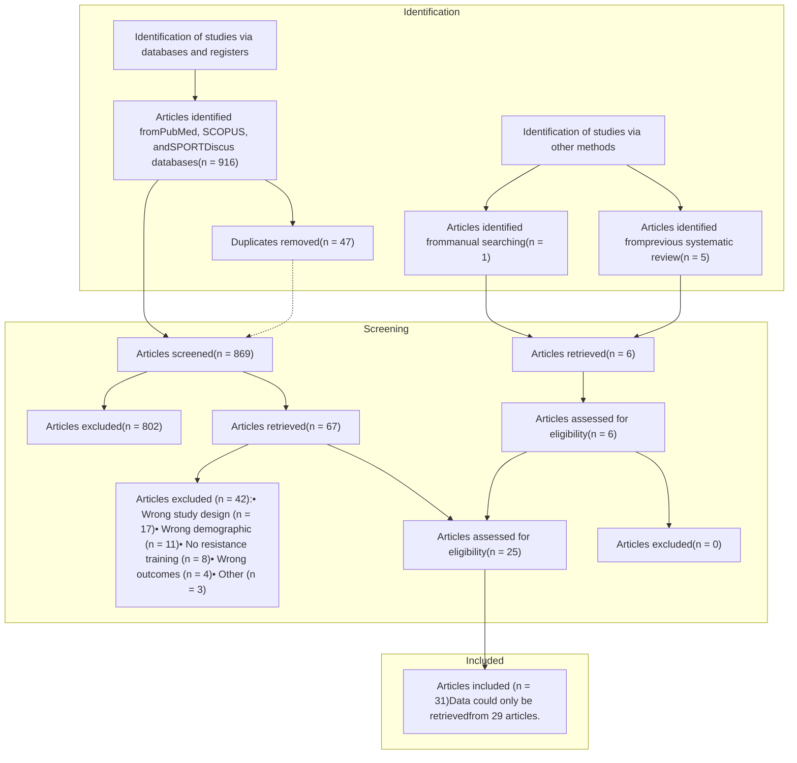

Downloaded from http://journals.lww.com/nsca-scj by BhDMf5ePHKav1zEoum1tQfN4a+kJLhEZgbsIHo4XMi0hCywC X1AWnYQp/IlQrHD3i3D0OdRyi7TvSFl4Cf3VC4/OAVpDDa8KKGKV0Ymy+78= on 01/22/2025

# Effect of Dietary Protein on Fat-Free Mass in Energy Restricted, Resistance-Trained Individuals: An Updated Systematic Review With Meta-Regression

Martin C. Refalo,¹ Eric T. Trexler,² and Eric R. Helms³'⁴

¹Institute for Physical Activity and Nutrition (IPAN), School of Exercise and Nutrition Sciences, Deakin University, Geelong, Australia; ²Department of Evolutionary Anthropology, Duke University, Durham, North Carolina; ³Sport Performance Research Institute New Zealand (SPRINZ), Auckland University of Technology, Auckland, New Zealand; and ⁴Florida Atlantic University, Department of Exercise Science and Health Promotion, Muscle Physiology Laboratory, Boca Raton, Florida

Availability of data and material: All data and code utilized will be openly available on Open Science Framework: https://osf.io/s2bgk/.

Supplemental digital content is available for this article. Direct URL citations appear in the printed text and are provided in the HTML and PDF versions of this article on the journal's Web site (http://journals.lww.com/nsca-scj).

### ABSTRACT

Individuals often restrict energy intake to lose fat mass (and body mass [BM]) while performing resistance training (RT) to retain fat-free mass (FFM). Therefore, the aim of the present systematic review with meta-regression was to explore (a) the pattern and strength of the dose-response relationship between daily dietary protein intake and FFM change, and (b) whether intervention duration, energy deficit magnitude, baseline body fat percentage (BF%), and participant sex influence this relationship. Studies were included if they involved a standardized RT protocol with nonobese, energy-restricted (experiencing fat mass loss) individuals with a minimum of 3 months RT experience. Of 916 retrieved studies, data were extracted from a total of 29 studies. Bayesian methods were used to fit linear and nonlinear meta-regression models and estimate effect sizes, highest density credible intervals, and probabilities. Results suggest a >97% probability of a *linear* dose-response relationship between daily protein intake [g/kgBM: $\beta = 0.07$ (95% highest density interval [HDI]: $-0.01$ to 0.14), and g/kg/FFM: $\beta = 0.06$ (95% HDI: 0.01 to 0.12)] and favorable FFM changes. The relationship is stronger when protein intake is expressed relative to FFM, in interventions longer than 4 weeks, in men, and when BF% is lower. Overall, the heterogeneity between studies renders our findings exploratory.

Address correspondence to Martin C. Refalo, mrefalo@deakin.edu.au.

### INTRODUCTION

Individuals often restrict energy intake to lose fat mass (and body mass [BM]) while performing resistance training (RT) to retain fat-free mass (FFM). This strategy is especially important for individuals attempting to maximize strength or power-to-mass ratio, such as combat athletes (26), sprinters (57), and jumpers (61), as well as weight-restricted strength athletes, such as weight lifters (56) and

**KEY WORDS:**
fat-free mass; protein; lean; deficit

Copyright © National Strength and Conditioning Association. Unauthorized reproduction of this article is prohibited.

Copyright © National Strength and Conditioning Association Strength and Conditioning Journal | www.nsca-scj.com **1**

Downloaded from http://journals.lww.com/nsca-scj by BhDMf5ePHKav1zEoum1tQfN4a+kJLhEZgbsIHo4XMi0hCywC X1AWnYQp/IlQrHD3i3D0OdRyi7TvSFl4Cf3VC4/OAVpDDa8KKGKV0Ymy+78= on 01/22/2025

# Effect of Dietary Protein on Fat-Free Mass

powerlifters (28), and bodybuilders (51). Importantly, multiple factors *mediate* and *moderate* potential FFM loss during energy restriction (Figure 1), which can hinder body composition and competitive outcomes.

A recent meta-regression of 1,213 participants across 52 studies (41) found that larger energy deficits lead to greater FFM loss, even with RT, suggesting that energy deficit magnitude mediates FFM change. Furthermore, baseline body fat percentage (BF%) may moderate this relationship, as Heymsfield and colleagues (20) reported greater FFM loss in men with lower versus higher baseline BF%. Mechanistically, an acute energy deficit suppresses muscle protein synthesis (MPS), and although muscle protein breakdown (MPB) is unaffected among men in the "overweight" body mass index (BMI) category (BMI: 28.6 ± 0.6 kg/m2) (16), MPB may increase alongside this decrease in MPS in leaner individuals in the "normal" BMI range (6,48). Furthermore, if longer-term energy restriction results in low energy availability (i.e., insufficient energy intake to support physiological and training demands), it may negatively affect immune function, sleep quality, hormone production, motivation, RT performance, and MPS (40), indirectly reducing FFM. Maximizing

FFM retention during energy restriction in individuals with lower BF% may, therefore, require specific nutritional manipulation, such as increasing dietary protein intake (18).

In their 2014 systematic review, Helms and colleagues suggested the combination of being lean while energy restricted increases the already high dietary protein requirement of individuals partaking in RT (18). Although not a health *requirement* per se, consuming roughly twice the recommended protein intake or higher (i.e., >1.6 g/kgBM/day) increases FFM to a greater extent during RT, albeit when at or above energy balance (43). Scaling protein to FFM, Helms and colleagues recommended 2.3–3.1 g/kgFFM/day for lean, energy-restricted individuals based on the protein intake ranges of their reviewed groups that increased, maintained, or nonsignificantly decreased FFM (18). Since Helms' publication, numerous reviews went on to suggest the same or similar high protein intake for maximizing FFM retention during energy restriction in lean individuals (2,15,17,42,70). However, the original recommendation is subject to notable limitations. Specifically, while the 2.3–3.1 g/kgFFM/day protein range was *associated* with FFM retention, only 2 reviewed studies specifically had the

research aim of experimentally manipulating protein intake for FFM retention (35,68), and no meta-analysis was conducted. As such, meta-analysis of the updated and relevant literature investigating the effect of dietary protein intake on FFM retention during energy restriction (in nonobese, resistance-trained individuals) is warranted and allows more robust recommendations to be derived from the literature.

## OBJECTIVES

Although consensus dietary protein recommendations based on meta-analysis exist for individuals in states of energy balance or surplus (39,43), consensus recommendations for nonobese, resistance-trained individuals in an energy deficit rest on weaker quality evidence (i.e., systematic review (18)), with no meta-analysis on the topic published to date. Therefore, the present article extends previous findings (18) by including new evidence and using meta-regression to explore (a) the pattern and strength of the dose-response relationship between daily protein intake (g/kgBM and g/kgFFM) and FFM change and (b) whether specific variables (i.e., intervention duration, energy deficit magnitude, baseline BF%, and participant sex) influence this relationship, in energy-restricted, resistance-trained individuals. We used a Bayesian approach for data analysis to improve the interpretation and precision (e.g., "borrowing" of information across studies (29)) of the effect size (ES) estimate, directly model the uncertainty of the ES estimate, and present the results with probabilities and high density credible intervals that allow for meaningful and intuitive inferences (29).

## METHODS

### EXPERIMENTAL APPROACH

A systematic review and meta-analysis were performed in accordance with the Preferred Reporting Items for Systematic Reviews and Meta-Analyses (PRISMA) guidelines (2). The original protocol was registered with Open Science Framework in May 2024.

Figure 1. Mediators and moderators of fat-free mass change during energy restriction investigated in this systematic review with meta-regression. Moderators are conditions under which energy restriction may influence fat-free mass retention, whereas mediators are affected by energy restriction and may therefore influence fat-free mass retention.

2 VOLUME 00 | NUMBER 00 | MONTH 2025
Copyright © National Strength and Conditioning Association. Unauthorized reproduction of this article is prohibited.

Downloaded X1AWnYQp/IlQrHD3i3D0OdRyi7TvSFl4Cf3VC4/OAVpDDa8KKGKV0Ymy+78= on 01/22/2025 from http://journals.lww.com/nsca-scj by BhDMf5ePHKav1zEoum1tQfN4a+kJLhEZgbsIHo4XMi0hCywC

(https://osf.io/s2bgk/). Since then, it was slightly adjusted to improve the suitability of the analysis with the available data. Only 5 studies (5,19,35,49,68) involving experimental comparisons of higher versus lower protein intakes qualified for meta-analysis. This was deemed to be an insufficient amount of data to justify conducting the meta-analysis.

## RESEARCH QUESTION(S)

The research question(s) were defined using the participants, interventions, comparisons, outcomes, and study design framework. The meta-regression included any study that reported protein intake and FFM change across an RT intervention within the target population. As such, the primary research question was: *"What magnitudes of FFM change are associated with a given protein intake in non-obese (BF % $\leq$ 27.8% for males and $\leq$ 39.7% for females), energy restricted, resistance-trained individuals following an RT intervention?"* To facilitate the interpretation of this research question, we also investigated whether intervention duration, energy deficit magnitude, baseline BF %, or participant sex had a moderating effect on the pooled ES estimate.

## INCLUSION CRITERIA

Studies were included if (a) they were longitudinal trials reporting the required information; (b) participants were apparently healthy, young to middle-aged (18–50-year-old), nonobese (men $\leq$ 27.8% and women $\leq$ 39.7% body fat) adults with a minimum of 3-months RT experience; (c) the intervention or observation period included a standardized RT protocol completed 1 or more times per week, or participants were told to continue performing their habitual RT protocol; (d) the intervention or observation period was at least 7 days in duration (based on the shortest intervention duration from the previously published systematic review (18)) and involved energy restriction (prescribed or unprescribed) that successfully induced fat mass loss during the intervention or observation period. The BF% cutoff points were

chosen based on data across 3,517 adults (<30 years of age), suggesting body fat above 27.8% for men and 39.7% for women had low-to-acceptable power for predicting cardiometabolic risk factors (45). Studies were excluded if (a) participants were receiving hormone replacement therapy or using anabolic exogenous hormones or (b) participants were using supplements (other than protein powder or amino acids) known to influence muscle size. Only original research articles (English language) in peer-reviewed journals were included. Case studies were excluded.

## LITERATURE SEARCH STRATEGY

The literature search updated a previously published systematic review (18) following the PRISMA guidelines (46). The previously published systematic review (18) was restricted to studies published before January 2013, so we conducted an updated search of the PubMed, SCOPUS, and SPORTDiscus databases on the 20^th of May, 2024. This search was restricted to articles published after January 2013 and used the following search terms that were adapted for each individual database: "resistance training" OR "resistance exercise" OR "strength training" AND "protein" OR "protein intake" AND "muscle hypertrophy" OR "muscle size" OR "muscle growth" OR "muscle mass" OR "lean body mass" OR "fat free mass" AND "diet" OR "energy deficit" OR "energy restricted" OR "calorie deficit" OR "calorie restricted." Search terms were added using the NOT term to reduce the number of irrelevant studies according to exclusion criteria (e.g., older, elderly, sarcopenia, cancer). Studies identified in this updated search were added to the studies published before 2013 ($n = 6$) that were included in the previously published systematic review on this topic (18). The reference lists of 2 previous meta-analyses (7,53) were also manually checked for relevant studies. Only studies conducted in humans were included.

## STUDY SELECTION

Covidence software (Veritas Health Innovations, Melbourne, Australia) was used to manage and conduct the systematic study selection process, including the removal of duplicates and the exclusion of ineligible studies at each stage of the screening process. An overview of the article identification process is shown in Figure 2. The article identification process was completed independently to reduce bias by 2 authors (M.C.R. and E.T.T.) with any disagreement resolved by discussion with E.R.H. Finally, M.C.R. and E.T.T. reviewed the full texts to determine inclusion eligibility based on predetermined criteria. Any studies added through reference checking or manual searching were subjected to the same screening process as if they were found in the initial database search.

## DATA EXTRACTION

Data charting was performed by the principal investigator (M.C.R.) to capture key information in a table (https://osf.io/s2bgk/). The following participant characteristics were extracted: (a) years of RT experience, (b) age, (c) sex, and (d) baseline fat mass and BF%. If RT experience was not explicitly reported, the minimum years of RT experience required for inclusion was extracted. The following article characteristics were also extracted: (a) first author, (b) sample size, (c) publication year, (d) intervention groups and protocol outlines (including average protein intake and calorie deficit size), (e) intervention duration and weekly RT sessions completed, (f) fat mass loss, and (g) raw data from preintervention and postintervention for all relevant outcome measures (where figures were used instead of numerical data: (a) authors were contacted, or (b) data were extracted using Web Plot Digitizer). If specific data (e.g., fat mass) were not reported and unable to be obtained from authors, values were estimated with the data provided (e.g., body weight and total BF%). Where data at multiple time points were provided, the mean score was extracted and used for data

Strength and Conditioning Journal | www.nsca-scj.com 3
Copyright © National Strength and Conditioning Association. Unauthorized reproduction of this article is prohibited.

Downloaded X1AWnYQp/IlQrHD3i3D0OdRyi7TvSFl4Cf3VC4/OAVpDDa8KKGKV0Ymy+78= on 01/22/2025 from http://journals.lww.com/nsca-scj by BhDMf5ePHKav1zEoum1tQfN4+kJLhEZgbsIHo4XMi0hCywC

# Effect of Dietary Protein on Fat-Free Mass

Figure 2. PRISMA flow chart. Summary of systematic literature search and article selection process.

analysis (e.g., protein intake in the early, middle, and late phases of the intervention). Owing to the absence of energy expenditure data in most studies, we quantified energy deficits through changes in fat mass (9,400 kcal per kg (41)) and FFM (1816.44 kcal per kg (14)) across the intervention (Table 1).

## METHODOLOGICAL QUALITY ASSESSMENT

Evaluation of methodological study quality (including risk of bias) was conducted by M.C.R. using the tool for the assessment of study quality and reporting in exercise (TESTEX) scale (19). Ambiguities in methodological quality assessment were resolved by discussion between M.C.R. and E.T.T. The scale contains 12 criteria scored dichotomously: 1, eligibility; 2, randomization; 3, allocation concealment; 4, groups similar at baseline; 5, assessor blinding; 6, outcome measures assessed in 85%

of patients (3 possible points); 7, intention-to-treat; 8, between-group statistical comparisons (2 possible points); 9, point-estimates of all measures included; 10, activity monitoring in control groups; 11, relative exercise intensity remained constant; and 12, exercise parameters recorded. The best possible score is 15 points. Sensitivity analyses were conducted to investigate whether study quality (as assessed by

the TESTEX scale (58)) influenced the overall outcomes.

## STATISTICAL ANALYSIS

A Bayesian meta-regression using the "brms" (Bürkner, 2023) package in R (v 4.0.2; R Core Team, https://www.r-project.org/) was performed. The extracted data and R code can be found on the Open Science Framework (https://osf.io/s2bgk/). Raw changes in FFM (or lean body mass) from

<table>
  <thead>
    <tr>
        <th colspan="2">Table 1 Equations for calculating energy deficit magnitudes based on fat mass and fat-free mass changes</th>
    </tr>
    <tr>
        <th>Primary equation</th>
        <th>Secondary equations</th>
    </tr>
  </thead>
  <tbody>
    <tr>
        <td>$$\frac{9400 \times FM\ Loss + 1816.44 \times \Delta FFM}{Number\ of\ Days\ in\ Deficit}$$</td>
        <td>Pre FM - Post FM = FM Loss (kg)</td>
    </tr>
    <tr>
        <td> </td>
        <td>Post FFM - Pre FFM = $\Delta$FFM (kg)</td>
    </tr>
  </tbody>
</table>

Fat mass was assumed to store 9,400 kcal per kg, and fat-free mass was assumed to store 1816.44 kcal per kg. Number of days in a deficit were calculated by multiplying the intervention weeks with 7.

FFM = fat-free mass; FM = fat mass; kg = kilograms.

4 | VOLUME 00 | NUMBER 00 | MONTH 2025
Copyright © National Strength and Conditioning Association. Unauthorized reproduction of this article is prohibited.

Downloaded X1AWnYQp/IlQrHD3i3D0OdRyi7TvSFl4Cf3VC4/OAVpDDa8KKGKV0Ymy+78= on 01/22/2025 from http://journals.lww.com/nsca-scj by BhDMf5ePHKav1zEoum1tQfN4a+kJLhEZgbsIHo4XMi0hCywC

preintervention to postintervention for all experimental groups were extracted from each study. Where possible, individual participant data were obtained from authors, and the pretest to posttest correlation coefficients ($r$ value) were calculated. The mean correlation coefficient value was subsequently calculated and used for studies where individual participant data could not be obtained. Most studies reported multiple observations, and some reported multiple observations in the same group (cross-over designs); as such, we nested random effects in the models (i.e., observations were nested within groups, which were nested within studies). ESs were estimated as standardized mean changes in FFM for each experimental group using the "escalc" function in the "metafor" (Viechtbauer, 2010) package following instructions for pretest to posttest study designs as per Morris (38) with an adjustment for small sample size bias (see Table 1.1, Supplemental Digital Content 1, http://links.lww.com/SCJ/A418). All group-level ESs were included in a meta-regression with protein intake (as g/kgBM/day and g/kgFFM/day) fitted as the primary continuous predictor. To explore the pattern of the dose-response relationship between protein intake and FFM change, linear and nonlinear (i.e., quadratic and cubic) Bayesian meta-regressions were generated with and without additional predictors (see Table 1.2, Supplemental Digital Content 1, http://links.lww.com/SCJ/A418): (a) intervention duration (weeks), (b) energy deficit magnitude (kcal), (c) baseline BF%, and (d) participant sex. Bayes factors using the "bayestestR" package (Makowski, 2019) were used to compare model fit and determine the "best fit" model, along with the widely applicable information criterion and leave-one-out cross-validation (See Figures 3.1 and 3.2, Supplemental Digital Content 1, http://links.lww.com/SCJ/A418). To investigate specific hypotheses about the effect of certain predictors, the structure of the best fit model (e.g., linear or non-linear, and with or without

additional predictors) was used to conduct secondary subgroup analyses with *categorical* predictors of interest. Predictors were categorized by the distribution of data and domain-specific expertise of the researchers. Noninformative priors (i.e., default "brms" priors) were used for all model parameters and outcome measures. Posterior draws were extracted using "tidybayes" (Kay, 2023) and ESs using "emmeans" (Lenth, 2023). Inferences were made from posterior distributions generated using the Hamiltonian Markov Chain Monte Carlo method and by the use of highest density credible intervals (HDI). Interpretations were based on the median marginal slope of the main effect of dietary protein intake on FFM change and its probability from 0 to 100% of being positive or negative (calculated manually by examining the proportion of posterior draws that meet the criteria of interest [e.g., >0] and described as the probability of direction). Both R² and I² statistics were calculated to assess the proportion of variance in ES estimates explained by the predictor(s) and the variance in ES estimates due to study heterogeneity rather than within-study sampling error, respectively. Small-study effects were visually assessed using funnel plots.

# RESULTS

## SEARCH RESULTS AND STUDY CHARACTERISTICS

A total of 31 studies met the inclusion criteria; however, data from 2 studies (11,54) could not be extracted despite author correspondence. A PRISMA diagram of the systematic literature search and study selection process is displayed in Figure 1. Funnel plot visual inspection (see File 4.1, Supplemental Digital Content 1, http://links.lww.com/SCJ/A418) identified no outliers. Important study characteristics related to the statistical analysis are visualized in Figure 3, and the following qualitative overview involves data from the 29 included studies. Data from 455 male and 274 female participants were obtained, with the male participants'

mean age being 24.8 ± 4.1 (range: 19.3 to 31.7) and female participants' 24.7 ± 5 (range: 20.7 to 30.7) years. Many studies did not report years of RT experience, making participant mean RT experience unclear. However, minimum years of required RT experience ranged from 3 months to 5 years. FFM outcomes ($n = 61$) were extracted with the following measures: (a) dual energy x-ray absorptiometry ($n = 34$), (b) bioelectrical impedance analysis ($n = 10$), (c) ultrasound ($n = 8$), (d) hydrostatic weighing ($n = 5$), and (e) anthropometric testing ($n = 4$). Study durations ranged from 1 to 21 weeks, with a mean of 8 weeks. For secondary subgroup analysis, intervention duration was categorized as ≤ 4 and > 4 weeks, as interventions ≤ 4 weeks may be susceptible to fluid alterations that influence FFM changes (4,52). Estimated energy deficit magnitudes ranged from 36 to 4,637 kcal (mean = 557 kcal), resulting in a mean fat mass loss of ~14% (~2–~68%) from baseline. Energy deficit magnitude was categorized by a median split (≤300 kcal and > 300 kcal) for secondary subgroup analysis. For statistical analysis, some energy deficit values were considered extreme and potentially implausible (>2000) and were thus replaced with the median energy deficit value (304 kcal). Sensitivity analyses were performed, showing weak evidence for a better model fit when extreme energy deficit values were replaced with the median (see Figures 2.2.1 and 2.2.2, Supplemental Digital Content 1, http://links.lww.com/SCJ/A418). Participant baseline BF% ranged from 7.5 to 27.4% for male participants (mean = 16%) and 17.9–35% for female participants (mean = 27.4%). Male BF% was split into quartiles and categorized into low (first quartile), medium (second and third quartiles), and high (fourth quartiles) for secondary subgroup analysis (low = <12.2%, medium = >12.2% and ≤18.9%, high = >18.9%). Considering the lower end of a healthy BF% is approximately 8% higher in female participants than male participants

Strength and Conditioning Journal | www.nsca-scj.com 5
Copyright © National Strength and Conditioning Association. Unauthorized reproduction of this article is prohibited.

Downloaded from http://journals.lww.com/nsca-scj by BhDMf5ePHKav1zEoum1tQfN4a+kJLhEZgbsIHo4XMi0hCywC X1AWnYQp/IlQrHD3i3D0OdRyi7TvSFl4Cf3VC4/OAVpDDa8KKGKV0Ymy+78= on 01/22/2025

# Effect of Dietary Protein on Fat-Free Mass

Figure 3. Key characteristics from each group within the included studies. Data are presented as raincloud plots with each dot point representing a group-level effect included in the meta-regression. Energy deficit magnitude does not include extreme values (>2000) that were replaced with the median.

(1), female ranges were developed by adding 8% to that of male participants (low = < 20.2%, medium = >20.2% and ≤ 26.9%, high = >26.9%). Dietary protein intake per kilogram of BM ranged from 0.8 to 3.2 g (mean = 1.8 g), and protein intake per kilogram of FFM ranged from 0.9 to 4.2 g (mean = 2.4 g). Of the 29 included studies, 13 prescribed RT (8,9,19,21,22,24,25,31–

35,44,47,49,50); however, the remaining studies instructed participants to continue their habitual RT (3,5,10,13,36,37,53,55,59,63,66–68). Extracting accurate RT characteristics from many studies was, therefore, not possible as not all variables were reported in studies where participants followed their habitual RT. A comprehensive overview of all studies (including limited

RT characteristics) is in the “data extraction” table on Open Science Framework (https://osf.io/s2bgk/).

## META-REGRESSIONS

Model comparison results and further details relevant to statistical modeling are in the Supplementary File. Five group-level observations from 3 studies (3,25,50) were deemed outliers as they

6 | VOLUME 00 | NUMBER 00 | MONTH 2025
Copyright © National Strength and Conditioning Association. Unauthorized reproduction of this article is prohibited.

Downloaded X1AWnYQp/IlQrHD3i3D0OdRyi7TvSFl4Cf3VC4/OAVpDDa8KKGKV0Ymy+78= on 01/22/2025 from http://journals.lww.com/nsca-scj by BhDMf5ePHKav1zEoum1tQfN4a+kJLhEZgbsIHo4XMi0hCywC

(a) highly influenced the ES estimate and (b) negatively affected the model’s predictive performance (see Figure 2.1.1, Supplemental Digital Content 1, http://links.lww.com/SCJ/A418). Outliers were removed, and meta-regression models were refit, with Bayes Factor comparisons indicating removal minimized their disproportionate influence and enhanced the accuracy of our findings by an improved model fit. Outlier identification sensitivity analysis is displayed in Supplemental Digital Content (see Figure 2.1.2, http://links.lww.com/SCJ/A418).

**Daily dietary protein intake—grams per kilogram of body mass.** Bayes Factor model comparisons revealed the linear model, without additional predictors, provided the best fit (see Figure 3.1, Supplemental Digital Content 1, http://links.lww.com/SCJ/A418). The linear meta-regression model (including 56 outcomes from 27 studies) estimated a positive median slope ($\beta = 0.07$ [95% HDI: $-0.01$ to $0.14$]) for the effect of daily dietary protein intake on FFM change, reflecting a typical

ES increase of 0.07 for each 1-unit increase in protein intake (g/kgBM/day) (Figure 4). In addition, there was a 97% probability that FFM change becomes more positive as daily protein intake (g/kgBW) increases. Furthermore, approximately 55% ($R^2\text{conditional}$) of the variance in FFM change was explained by protein intake and random effects (across study, group, and observation levels), representing a moderate-to-strong model fit and explanatory power with a 95% HDI of 34–71% and reasonable precision (SE = 0.09). Of this variance, most is attributed to the study level ($I^2\text{study} = 85\%$; $I^2\text{group} = 8\%$; $I^2\text{observation} = 3\%$). Secondary subgroup analyses are displayed in Table 2 and Supplemental Digital Content (see Figure 6.1, http://links.lww.com/SCJ/A418). Supplemental Digital Content (see Figure 7.1, http://links.lww.com/SCJ/A418) for forest plot displaying study-level ESs.

**Dietary protein intake—grams per kilogram of fat-free mass.** Bayes Factor model comparisons revealed the linear model, without additional predictors, provided the best fit (see Figure 3.2, Supplemental Digital

Content 1, http://links.lww.com/SCJ/A418). The linear meta-regression model (including 55 outcomes from 26 studies) estimated a positive median slope ($\beta = 0.06$ [95% HDI: $0.01$ to $0.12$]) of daily dietary protein intake on FFM change, reflecting a typical ES increase of 0.06 for each 1-unit increase in protein intake (g/kgFFM/day) (Figure 5). In addition, there was a 99% probability that FFM change becomes more positive as daily protein intake (g/kgFFM) increases. Furthermore, approximately 54% ($R^2\text{conditional}$) of the variance in FFM change was explained by protein intake and random effects (across study, group, and observation levels), representing a moderate-to-strong model fit and explanatory power with a 95% HDI of 33–71% and reasonable precision (SE = 0.09). Of this variance, most is attributed to the study level ($I^2\text{study} = 83\%$; $I^2\text{group} = 9\%$; $I^2\text{observation} = 4\%$). Secondary subgroup analyses are displayed in Table 2 and Supplemental Digital Content (see Figure 6.2, http://links.lww.com/SCJ/A418). Supplemental Digital Content (see Figure 7.2, http://links.lww.com/SCJ/A418) for forest plot displaying study-level ESs.

<table>
  <thead>
    <tr>
        <th>Dietary Protein Intake (g/kgBM)</th>
        <th>Standardised Mean Change (FFM)</th>
    </tr>
  </thead>
  <tbody>
    <tr>
        <td>1.1</td>
        <td>-0.25</td>
    </tr>
    <tr>
        <td>1.2</td>
        <td>0.18</td>
    </tr>
    <tr>
        <td>1.3</td>
        <td>-0.22</td>
    </tr>
    <tr>
        <td>1.4</td>
        <td>-0.15</td>
    </tr>
    <tr>
        <td>1.5</td>
        <td>0.08</td>
    </tr>
    <tr>
        <td>1.6</td>
        <td>-0.05</td>
    </tr>
    <tr>
        <td>1.7</td>
        <td>0.15</td>
    </tr>
    <tr>
        <td>1.8</td>
        <td>-0.10</td>
    </tr>
    <tr>
        <td>1.9</td>
        <td>0.05</td>
    </tr>
    <tr>
        <td>2.0</td>
        <td>0.12</td>
    </tr>
    <tr>
        <td>2.1</td>
        <td>0.18</td>
    </tr>
    <tr>
        <td>2.2</td>
        <td>-0.02</td>
    </tr>
    <tr>
        <td>2.3</td>
        <td>0.08</td>
    </tr>
    <tr>
        <td>2.4</td>
        <td>0.15</td>
    </tr>
    <tr>
        <td>2.5</td>
        <td>0.35</td>
    </tr>
    <tr>
        <td>2.6</td>
        <td>0.25</td>
    </tr>
    <tr>
        <td>2.7</td>
        <td>-0.20</td>
    </tr>
    <tr>
        <td>3.1</td>
        <td>0.28</td>
    </tr>
  </tbody>
</table>

Figure 4. Best fit linear meta-regression displaying the relationship between daily protein intake (grams per kilogram of body mass) and fat-free mass change across a resistance training intervention in energy-restricted individuals. Dot points represent estimated group-level standardized mean changes, with dot size representing its weight determined by inverse variance weighting. Shaded region around regression line represents highest density credible intervals categorized as 50% (darkest red), 80%, and 95% (lightest red).

Strength and Conditioning Journal | www.nsca-scj.com 7
Copyright © National Strength and Conditioning Association. Unauthorized reproduction of this article is prohibited.

Downloaded from http://journals.lww.com/nsca-scj by BhDMf5ePHKav1zEoum1tQfN4a+kJLhEZgbsIHo4XMi0hCywC X1AWnYQp/IlQrHD3i3D0OdRyi7TvSFl4Cf3VC4/OAVpDDa8KKGKV0Ymy+78= on 01/22/2025

# Effect of Dietary Protein on Fat-Free Mass

<table>
  <thead>
    <tr>
        <th>Dietary Protein Intake (g/kg FFM)</th>
        <th>Standardised Mean Change in FFM</th>
    </tr>
  </thead>
  <tbody>
    <tr>
        <td>1.0</td>
        <td>-0.25</td>
    </tr>
    <tr>
        <td>1.1</td>
        <td>-0.05</td>
    </tr>
    <tr>
        <td>1.2</td>
        <td>-0.02</td>
    </tr>
    <tr>
        <td>1.3</td>
        <td>-0.15</td>
    </tr>
    <tr>
        <td>1.4</td>
        <td>-0.10</td>
    </tr>
    <tr>
        <td>1.5</td>
        <td>-0.08</td>
    </tr>
    <tr>
        <td>1.6</td>
        <td>0.18</td>
    </tr>
    <tr>
        <td>1.7</td>
        <td>-0.05</td>
    </tr>
    <tr>
        <td>1.8</td>
        <td>0.05</td>
    </tr>
    <tr>
        <td>1.9</td>
        <td>0.08</td>
    </tr>
    <tr>
        <td>2.0</td>
        <td>0.02</td>
    </tr>
    <tr>
        <td>2.1</td>
        <td>0.12</td>
    </tr>
    <tr>
        <td>2.2</td>
        <td>0.05</td>
    </tr>
    <tr>
        <td>2.3</td>
        <td>0.20</td>
    </tr>
    <tr>
        <td>2.4</td>
        <td>0.15</td>
    </tr>
    <tr>
        <td>2.5</td>
        <td>0.10</td>
    </tr>
    <tr>
        <td>2.6</td>
        <td>0.08</td>
    </tr>
    <tr>
        <td>2.7</td>
        <td>0.05</td>
    </tr>
    <tr>
        <td>2.8</td>
        <td>0.22</td>
    </tr>
    <tr>
        <td>2.9</td>
        <td>0.02</td>
    </tr>
    <tr>
        <td>3.0</td>
        <td>0.05</td>
    </tr>
    <tr>
        <td>3.1</td>
        <td>0.35</td>
    </tr>
    <tr>
        <td>3.2</td>
        <td>-0.18</td>
    </tr>
    <tr>
        <td>3.3</td>
        <td>0.28</td>
    </tr>
    <tr>
        <td>3.4</td>
        <td>0.22</td>
    </tr>
    <tr>
        <td>3.5</td>
        <td>0.05</td>
    </tr>
    <tr>
        <td>3.6</td>
        <td>0.10</td>
    </tr>
    <tr>
        <td>4.1</td>
        <td>0.10</td>
    </tr>
  </tbody>
</table>

**Figure 5.** Best fit linear meta-regression displaying the relationship between daily protein intake (grams per kilogram of fat-free mass) and fat-free mass change across a resistance training intervention in energy-restricted individuals. Dot points represent estimated group-level standardized mean changes, with dot size representing its weight determined by inverse variance weighting. Shaded region around regression line represents highest density credible intervals categorized as 50% (darkest orange), 80%, and 95% (lightest orange).

## METHODOLOGICAL QUALITY

A detailed overview of the methodological quality of included studies using the TESTEX scale (58) is in Supplemental Digital Content (see Table 5.1, http://links.lww.com/SCJ/A418). Study quality ranged from 2 to 15 (out of a possible 15), with mean and median scores of 8. Although each study had some risk of bias, many lost points because they lacked (a) an intention-to-treat analysis, (b) blinding of assessors, or (c) activity monitoring. Furthermore, 16 (8,9,19,21,22,24,25,31–35,44,47,49,50) of 29 studies instructed participants to continue their habitual RT, losing points for not reporting (a) exercise adherence and (b) program variables (intensity, frequency, volume, etc). Overall, 12 of 29 studies scored highly (>10). Sensitivity analyses based on study quality scores identified no influence on the overall standardized mean change in FFM (see Figures 5.1 and 5.2, Supplemental Digital Content 1, http://links.lww.com/SCJ/A418).

## DISCUSSION

The purpose of this systematic review with meta-regression was to update dietary protein intake recommendations for energy-restricted, nonobese, resistance-trained individuals with higher quality evidence. Prior recommendations were derived from a 2014 systematic review of only 6 studies (18). Primarily, and in support of previous recommendations, our data suggest a *linear* dose-response relationship between daily protein intake (g/kgBM and g/kg/FFM) and favorable FFM changes in RT individuals undergoing energy restriction. Secondarily, this relationship is stronger when protein intake is expressed relative to FFM, in interventions longer than 4 weeks, in male participants, and when baseline BF% is lower. We intended to perform a meta-analysis of studies directly comparing groups with different protein intakes, but only 5 studies were eligible. We deemed this small group of studies insufficient for a precise, informative outcome and opted instead to analyze the data using meta-regression. The meta-regression models presented are *exploratory*, as included studies (a) may not have compared higher versus lower protein intakes in a controlled setting, and (b) involve intervention heterogeneity (e.g., different RT protocols). Nonetheless, our findings update dietary protein intake recommendations for the target population and increase their strength of evidence (Figure 6).

The results of the best fit meta-regression models indicate for each additional gram of dietary protein consumed per kilogram of BM ($\beta = 0.07$) or FFM ($\beta = 0.06$), there is high probability (>97%) of a favorable change in FFM; such that increasing protein intake leads to either lower FFM loss or larger FFM gain. However, increasing protein intake from the lowest (0.8 g/kg/BM/day and 0.9 g/kg/FFM/day) to the highest (3.2 g/kg/BM/day or 4.2 g/kg/FFM/day) analyzed intakes results in only a "small" ES difference (60). The present best fit models have moderate-to-strong explanatory power, with protein intake and random effects (studies, groups, and observations) accounting for ~54–55% of the variance in FFM change. Of this variance, ~83–85% is due to substantial heterogeneity in study design. Indeed, a robust RT stimulus is likely more important for retaining FFM during energy restriction than dietary

8 VOLUME 00 | NUMBER 00 | MONTH 2025
Copyright © National Strength and Conditioning Association. Unauthorized reproduction of this article is prohibited.

Downloaded from http://journals.lww.com/nsca-scj by BhDMf5ePHKav1zEoum1tQfN4a+kJLhEZgbsIHo4XMi0hCywC X1AWnYQp/IlQrHD3i3D0OdRyi7TvSFl4Cf3VC4/OAVpDDa8KKGKV0Ymy+78= on 01/22/2025

# Table 2
## Secondary subgroup analyses of intervention duration, energy deficit magnitude, baseline body fat (%), and participant sex for daily protein intake (g) per kilogram of body mass and fat-free mass

<table>
  <thead>
    <tr>
        <th>Categorical variable</th>
        <th>β estimate</th>
        <th>HDI</th>
        <th>pd</th>
        <th>Obs</th>
    </tr>
  </thead>
  <tbody>
    <tr>
        <td colspan="5">Dietary protein intake (g)—per kilogram of body mass</td>
    </tr>
    <tr>
        <td colspan="5">Study duration</td>
    </tr>
    <tr>
        <td>≤4 Weeks</td>
        <td>0.05</td>
        <td>-0.06 to 0.15</td>
        <td>80%</td>
        <td>21</td>
    </tr>
    <tr>
        <td>4 Weeks</td>
        <td>0.07</td>
        <td>-0.05 to 0.18</td>
        <td>88%</td>
        <td>34</td>
    </tr>
    <tr>
        <td colspan="5">Energy deficit (kcal/d)</td>
    </tr>
    <tr>
        <td>≤300 kcal</td>
        <td>0.08</td>
        <td>-0.07 to 0.22</td>
        <td>85%</td>
        <td>28</td>
    </tr>
    <tr>
        <td>300 kcal</td>
        <td>0.04</td>
        <td>-0.04 to 0.14</td>
        <td>84%</td>
        <td>28</td>
    </tr>
    <tr>
        <td colspan="5">Body fat percentage</td>
    </tr>
    <tr>
        <td>Low BF%</td>
        <td>0.14</td>
        <td>-0.04 to 0.31</td>
        <td>93%</td>
        <td>10</td>
    </tr>
    <tr>
        <td>Medium BF %</td>
        <td>0.10</td>
        <td>-0.05 to 0.24</td>
        <td>91%</td>
        <td>18</td>
    </tr>
    <tr>
        <td>High BF%</td>
        <td>0.04</td>
        <td>-0.06 to 0.14</td>
        <td>78%</td>
        <td>28</td>
    </tr>
    <tr>
        <td colspan="5">Participant sex</td>
    </tr>
    <tr>
        <td>Male</td>
        <td>0.09</td>
        <td>0.00 to 0.19</td>
        <td>98%</td>
        <td>34</td>
    </tr>
    <tr>
        <td>Female</td>
        <td>0.05</td>
        <td>-0.06 to 0.16</td>
        <td>81%</td>
        <td>22</td>
    </tr>
    <tr>
        <td colspan="5">Dietary protein intake (g)—per kilogram of fat-free mass</td>
    </tr>
    <tr>
        <td colspan="5">Study duration</td>
    </tr>
    <tr>
        <td>≤4 Weeks</td>
        <td>0.04</td>
        <td>-0.04 to 0.13</td>
        <td>83%</td>
        <td>21</td>
    </tr>
    <tr>
        <td>4 Weeks</td>
        <td>0.07</td>
        <td>-0.01 to 0.16</td>
        <td>95%</td>
        <td>33</td>
    </tr>
    <tr>
        <td colspan="5">Energy deficit (kcal/d)</td>
    </tr>
    <tr>
        <td>≤300 kcal</td>
        <td>0.07</td>
        <td>-0.05 to 0.20</td>
        <td>89%</td>
        <td>27</td>
    </tr>
    <tr>
        <td>300 kcal</td>
        <td>0.05</td>
        <td>-0.02 to 0.12</td>
        <td>93%</td>
        <td>28</td>
    </tr>
    <tr>
        <td colspan="5">Body fat percentage</td>
    </tr>
    <tr>
        <td>Low BF%</td>
        <td>0.12</td>
        <td>-0.03 to 0.27</td>
        <td>94%</td>
        <td>10</td>
    </tr>
    <tr>
        <td>Medium BF %</td>
        <td>0.07</td>
        <td>-0.05 to 0.20</td>
        <td>89%</td>
        <td>17</td>
    </tr>
    <tr>
        <td>High BF%</td>
        <td>0.03</td>
        <td>-0.04 to 0.11</td>
        <td>78%</td>
        <td>28</td>
    </tr>
    <tr>
        <td colspan="5">Participant sex</td>
    </tr>
    <tr>
        <td>Male</td>
        <td>0.09</td>
        <td>0.01 to 0.17</td>
        <td>99%</td>
        <td>34</td>
    </tr>
    <tr>
        <td>Female</td>
        <td>0.02</td>
        <td>-0.06 to 0.11</td>
        <td>69%</td>
        <td>21</td>
    </tr>
    <tr>
        <td colspan="5">Estimate of coefficient (β) presented as a median value.</td>
    </tr>
    <tr>
        <td colspan="5">pd = probability of direction; Obs = observations.</td>
    </tr>
  </tbody>
</table>

protein intake. For example, Longland and colleagues (30) observed no mean loss of lean body mass (+0.1 ± 1.0 kg) in male participants undergoing 4 weeks of 40% energy restriction consuming 1.2 g/kgBM/day of protein (an amount associated with a mean reduction in FFM in the present analysis) while performing sprint interval cycling 2×/week, plyometrics 2×/week, and RT 2×/week with the final set per exercise

Strength and Conditioning Journal | www.nsca-scj.com **9**
Copyright © National Strength and Conditioning Association. Unauthorized reproduction of this article is prohibited.

Effect of Dietary Protein on Fat-Free Mass
Downloaded from http://journals.lww.com/nsca-scj by BhDMf5ePHKav1zEoum1tQfN4a+kJLhEZgbsIHo4XMi0hCywC on 01/22/2025

# Refalo et al. Protein Intake and Fat-Free Mass Retention During Energy Restriction

**Daily Dietary Protein Intake (g)**

**Per Kilogram of Body Mass**

**Per Kilogram of Fat-Free Mass**

For each additional gram of protein consumed from 0.8g to 3.2g, there is a 97% probability of improved FFM retention.

For each additional gram of protein consumed from 0.9g to 4.2g, there is a 99% probability of improved FFM retention.

***Resistance-Trained, Lean (BF%: Female = <39%, Male = <28%), Energy Restricted Individuals***

**These findings may inform dietary protein intake prescription for lean individuals requiring maximal fat-free mass retention during energy restriction.**

Protein intakes up to 3.2 g/kgBM and 4.2 g/kgFFM are linearly associated with larger FFM gain and may be prescribed if FFM retention is of utmost importance.

* Dietary protein should inversely scale with BF%, such that leaner individuals select higher protein targets than those with a higher BF%.

* Increasing protein intake during energy restriction means reducing fat or carbohydrate intake, which could affect health, training performance, or dietary adherence.

* Resistance training and energy deficit magnitude also have a meaningful influence on FFM retention during energy restriction and should be considered.

Protein intakes up to 1.9 g/kgBM or 2.5 g/kgFFM, on average, are associated with less FFM loss and may be suited to non-athletes who don't require maximal FFM retention.

* The effect magnitude of higher protein intakes is small and influenced by variables not controlled for, which non-athletes should attempt to prioritize (e.g., resistance training).

* Females may not benefit (as much as males) from higher protein intakes during energy restriction, but more data are needed to support this hypothesis.

* Individuals who are not within the BF% ranges analyzed may not benefit from the high protein intakes recommended, and may be more flexible with their targets.

Improved FFM Retention **BF%** = Body Fat % **BM** = Body Mass **FFM** = Fat-Free Mass

(Labels from diagram: 3g/kgBM, 2g/kgBM, 1g/kgBM, 4g/kgFFM, 3g/kgFFM, 2g/kgFFM, 1g/kgFFM)

Figure 6. Graphical overview of practical applications.

performed to volitional failure. The comparator high-protein group consumed twice as much protein (2.4 g/kgBM/day), and while they gained significantly more lean body mass (+1.2 ± 1.0 kg), the difference (1.1 kg) was modest. As such, it is plausible that the quality of RT performed by participants across the included studies highly influenced the FFM outcomes. Overall, while there is strong evidence for a linear relationship between dietary protein intake and favorable FFM change, the effect magnitude is small and likely influenced by variables not controlled for within the meta-regression models (e.g., RT protocol characteristics). Nonetheless, these findings may be relevant for those benefitting from small advantages, such as

10 VOLUME 00 | NUMBER 00 | MONTH 2025
Copyright © National Strength and Conditioning Association. Unauthorized reproduction of this article is prohibited.

Downloaded from http://journals.lww.com/nsca-scj by BhDMf5ePHKav1zEoum1tQfN4a+kJLhEZgbsIHo4XMi0hCywC X1AWnYQp/IlQrHD3i3D0OdRyi7TvSFl4Cf3VC4/OAVpDDa8KKGKV0Ymy+78= on 01/22/2025

athletes (e.g., weight-restricted combat and strength athletes and bodybuilders), of whom FFM loss would be detrimental to competitive outcomes.

Although similar, the model for dietary protein intake expressed relative to FFM had a higher probability of favorably influencing FFM change than the model with protein expressed relative to BM (99 versus 97%), as the entirety of the 95% HDI was positive and did not include zero (95% HDI: 0.01 to 0.12 versus -0.01 to 0.14). As Helms and colleagues (18) originally speculated, *"it may be worthwhile to prescribe protein intake based on FFM versus total body mass in athletic populations. This may avoid giving recommendations that are too low for lean athletes."* Importantly, neither model was improved by including additional predictors such as intervention duration, energy deficit magnitude, baseline BF%, and participant sex. The simpler models, including only protein intake as a predictor of FFM change, were the most parsimonious fits for the data. However, considering the substantial study-level heterogeneity, it is possible that model comparison results could have differed had more studies met our inclusion criteria and been analyzed. Furthermore, the observed heterogeneity may indicate other variables influence the relationship between protein intake and FFM change, such as environmental factors (e.g., sleep, stress, other nutrition factors) or RT variables, as previously mentioned. Arguably, more high-quality, longitudinal data are needed to make nuanced inferences, as only 12 of 29 studies scored highly (>10) on the TESTEX scale. With that said, our categorical subgroup analyses captured some variables that may influence the relationship between protein intake and FFM change.

The probability of a linear dose-response relationship between dietary protein and favorable FFM change was higher in studies lasting longer versus shorter than 4 weeks with protein expressed relative to BM (88 versus 80%) and FFM (95 versus 83%). FFM changes in short-term interventions (≤4 weeks) are likely more susceptible to fluid alterations (4,52), which could add variability to the relationship between protein intake and changes in FFM. Notably, the median slope was larger for interventions longer than 4 weeks with slightly tighter HDIs, particularly with protein intake expressed relative to FFM, arguably strengthening the evidence that higher protein intakes protect against "true" FFM losses (i.e., are not influenced by fluid alterations) while dieting. Interestingly, the probability of a linear dose-response was stronger for male participants than female participants, with the difference more pronounced with protein expressed relative to FFM (99 versus 69%) than BM (98 versus 81%). Highlighting the possibility that protein requirements for FFM retention may be lower in female participants is research showing less protein and leucine oxidation during exercise in female participants (62,65). However, substantially less female versus male observations were included in our analysis, and it is unclear whether results would be altered with more female participants. Finally, our subgroup analyses of BF% indicated leaner individuals may benefit more from higher protein intakes. Probability of a linear dose-response increased with each stepwise decrease in BF% (High BF% = 78%; Medium BF% = 89–91%; Low BF% = 93–94%). Specifically, for each additional gram of protein consumed per kilogram of BM and FFM, FFM change increased by 0.14 and 0.12 in the Low BF% category, 0.10 and 0.07 in the Medium BF% category, and 0.04 and 0.03 in the High BF% category, respectively. This finding supports the initial premise set forth by Helms and colleagues (18) that protein demands increase in leaner individuals during energy restriction due to a reduced ability to liberate energy from lower adipose tissue stores (12). As discussed by Elia and colleagues in their review of early starvation studies, lean individuals have 2-fold to 3-fold

higher rates of urinary nitrogen excretion, leucine oxidation, and contributions of protein to glucose production compared with individuals with obesity (12). More recently, MPB increases were observed alongside decreases in MPS in leaner individuals during energy restriction (6,48), compared with those with obesity only experiencing decreases in MPS (16). However, the extent to which lessened MPB may aid FFM retention remains unclear (64). Although our observed relationship is somewhat tentative, there is theoretical support that higher protein intakes in leaner individuals might offset the use of body protein stores for energy. In addition, splitting our data into 3 BF% categories reduced the observations per category (Low BF%: 10), resulting in higher uncertainty of ES estimates, most notably in the Low BF% category, making more research on leaner individuals important for firmer conclusions.

The relationship between dietary protein intake and FFM changes were similar between smaller (≤300 kcal/d) and larger (>300 kcal/d) energy deficits. To perform this subgroup analysis, we categorized the energy deficit magnitude by a median split, ensuring a balanced number of observations per category. Although alternative categorization methods (e.g., ≤500 and >500 kcal/d) may have provided different insights, they would have been influenced by an unequal number of observations. Helms and colleagues (18) speculated that protein intake should scale with energy deficit severity while acknowledging that energy deficit magnitude may be more important for FFM retention than protein intake (13,34). During large energy restriction, any increase in dietary protein necessarily reduces dietary carbohydrate or fat, with potential for low dietary carbohydrate negatively affecting RT volume performance (27) and low dietary fat compromising sex hormone concentrations (23,69). Furthermore, Murphy and colleagues recently suggested that an energy deficit of ~500 kcal per day prevented gains in

Strength and Conditioning Journal | www.nsca-scj.com 11
Copyright © National Strength and Conditioning Association. Unauthorized reproduction of this article is prohibited.

Effect of Dietary Protein on Fat-Free Mass
Downloaded from http://journals.lww.com/nsca-scj by BhDMf5ePHKav1zEoum1tQfN4a+kJLhEZgbsIHo4XMi0hCywC on 01/22/2025
X1AWnYQp/IlQrHD3i3D0OdRyi7TvSFl4Cf3VC4/OAVpDDa8KKGKV0Ymy+78=

FFM, highlighting a possible interaction between energy deficit magnitude and FFM change (41). Therefore, individuals seeking to avoid FFM losses at all costs should likely implement modest energy restriction.

## STRENGTHS & LIMITATIONS OF CURRENT RESEARCH

Previous research investigating the effect of dietary protein intake on FFM retention during energy restriction qualitatively summarized findings across a total of 6 studies (18). The present analyses for protein expressed relative to BM and FFM involved 56 and 55 study observations, respectively, allowing quantitative synthesis of a larger body of literature that accounted for different protein intakes across observations. Data were only extracted by 1 author (M.C.R.), which we acknowledge may increase the potential for error in data extraction. It is important to note that changes in FFM do not directly equate to changes in skeletal muscle mass and may be affected by fluid alterations (4,52). Nonetheless, most studies in the relevant literature assess FFM to infer whole-body changes, which we considered relevant to our target population. Shorter-term interventions (e.g., $\leq$ 4 weeks) also likely have a higher susceptibility to fluid alterations, with our data analysis involving studies of 4-week (9,10,22,34,35,59), 3-week (66), 2-week (19,49), and 1 (68)-week durations. In addition, most studies relied on self-reported dietary records to estimate protein intake, leaving the accuracy of the reported protein intakes in question. To estimate the pattern of the dose-response relationship, we fit both linear and nonlinear meta-regression models and identified the best fit using model comparison techniques. We also calculated multiple statistics, including probability of direction and R², to assess the strength of the dose-response relationship. These advanced statistical techniques provided important insights into the research question that individual studies could not achieve independently. To investigate potential sources of

between-study heterogeneity, we explored the impact of multiple predictors (i.e., intervention duration, energy deficit magnitude, baseline BF%, and participant sex) on the relationship between protein intake and FFM change but found they did not improve the model fit. Owing to poor reporting of RT interventions within the included studies, we were unable to use RT characteristics as predictors within the meta-regression models; RT interventions differed widely between studies, and 16 (8,9,19,21,22,24,25,31–35,44,47,49,50) of the 29 retrieved studies had participants perform habitual rather than prescribed RT. Furthermore, many studies did not report years of RT experience, and it is thus unclear how the relationship between dietary protein intake and FFM change may be influenced by different levels of RT experience. Importantly, energy deficit magnitude was estimated using approximated energy values of FFM and fat mass; however, the accuracy of the estimations is unclear. To explore how the relationship between protein intake and FFM change may vary, we used domain-specific expertise and data distribution to categorize predictors for secondary subgroup analyses. The number of observations in each subgroup therefore decreased, reducing statistical power and increasing uncertainty of the ES estimates. Despite differences between study interventions likely influencing the overall outcomes of our best fit models that only involved protein intake as a predictor, the results provide a more robust basis for protein intake recommendations in the target population and highlight areas for future research. For example, future studies should consider (a) experimentally comparing different protein intakes (particularly very high protein intakes) while reporting and controlling RT variables, (b) recruiting leaner individuals to better understand how low BF% may influence optimal protein intake for FFM retention, and (c) further assessing whether protein intake should scale with energy deficit severity or differ between male participants and female participants.

## PRACTICAL APPLICATION OF KEY FINDINGS

During energy restriction, resistance-trained individuals may benefit from higher dietary protein intakes than currently advised during states of energy balance or surplus (1.6 g/kgBM/day or higher), particularly when maximal FFM preservation is of utmost importance (Table 3). Specifically, increasing protein intake up to 1.9 g/kgBM/day or 2.5 g/kgFFM/day, on average, is associated with less FFM loss in the present analysis (representing the protein intake levels at which the trend line of our meta-regression crosses an ES of zero). Furthermore, intakes above these values, up to the highest analyzed intakes of 3.2 g/kgBM/day and 4.2 g/kgFFM/day, are linearly associated with larger FFM gain. Furthermore, protein intake should inversely scale with BF%, such that lean individuals (BF% below ~12 and ~20% for males and females, respectively) should select protein targets comfortably associated with larger FFM gain in the present analysis. However, it is also important to acknowledge that energy restriction imposes a "caloric budget," such that increasing protein intake necessitates lowering fat or carbohydrate intakes, plausibly detracting from health, performance, or dietary adherence. As such, the potential benefit of higher protein intake must be weighed against the potential detriments of reduced fat or carbohydrate intake. Furthermore, practitioners should weigh the perceived *risk* of FFM loss (e.g., based on the context and circumstances of the athlete) with the *importance* of FFM retention or gain (e.g., importance of FFM retention to the athlete or their sporting requirements). For example, higher dietary protein intakes may be prescribed when both risk and importance are high. Practitioners may consider the exploratory recommendations outlined in Table 3 for practical evaluation, guided by their expertise and the specific needs and preferences of their athletes. When reasonably accurate estimations of FFM are possible, FFM-based protein recommendations are preferred. In addition, female participants may not benefit as

**12** VOLUME 00 | NUMBER 00 | MONTH 2025
Copyright © National Strength and Conditioning Association. Unauthorized reproduction of this article is prohibited.

Downloaded from http://journals.lww.com/nsca-scj by BhDMf5ePHKav1zEoum1tQfN4a+kJLhEZgbsIHo4XMi0hCywC on 01/22/2025

# Table 3
# Exploratory dietary protein intake recommendations for fat-free mass retention during energy restriction, intended for practical evaluation by practitioners and athletes

<table>
  <thead>
    <tr>
        <th>FFM retention rating</th>
        <th>Risk/Importance</th>
        <th>Dietary protein recommendations</th>
    </tr>
  </thead>
  <tbody>
    <tr>
        <td rowspan="2">High</td>
        <td>↑ Risk</td>
        <td>1.9–3.2 g/kgBM/day</td>
    </tr>
    <tr>
        <td>↑ Importance</td>
        <td>2.5–4.2 g/kgFFM/day</td>
    </tr>
    <tr>
        <td rowspan="4">Moderate</td>
        <td>↓ Risk</td>
        <td>At least 1.9 g/kgBM/day</td>
    </tr>
    <tr>
        <td>↑ Importance</td>
        <td> </td>
    </tr>
    <tr>
        <td>↑ Risk</td>
        <td>At least 2.5 g/kgFFM/day</td>
    </tr>
    <tr>
        <td>↓ Importance</td>
        <td> </td>
    </tr>
    <tr>
        <td rowspan="2">Low</td>
        <td>↓ Risk</td>
        <td>Up to 1.9 g/kgBM/day</td>
    </tr>
    <tr>
        <td>↓ Importance</td>
        <td>Up to 2.5 g/kgFFM/day</td>
    </tr>
  </tbody>
</table>

Risk = perceived risk of FFM loss; Importance = importance of FFM retention/gain.

Recommendations are based on perceived risk of fat-free mass loss (i.e., Risk) and the importance of fat-free mass retention or gain (i.e., Importance), referred to as the "fat-free mass retention rating." For example, practitioners may consider low body fat percentages or large energy deficits as high risk, while the athlete's preferences or sport requirements may influence the importance. These recommendations are derived from the exploratory findings of the present meta-regression and should be applied with caution. Future research may further support or revise these dietary protein recommendations.

FFM = fat-free mass.

much as male participants from higher protein intakes during energy restriction, but more data are needed to strengthen this observation. Finally, while a linear dose-response relationship between daily protein intake and favorable FFM change was observed, it is paramount that practitioners understand that a robust RT stimulus and an appropriately sized energy deficit also have a meaningful influence on FFM change during energy restriction. Which of these variables has the greatest influence on FFM change, however, is likely context-dependent (e.g., large energy deficits may lead to more FFM loss in leaner individuals).

## CONCLUSION

Prior dietary protein intake recommendations for resistance-trained individuals undergoing energy restriction were based on plausible theoretical rationale that protein demands increase during energy restriction and with reduced adiposity but relied on weak empirical evidence.

The present meta-regression updates those prior protein intake recommendations, providing quantitative support for a linear dose-response relationship between dietary protein intake and favorable FFM change. Specifically, while increasing protein intake may lead to FFM gain even in energy restriction, at minimum, it can mitigate FFM loss, thereby maximizing FFM retention. Although the magnitude of change in FFM with increased protein intake is likely most relevant when FFM retention is of utmost importance (e.g., weight-restricted combat and strength athletes, and bodybuilders), higher protein intake leads to more favorable FFM changes when (a) protein intake is expressed relative to FFM, (b) baseline BF% is lower, and (c) possibly in male participants versus female participants. While these conclusions are based on stronger evidence than prior recommendations, the heterogeneity between studies included in our meta-regression renders the

findings exploratory rather than confirmatory. Practitioners and researchers should thus interpret the results with caution and treat findings as hypotheses that may be carefully tested in practice and/or future experimental investigations.

Conflicts of Interest: Renaissance Periodization, LLC, Reg. U.S. Pat. & Tm. Off.

**Martin C. Refalo, PhD,** is the Education Manager at JPS Health & Fitness.

**Eric R. Trexler, PhD, CSCS\*D,** is a postdoctoral associate at Duke University and a co-author of the MASS Research Review.

**Eric T. Helms, PhD, CSCS,** is a Senior Research Fellow at AUT's Sports Performance Research Institute New Zealand, the Chief Science Officer of 3D Muscle Journey, and a co-author of the MASS Research Review.

## REFERENCES

1. Abernathy RP, Black DR. Healthy body weights: An alternative perspective. Am J Clin Nutr 63: 448S–51S, 1996.
2. Aragon AA, Schoenfeld BJ, Wildman R, et al. International society of sports nutrition position stand: Diets and body composition. J Int Soc Sports Nutr 14: 16, 2017.
3. Bagheri R, Hooshmand Moghadam B, Jo E, et al. Comparison of whole egg v. egg white ingestion during 12 weeks of resistance training on skeletal

Strength and Conditioning Journal | www.nsca-scj.com 13
Copyright © National Strength and Conditioning Association. Unauthorized reproduction of this article is prohibited.

Downloaded X1AWnYQp/IlQrHD3i3D0OdRyi7TvSFl4Cf3VC4/OAVpDDa8KKGKV0Ymy+78= on 01/22/2025 from http://journals.lww.com/nsca-scj by BhDMf5ePHKav1zEoum1tQfN4a+kJLhEZgbsIHo4XMi0hCywC

# Effect of Dietary Protein on Fat-Free Mass

muscle regulatory markers in resistance-trained men. *Br J Nutr* 124: 1035–1043, 2020.

4. Bone JL, Ross ML, Tomcik KA, Jeacocke NA, Hopkins WG, Burke LM. Manipulation of muscle creatine and glycogen changes dual X-ray absorptiometry estimates of body composition. *Med Sci Sports Exerc* 49: 1029–1035, 2017.

5. Campbell BI, Aguilar D, Conlin L, et al. Effects of high versus low protein intake on body composition and maximal strength in aspiring female physique athletes engaging in an 8-week resistance training program. *Int J Sport Nutr Exerc Metab* 28: 580–585, 2018.

6. Carbone JW, Pasiakos SM, Vislocky LM, Anderson JM, Rodriguez NR. Effects of short-term energy deficit on muscle protein breakdown and intramuscular proteolysis in normal-weight young adults. *Appl Physiol Nutr Metab* 39: 960–968, 2014.

7. Carbone JW, McClung JP, Pasiakos SM. Recent advances in the characterization of skeletal muscle and whole-body protein responses to dietary protein and exercise during negative energy balance. *Adv Nutr* 10: 70–79, 2019.

8. Conlin LA, Aguilar DT, Rogers GE, Campbell BI. Flexible vs. rigid dieting in resistance-trained individuals seeking to optimize their physiques: A randomized controlled trial. *J Int Soc Sports Nutr* 18: 52, 2021.

9. Correia JM, Santos I, Pezarat-Correia P, Minderico C, Schoenfeld BJ, Mendonca GV. Effects of time-restricted feeding on supramaximal exercise performance and body composition: A randomized and counterbalanced crossover study in healthy men. *Int J Environ Res Public Health* 18: 7227, 2021.

10. Correia JM, Santos PDG, Pezarat-Correia P, Minderico CS, Infante J, Mendonca GV. Effect of time-restricted eating and resistance training on high-speed strength and body composition. *Nutrients* 15: 285, 2023.

11. Dudgeon WD, Kelley EP, Scheett TP. Effect of whey protein in conjunction with a calorie-restricted diet and resistance training. *J Strength Cond Res* 31: 1353–1361, 2017.

12. Elia M, Stubbs RJ, Henry CJ. Differences in fat, carbohydrate, and protein metabolism between lean and obese subjects undergoing total starvation. *Obes Res* 7: 597–604, 1999.

13. Garthe I, Raastad T, Refsnes PE, Koivisto A, Sundgot-Borgen J. Effect of two different weight-loss rates on body composition and strength and power-related performance in elite athletes. *Int J Sport Nutr Exerc Metab* 21: 97–104, 2011.

14. Hall KD. What is the required energy deficit per unit weight loss? *Int J Obes (Lond)* 32: 573–576, 2008.

15. Hector AJ, Phillips SM. Protein recommendations for weight loss in elite athletes: A focus on body composition and performance. *Int J Sport Nutr Exerc Metab* 28: 170–177, 2018.

16. Hector AJ, McGlory C, Damas F, Mazara N, Baker SK, Phillips SM. Pronounced energy restriction with elevated protein intake results in no change in proteolysis and reductions in skeletal muscle protein synthesis that are mitigated by resistance exercise. *FASEB J* 32: 265–275, 2018.

17. Helms ER, Aragon AA, Fitschen PJ. Evidence-based recommendations for natural bodybuilding contest preparation: Nutrition and supplementation. *J Int Soc Sports Nutr* 11: 20, 2014.

18. Helms ER, Zinn C, Rowlands DS, Brown SR. A systematic review of dietary protein during caloric restriction in resistance trained lean athletes: A case for higher intakes. *Int J Sport Nutr Exerc Metab* 24: 127–138, 2014.

19. Helms ER, Zinn C, Rowlands DS, Naidoo R, Cronin J. High-protein, low-fat, short-term diet results in less stress and fatigue than moderate-protein moderate-fat diet during weight loss in male weightlifters: A pilot study. *Int J Sport Nutr Exerc Metab* 25: 163–170, 2015.

20. Heymsfield SB, Thomas D, Nguyen AM, et al. Voluntary weight loss: Systematic review of early phase body composition changes. *Obes Rev* 12: e348–e361, 2011.

21. Hulmi JJ, Isola V, Suonpaa M, et al. The effects of intensive weight reduction on body composition and serum hormones in female fitness competitors. *Front Physiol* 7: 689, 2016.

22. Huovinen HT, Hulmi JJ, Isolehto J, et al. Body composition and power performance improved after weight reduction in male athletes without hampering hormonal balance. *J Strength Cond Res* 29: 29–36, 2015.

23. Ingram DM, Bennett FC, Willcox D, de Klerk N. Effect of low-fat diet on female sex hormone levels. *J Natl Cancer Inst* 79: 1225–1229, 1987.

24. Isenmann E, Dissemond J, Geisler S. The effects of a macronutrient-based diet and time-restricted feeding (16:8) on body composition in physically active individuals-A 14-week randomised controlled trial. *Nutrients* 13: 3122, 2021.

25. Isola V, Hulmi JJ, Petaja P, Helms ER, Karppinen JE, Ahtiainen JP. Weight loss induces changes in adaptive thermogenesis in female and male physique athletes. *Appl Physiol Nutr Metab* 48: 307–320, 2023.

26. Januszko P, Lange E. Nutrition, supplementation and weight reduction in combat sports: A review. *AIMS Public Health* 8: 485–498, 2021.

27. King A, Helms E, Zinn C, Jukic I. The ergogenic effects of acute carbohydrate feeding on resistance exercise performance: A systematic review and meta-analysis. *Sports Med* 52: 2691–2712, 2022.

28. King A, Kwan K, Jukic I, Zinn C, Helms E. The general nutrition practices of competitive powerlifters vary by competitive calibre and sex, weight, and age class. *Eur J Nutr* 62: 3297–3310, 2023.

29. Kruschke JK, Liddell TM. The Bayesian New Statistics: Hypothesis testing, estimation, meta-analysis, and power analysis from a Bayesian perspective. *Psychon Bull Rev* 25: 178–206, 2018.

30. Longland TM, Oikawa SY, Mitchell CJ, Devries MC, Phillips SM. Higher compared with lower dietary protein during an energy deficit combined with intense exercise promotes greater lean mass gain and fat mass loss: A randomized trial. *Am J Clin Nutr* 103: 738–746, 2016.

31. MacKenzie-Shalders KL, King NA, Byrne NM, Slater GJ. Increasing protein distribution has No effect on changes in lean mass during a rugby preseason. *Int J Sport Nutr Exerc Metab* 26: 1–7, 2016.

32. Maestu J, Eliakim A, Jurimae J, Valter I, Jurimae T. Anabolic and catabolic hormones and energy balance of the male bodybuilders during the preparation for the competition. *J Strength Cond Res* 24: 1074–1081, 2010.

33. McGuire A, Warrington G, Doyle L. Energy availability and macronutrient intake in elite male Gaelic football players. *Sci Med Footb* 7: 1–7, 2023.

34. Mero AA, Huovinen H, Matintupa O, et al. Moderate energy restriction with high protein diet results in healthier outcome in women. *J Int Soc Sports Nutr* 7: 4, 2010.

35. Mettler S, Mitchell N, Tipton KD. Increased protein intake reduces lean body mass loss during weight loss in athletes. *Med Sci Sports Exerc* 42: 326–337, 2010.

36. Mielgo-Ayuso J, Zourdos MC, Calleja-Gonzalez J, Urdampilleta A, Ostojic SM. Dietary intake habits and controlled training on body composition and strength in elite female volleyball players during the season. *Appl Physiol Nutr Metab* 40: 827–834, 2015.

37. Moro T, Tinsley G, Bianco A, et al. Effects of eight weeks of time-restricted feeding (16/8) on basal metabolism, maximal strength, body composition, inflammation, and cardiovascular risk factors in resistance-trained males. *J Transl Med* 14: 290, 2016.

38. Morris SB. Estimating effect sizes from pretest-posttest-control group designs. *Organizational Res Methods* 11: 364–386, 2008.

39. Morton RW, Murphy KT, McKellar SR, et al. A systematic review, meta-analysis and meta-regression of the effect of protein supplementation on resistance training-induced gains in muscle mass and strength in healthy adults. *Br J Sports Med* 52: 376–384, 2018.

40. Mountjoy M, Ackerman KE, Bailey DM, et al. 2023 international olympic committee’s (IOC) consensus statement on relative energy deficiency in sport (REDs). *Br J Sports Med* 2023;57: 1073–1097.

41. Murphy C, Koehler K. Energy deficiency impairs resistance training gains in lean mass but not strength: A meta-analysis and meta-regression. *Scand J Med Sci Sports* 32: 125–137, 2022.

42. Murphy CH, Hector AJ, Phillips SM. Considerations for protein intake in managing weight loss in athletes. *Eur J Sport Sci* 15: 21–28, 2015.

43. Nunes EA, Colenso-Semple L, McKellar SR, et al. Systematic review and meta-analysis of protein intake to support muscle mass and function in healthy adults. *J Cachexia Sarcopenia Muscle* 13: 795–810, 2022.

44. Olenick AA, Pearson RC, Jenkins NT. Training status impacts metabolic response to A high-protein weight loss diet in recreationally resistance-trained females. *Int J Exerc Sci* 16: 377–392, 2023.

45. Oliveira BR, Magalhaes E, Braganca M, et al. Performance of body fat percentage, fat mass index and body mass index for detecting cardiometabolic outcomes in Brazilian adults. *Nutrients* 15: 2974, 2023.

46. Page MJ, McKenzie JE, Bossuyt PM, et al. The PRISMA 2020 statement: An updated guideline for reporting systematic reviews. *BMJ* 372: n71, 2021.

47. Paoli A, Cenci L, Pompei P, et al. Effects of two months of very low carbohydrate ketogenic diet on body composition, muscle strength, muscle area, and blood parameters in competitive natural body builders. *Nutrients* 13: 374, 2021.

48. Pasiakos SM, Vislocky LM, Carbone JW, et al. Acute energy deprivation affects skeletal muscle protein synthesis and associated intracellular signaling proteins in physically active adults. *J Nutr* 140: 745–751, 2010.

49. Pearson AG, Alexander L, Witard OC, Coughlin TE, Tipton KD, Walshe IH. A hypoenergetic diet with decreased protein intake does not reduce lean body mass in trained females. *Eur J Appl Physiol* 121: 771–781, 2021.

50. Peos JJ, Helms ER, Fournier PA, et al. Continuous versus intermittent dieting for fat loss and fat-free mass retention in resistance-trained adults: The ICECAP trial. *Med Sci Sports Exerc* 53: 1685–1698, 2021.

51. Roberts BM, Helms ER, Trexler ET, Fitschen PJ. Nutritional recommendations for physique athletes. *J Hum Kinet* 71: 79–108, 2020.

52. Rodriguez C, Mota JD, Palmer TB, Heymsfield SB, Tinsley GM. Skeletal muscle estimation: A review of techniques and their applications. *Clin Physiol Funct Imaging* 44: 261–284, 2024.

53. Roth C, Schoenfeld BJ, Behringer M. Lean mass sparing in resistance-trained athletes during caloric restriction: The role of resistance training volume. *Eur J Appl Physiol* 122: 1129–1151, 2022.

54. Saidi O, Bezrati-Ben Ayed I, Benzarti A, Duche P, Serairi R. Intake of carbohydrate-protein supplements by recreational users at gyms: Body composition improved? ScienceDirect. *Sci Sports*: e141–e9, 2018.

55. Siedler MR, Lewis MH, Trexler ET, et al. The effects of intermittent diet breaks during 25%

14 VOLUME 00 | NUMBER 00 | MONTH 2025
Copyright © National Strength and Conditioning Association. Unauthorized reproduction of this article is prohibited.

Downloaded X1AWnYQp/IlQrHD3i3D0OdRyi7TvSFl4Cf3VC4/OAVpDDa8KKGKV0Ymy+78= on 01/22/2025 from http://journals.lww.com/nsca-scj by BhDMf5ePHKav1zEoum1tQfN4a+kJLhEZgbsIHo4XMi0hCywC

energy restriction on body composition and resting metabolic rate in resistance-trained females: A randomized controlled trial. *J Hum Kinet* 86: 117–132, 2023.

56. Slater G, Phillips SM. Nutrition guidelines for strength sports: Sprinting, weightlifting, throwing events, and bodybuilding. *J Sports Sci* 29: S67–S77, 2011.

57. Slater GJ, Sygo J, Jorgensen M. SPRINTING. Dietary approaches to optimize training adaptation and performance. *Int J Sport Nutr Exerc Metab* 29: 85–94, 2019.

58. Smart NA, Waldron M, Ismail H, et al. Validation of a new tool for the assessment of study quality and reporting in exercise training studies: TESTEX. *Int J Evid Based Healthc* 13: 9–18, 2015.

59. Stratton MT, Tinsley GM, Alesi MG, et al. Four weeks of time-restricted feeding combined with resistance training does not differentially influence measures of body composition, muscle performance, resting energy expenditure, and blood biomarkers. *Nutrients* 12: 1126, 2020.

60. Swinton P, Murphy A. Comparative effect size distributions in strength and conditioning and implications for future research. *SportRxiv*, 2022. Preprint.

61. Sygo J, Kendig Glass A, Killer SC, Stellingwerff T. Fueling for the field: Nutrition for jumps, throws, and combined events. *Int J Sport Nutr Exerc Metab* 29: 95–105, 2019.

62. Tarnopolsky MA. Gender differences in metabolism; nutrition and supplements. *J Sci Med Sport* 3: 287–298, 2000.

63. Tinsley GM, Moore ML, Graybeal AJ, et al. Time-restricted feeding plus resistance training in active females: A randomized trial. *Am J Clin Nutr* 110: 628–640, 2019.

64. Tipton KD, Hamilton DL, Gallagher IJ. Assessing the role of muscle protein breakdown in response to nutrition and exercise in humans. *Sports Med* 48: 53–64, 2018.

65. Tipton KD. Gender differences in protein metabolism. *Curr Opin Clin Nutr Metab Care* 4: 493–498, 2001.

66. Umeda T, Nakaji S, Shimoyama T, Yamamoto Y, Totsuka M, Sugawara K. Adverse effects of energy restriction on myogenic enzymes in judoists. *J Sports Sci* 22: 329–338, 2004.

67. Vargas-Molina S, Bonilla DA, Petro JL, et al. Efficacy of progressive versus severe energy restriction on body composition and strength in concurrent trained women. *Eur J Appl Physiol* 123: 1311–1321, 2023.

68. Walberg JL, Leidy MK, Sturgill DJ, Hinkle DE, Ritchey SJ, Sebolt DR. Macronutrient content of a hypoenergy diet affects nitrogen retention and muscle function in weight lifters. *Int J Sports Med* 9: 261–266, 1988.

69. Whittaker J, Wu K. Low-fat diets and testosterone in men: Systematic review and meta-analysis of intervention studies. *J Steroid Biochem Mol Biol* 210: 105878, 2021.

70. Witard OC, Garthe I, Phillips SM. Dietary protein for training adaptation and body composition manipulation in track and field athletes. *Int J Sport Nutr Exerc Metab* 29: 165–174, 2019.

Strength and Conditioning Journal | www.nsca-scj.com **15**
Copyright © National Strength and Conditioning Association. Unauthorized reproduction of this article is prohibited.