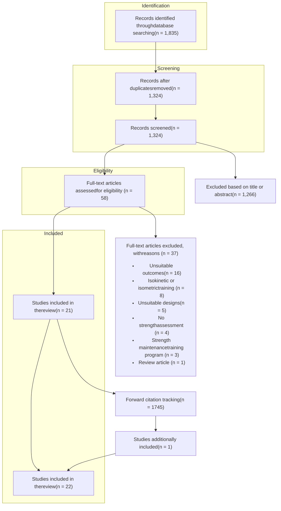

# Abstract

**Background:** Current recommendations on resistance training (RT) frequency for gains in muscular strength are based on extrapolations from limited evidence on the topic and thus their practical applicability remains questionable.

**Objective:** To elucidate this issue, we conducted a systematic review and meta-analysis of the studies that compared muscular strength outcomes with different RT frequencies.

**Methods:** To carry out this review, English-language literature searches of PubMed/MEDLINE, Scopus, and SPORTDiscus were conducted. The meta-analysis was performed using a random-effects model. The meta-analysis models were generated with RT frequencies classified as a categorical variable as either 1, 2, 3, or 4+ times/week or, if there was not sufficient data in subgroup analyses, the training frequencies were categorized as 1, 2, 3 times/week. Subgroup analyses were performed for potential moderators including (i) training volume, (ii) exercise selection for the 1 repetition maximum (RM) test (for multi-joint and for single-joint exercises), (iii) upper and lower body strength gains, (iv) training to muscular failure (for studies involving training to muscular failure and for studies that did not involve training to muscular failure), (v) age (for middle-aged/older adults and for young adults), and (vi) sex (for men and for women). The methodological quality of studies was appraised using the modified Downs and Black checklist.

**Results:** A total of 22 studies were found to meet inclusion criteria. The average score on the Downs and Black checklist was 18 (range: 13-22 points). Four studies were classified as being of good methodological quality, while the rest were classified as being of moderate methodological quality. Results of the meta-analysis showed a significant effect ($p = 0.003$) of RT frequency on muscular strength gains. Effect sizes increased in magnitude from 0.74, 0.82, 0.93, 1.08 for training 1, 2, 3, and 4+ times per week, respectively. A subgroup analysis of volume-equated studies showed no significant effect ($p = 0.421$) of RT frequency on

muscular strength gains. The subgroup analysis for exercise selection for the 1RM test suggested a significant effect of RT frequency on multi-joint ($p < 0.001$) but not on single-joint 1RM test results ($p = 0.324$). The subgroup analysis for upper and lower body showed a significant effect of frequency ($p = 0.004$) for upper body but not for lower body strength gains ($p = 0.070$). In the subgroup analysis for studies in which the training was carried out to muscular failure and for studies in which the training was not carried out to muscular failure, no significant effect of RT frequency was found. The subgroup analysis for the age groups suggested a significant effect of training frequency among young adults ($p = 0.024$) but not among middle-aged and older adults ($p = 0.093$). Finally, the subgroup analysis for sex indicated a significant effect of RT frequency on strength gains in women ($p = 0.030$) but not in men ($p = 0.190$).

**Conclusions:** In conclusion, the results of the present systematic review and meta-analysis suggest a significant effect of RT frequency, as higher training frequencies are translated into greater muscular strength gains. However, these effects seem to be primarily driven by training volume, because when the volume is equated, there was no significant effect of RT frequency on muscular strength gains. Thus, from a practical standpoint, greater training frequencies can be used for additional RT volume, which is then likely to result in greater muscular strength gains. However, it remains unclear whether RT frequency on its own has significant effects on strength gain. It seems that higher RT frequencies result in greater gains in muscular strength on multi-joint exercises, in upper body, in women and finally, in contrast to older adults, young individuals seem to respond more positively to greater RT frequencies. More evidence among resistance trained individuals is needed, as most of the current studies were performed in untrained participants.

# Key Points

* The results of the present analysis indicate a significant effect of resistance training frequency on gains in muscular strength, where higher training frequencies result in greater muscular strength gains.

* The effects of higher training frequencies seem to be primarily due to higher training volume, because when the training volume is equated, this analysis found no significant effect of resistance training frequency on muscular strength gains.

* It is likely that trained individuals will use greater resistance training frequencies in their routines, and thus, future research among this population is needed to draw more generalizable conclusions.

# 1. Introduction

Muscular strength can be defined as the capacity to exert force under a particular set of biomechanical conditions [1]. This physical characteristic is of great importance, as it impacts the effectiveness of performing many tasks both in sport and daily living [2, 3]. Engaging in resistance training (RT) can significantly increase muscular strength [4]. This is consistent with the ‘Specific Adaptations to Imposed Demands’ (SAID) principle because the body adapts to a resistive stimulus by enhancing its capacity to produce force in anticipation of similar future demands [5]. RT variables, such as training volume, intensity, rest interval duration, exercise selection, training to muscular failure, exercise order, repetition velocity, and training frequency, are manipulated in an endeavor to maximize muscular adaptations. Of these variables, volume and load have received the majority of attention in the literature [6-9]. In comparison, the potential of training frequency to influence increases in strength may be overlooked.

RT frequency pertains to the number of training sessions performed per muscle group in a given period. A common time-frame for classifying RT frequency is on a weekly basis. The current American College of Sports Medicine RT guidelines suggest that novice and intermediately trained individuals train each muscle group 2-3 times per week using either a total-body or a split-body (i.e., upper and lower-body) routine. For individuals who are more advanced in RT, a muscle group split routine is suggested, in which one to three muscle groups are trained per training session [4]. However, these recommendations are based on extrapolations from limited evidence [10, 11] on the topic and, thus, their practical applicability remains questionable. Since the publication of the position stand, several additional studies [12-20] have been published investigating the effects of RT frequency on muscular strength gains, some of them providing novel data among trained individuals [12, 13] and older adults [15, 19, 20], thus justifying a need for a comprehensive review of the

available evidence. Therefore, the purpose of the present paper is threefold: (i) to perform a systematic review of the studies that compare different RT frequencies while assessing muscular strength outcomes; (ii) to quantify the findings with a meta-analysis, and (iii) to draw evidence-based conclusions guiding exercise program design.

# 2. Methods

This systematic review was registered in advance in the PROSPERO register of systematic reviews (ref: CRD42017070090) and performed following the Preferred Reporting Items for Systematic Reviews and Meta-Analyses guidelines [21].

## 2.1. Search strategy

To carry out the review, English-language literature searches of PubMed/MEDLINE, Scopus, and SPORTDiscus were conducted. In all of these databases, a search was performed from the inception of indexing to June 1st, 2017, by combining the following search terms: ‘resistance training frequency’; ‘weight training frequency’; ‘strength training frequency’; ‘strength’; ‘split training’; ‘workout frequency’; ‘split routine’; ‘split weight training’; ‘volume load’; ‘effects’. Boolean operators (AND, OR) were used to concatenate the search terms. The secondary search was performed by screening the reference lists of the included studies and relevant review articles. Additionally, forward citation tracking of the included studies was conducted through Scopus and Google Scholar. The study selection was carried out independently by two authors (JG and BL) to minimize potential selection bias.

## 2.2. Inclusion criteria

Studies meeting the following criteria were included in this review: (i) the study was published in English as a full-text manuscript; (ii) the study compared effects of different

weekly RT frequencies with the RT program being performed using traditional dynamic exercise; (iii) the pre- and post-assessments of muscular strength were performed using a 1 repetition maximum (RM) test, an isokinetic test, and/or an isometric test; (iv) the RT trial lasted a minimum of four weeks; and (v) the study was conducted among human participants without pre-existing chronic disease or injury. We decided to include only the studies in which dynamic RT was investigated, because dynamic exercise seems to be the predominant type of RT among most people, including athletes and fitness enthusiasts [22].

## 2.3. Data extraction

The following variables from the included studies were extracted independently by two authors (JG and BL) of the study: (i) descriptive data including the sample size, age, and RT experience; (ii) characteristics of the RT trial, including training frequency, trial length, number of sets, and number of repetitions per set; (iii) muscular strength test(s) used; and (iv) the main findings related to the muscular strength outcomes. Participants were considered as trained if they were reported to have at least one year of regular RT experience. All data were tabulated in an Excel (Microsoft, Redmond, WA, USA) spreadsheet pre-designed for this review. Coding sheets were cross-checked between authors, while discussion and consensus resolved any discrepancies.

## 2.4. Methodological quality

To assess the methodological quality of the included studies we used the validated Downs and Black checklist [23]. The 27-item checklist was modified by adding two items, namely ‘adherence to the RT programs’ (item 28) and ‘RT supervision’ (item 29). Items 1-10 refer to reporting, items 11-13 refer to external validity, items 14-26 refer to internal validity, and item 27 relates to statistical power. The study quality was classified as in Davies et al. [24] and in previous reviews focused on RT interventions [25]. Specifically, studies were

classified as being of: ‘good quality’ if they scored 20–29 points; ‘moderate quality’ if they scored from 11–20 points; and ‘poor quality’ if they scored less than 11 points on the checklist [24]. Studies were independently rated by two reviewers (JG and TD) with discussions and agreement for any observed differences.

## 2.5. Statistical analyses

The effect size (ES) was calculated as the difference between posttest and pretest scores, divided by the pretest standard deviation [26], with an adjustment for small sample bias [27]. The sample size and mean ES across all studies were used to calculate the variance around each ES. Robust variance random-effects meta-regression for multilevel data structures (adjusted for small samples [28, 29]) were used for performing the meta-analysis. To account for correlated effects within studies, a study was used as the clustering variable. Model parameters were calculated by the restricted maximum likelihood method, and the observations were weighted by the inverse of the sampling variance [30]. Our aim was to analyze different methods of measuring strength separately, as, for instance, there is evidence that 1RM testing and isokinetic peak torque can show large variations even in the same individual and in some cases can even be conflicting [31]. Separate meta-regressions were performed on ESs for 1RM outcomes only, as insufficient data were available for other muscular strength outcomes. The meta-analysis models were generated with training frequency classified as a categorical variable as either 1, 2, 3, 4+ times/week or, if there was not sufficient data, the training frequencies were categorized as 1, 2, 3 times/week. A sensitivity analysis was performed by excluding the two studies that combined both RT and aerobic training and then examining the effects [32, 33]. Subgroup analyses were performed for potential moderators including RT volume, exercise selection for the 1RM test (multi-joint or single-joint exercises), upper and lower body strength gains, training to muscular failure (involving training to muscular failure and not involving training to muscular failure), age

(middle-aged/older adults and young adults) and sex (for men and for women). A subgroup analysis including only trained participants could not be performed due to the low number of studies conducted in this population.

All analyses were performed using package metafor in R version 3.4 (The R Foundation for Statistical Computing, Vienna, Austria). Effects were considered significant at $p < 0.05$. Data are reported as $\bar{x} \pm$ standard error of the mean (SEM) and 95% confidence interval (CI).

# 3. Results

## 3.1. Study selection

The primary search through the databases yielded 1835 results of which 21 studies met the inclusion criteria. Forward citation tracking of the included studies through Google Scholar (1135 search results) and Scopus (610 search results) yielded another 1745 search results. This search led to the inclusion of one additional paper. Scanning the reference lists did not result with the inclusion of any additional studies. Therefore, the total number of studies included in this review is 22 [10-20, 32-42]. The stages of the search and study selection process are presented in Figure 1.

***Insert Figure 1. about here***

## 3.2. Study characteristics

The pooled number of participants across all included studies was 912. Sample sizes in individual studies ranged from 11 to 152. The median number of participants per study was 29. Only three studies included participants with previous RT experience (pooled $n = 56$), while the rest included untrained individuals. The mean duration of RT programs was ~12 weeks (range: 6-24 weeks). The most common comparison of RT frequency was between two and three weekly training sessions (in 14 studies). The number of sets performed per exercise in individual studies during a training session varied from 1 to 18 sets. Twenty-one studies assessed dynamic muscular strength using 1 RM tests. Several included studies used both multi-joint and single-joint exercises for the 1 RM strength assessment (Table 1). Two of those studies assessed both dynamic and isometric strength, and one study assessed only isokinetic strength. Table 1 summarizes the studies analyzed.

\*\*\*Insert Table 1. about here\*\*\*

## 3.3. Methodological quality

The average score on the Downs and Black checklist was 18 (range: 13-22 points). Four studies were considered to be of good quality, while the rest were considered to be of moderate methodological quality. None of the included studies were classified as being of low methodological quality. Quality assessment scores for individual studies can be found in Table 2.

\*\*\*Insert Table 2. about here\*\*\*

## 3.4. Meta-analysis results

The final analysis comprised 156 ESs from 49 treatment groups from 21 studies. Results for training frequency as a categorical variable for all analyses are shown in Table 1. ESs gradually increased in magnitude with each additional training day per week, with a significant overall effect of training frequency ($p = 0.003$). Removal of the studies [32, 33] that combined RT and aerobic training did not impact the results.

### 3.4.1 Training volume

The subgroup analysis of volume-equated studies comprised 42 ESs from 16 treatment groups from 7 studies and did not show a significant effect of training frequency ($p = 0.421$).

### 3.4.2 Multi-joint and single-joint exercises

The subgroup analysis of multi-joint exercises comprised 94 ESs from 45 treatment groups from 19 studies. ES gradually increased in magnitude with each additional training day per week, with a significant overall effect of training frequency ($p < 0.001$). The subgroup analysis of single-joint exercises comprised 60 ESs from 19 treatment groups from 8 studies and did not show a significant effect of training frequency ($p = 0.324$).

### 3.4.3 Upper and lower body strength gains

The subgroup analysis of studies assessing upper body strength comprised 86 ESs from 43 treatment groups from 17 studies. ES gradually increased in magnitude with each additional training day per week, with a significant overall effect of training frequency ($p = 0.004$). The subgroup analysis of studies assessing lower body strength comprised 68 ESs from 40 treatment groups from 17 studies. ES gradually increased in magnitude with each additional day per week, but the effect was not significant ($p = 0.070$).

### 3.4.4 Muscular failure

The subgroup analysis of studies involving training to muscular failure comprised 90 ESs from 32 treatment groups from 14 studies. ESs across the included studies gradually increased in magnitude with each additional training day per week, but the linear trend was not significant ($p = 0.078$). The subgroup analysis of studies not involving training to muscular failure comprised 66 ESs from 17 treatment groups from 7 studies. No significant effect of training frequency was found ($p = 0.160$).

### 3.4.5 Age groups

The subgroup analysis of middle-aged and older adults comprised 95 ESs from 24 treatment groups from 10 studies. ESs across the included studies gradually increased in magnitude with each additional training day per week, but the linear trend was not significant ($p = 0.093$). The subgroup analysis of young adults comprised 53 ESs from 21 treatment groups from 9 studies. ES gradually increased in magnitude with each additional training day per week, with a significant overall effect of training frequency ($p = 0.024$).

### 3.4.6 Sex

The subgroup analysis of studies involving men comprised 30 ESs from 17 treatment groups from 7 studies. ES gradually increased in magnitude with each additional training day per week, but the effect was not significant ($p = 0.190$). The subgroup analysis of studies involving women comprised 54 ESs from 19 treatment groups from 8 studies. ES gradually increased in magnitude with each additional training day per week, with a significant overall effect of training frequency ($p = 0.030$). The estimate for 4+ times/week should be interpreted with caution as the analysis included only one ES from one study [35] with this training frequency.

***Insert Table 3. about here***

# 4. Discussion

The present paper is the first systematic review of studies comparing different RT frequencies and their effects on muscular strength gains. Based on the current evidence, the main results of this review suggest that there is a dose-response relationship between RT frequency and muscular strength gains. However, when volume is equated, we found no significant effect. Therefore, it remains unclear whether RT frequency on its own has significant effects on muscular strength gains. Still, several important practical and clinical implications need to be discussed.

A recent review suggested that there is a graded dose-response relationship between RT volume and muscular strength adaptations [6]. Therefore, not equating the training volume in studies that are comparing the effects of RT frequency on muscular strength gains might be misguided. Under such study designs, it cannot be inferred if the effects of higher RT frequency are attributable to the RT frequency itself, or, they are a result of greater RT volume associated with more weekly RT sessions. The subgroup analysis of volume-equated studies did not show a significant effect of RT frequency on changes in muscular strength, as the ESs were similar across training conditions. Therefore, it can be assumed that the higher muscular strength gains associated with higher RT frequencies are observed largely because of the additional training volume. However, even under volume-equated conditions it seems reasonable that undertaking too much training volume in a given RT session would be suboptimal due to the accumulation of fatigue that would ultimately impair performance [43]. Higher RT frequencies allow a distribution of training volume throughout the week while keeping the performance on each RT session high, which may translate into greater gains in muscular strength. Nonetheless, future research using volume-equated study designs is warranted to elucidate the topic of RT frequency and muscular strength gains.

While the current body of evidence does suggest that RT volume is a contributing factor to increasing muscular strength [6], it is relevant to emphasize that simply testing the 1RM can lead to substantial increases in muscular strength [44]. Recently, Mattocks et al. [45] reported that practicing the muscular strength test can lead to equivalent gains in strength compared to traditional high-volume RT. Such gains in muscular strength, without any evident muscle hypertrophy, suggest that the increases could be governed by the principle of specificity [46, 47]. Interestingly, our subgroup analysis for exercise selection for the 1RM test suggests a significant effect of RT frequency for multi-joint but not for single-joint exercises. These findings might be explained from a motor learning standpoint. Specifically, more complex RT exercises, such as multi-joint movements, require a precise timing of muscle recruitment and coordination and a higher degree motor proficiency [1]. Thus, higher RT frequency would allow more opportunities for ‘practicing’ the test/exercise which can result in a better performance on that test. From a practical standpoint, it is also important to highlight that several acute studies reported that the recovery rates might differ between multi-joint and single-joint exercises [48, 49]. Specifically, when comparing unilateral seated row exercise (i.e., a multi-joint exercise) with a unilateral biceps preacher curl exercise (i.e., a single-joint exercise), Soares and colleagues [49] reported that the latter induced greater decreases in isometric peak torque and increases in delayed onset muscle soreness. Therefore, exercise selection effects might also dictate RT frequency prescription.

The results of the subgroup analyses for upper and lower body strength gains showed that there is a significant effect of training frequency for the upper but not for the lower body. Differences between the upper and lower body neuromuscular adaptations following RT have been previously noted in the literature [50]. For example, following an 8-week RT intervention, Housh et al. [51] reported greater gains in upper body strength then in lower body strength. Others did not find significant differences in strength gains between upper and

lower body muscle groups [52]. While our review found a benefit of a higher RT frequency for upper but not lower body strength, from a practical perspective, possible individual variations also need to be taken into account. As noted by Gentil [53] some individuals can experience decreases in upper body strength with large increases in lower body strength, and vice-versa. One muscle group might experience strength gain with one training frequency, while another muscle group might be more susceptible to different stimuli. Therefore, there is an evident need for individualization when designing training programs for strength gains.

Regarding training to muscular failure, a recent meta-analysis suggested that similar muscular strength gains can be achieved with failure and non-failure RT [54]. Both subgroup analyses for studies in which the training was carried out to muscular failure and in which sets were stopped short of failure indicated no significant effect of RT frequency. However, from a practical standpoint, it should be acknowledged that acute studies indicate that training to muscular failure significantly impacts the recovery of neuromuscular function and metabolic and hormonal homeostasis [55]. For example, Moran-Navarro et al. [55] reported that the time course of recovery is prolonged when RT is performed to muscular failure. By contrast, even when matched for total training volume, avoiding muscular failure allowed faster recovery, which might enable training with higher RT frequency [55]. Ferreira et al. [56] reported that after performing eight sets of bench press to muscular failure pectoralis major peak torque remained lower than baseline for 72 hours, suggesting a presence of muscle damage.

As the decline in muscular strength that is associated with aging (i.e., dynapenia) is related to a plethora of adverse effects, older adults are especially encouraged to regularly participate in RT [57]. A recent meta-regression suggested that older adults should engage in two RT sessions per week for the most efficient muscular strength results [58]. However, the meta-regression was not explicitly designed to evaluate RT frequency as other RT variables

were not held constant in the included studies, thus precluding more definite conclusions. To answer the question about the effects of RT frequency on muscular strength gains among older adults we conducted a subgroup analysis of studies that included middle-aged and older adults. In line with the primary findings, this subgroup analysis also did not show a significant effect of RT frequency on muscular strength gains. Currently, there are no studies comparing training frequencies of more than three days per week in this population. While future studies might consider exploring higher training frequencies, from a practical standpoint it is not likely to expect long-term adherence to a high training frequency RT program in this age group, as population-based studies report meager participation rates of older adults in RT [59]. Indeed, several studies have shown that training a muscle group as infrequent as once per week can lead to strength gains, hypertrophy, and enhanced components of functionality among older adults [60, 61]. The subgroup analysis for young adults suggested that they may respond better to higher training frequencies. These findings might be explained by the difference in recovery rates between older and young adults. Roth et al. [62] showed that older women, in comparison to young women, exhibit higher levels of muscle damage after RT. This increase in muscle damage following RT can lead to prolonged recovery duration. Therefore, it can be hypothesized that due to the differences in recovery rates between the age groups, young adults potentially respond more positively to higher training frequencies which, in turn, translates to greater gains in muscular strength with higher training frequencies.

A study by Flores et al. [63] showed that following an RT session, men recovered faster than women. Based on this difference in recovery rates between sexes, it could be suggested that men would respond better to higher RT frequencies. However, our subgroup analysis performed for sexes indicated a significant effect of RT frequency in women but not in men. It should be noted that both analyses were limited to a small number of studies as there were only seven studies for men and eight for women. Besides, three out of the seven

studies included for men used a volume-equated design, while only two out of the eight studies for women used a volume-equated design. This might partly explain the observed discrepancy. Several studies did include a mixed-sex sample. However, in most such studies, only pooled results (for both sexes together) were presented. Future studies that include both men and women might consider plotting the results separately for men and women, to examine potential differences in effect sizes between sexes.

Unfortunately, there are currently only three studies performed in trained individuals that investigated the effects of RT frequency on muscular strength gains [11-13]. All these studies compared training once versus training three times a week and used a volume-equated design. McLester et al. [11] reported that 1RM strength gains in leg press were greater for the group training three times a week compared to the group training once a week. However, no significant between-group differences were found for the remaining three lower-body and five upper-body 1RM tests. The studies by Schoenfeld et al. [12] and Thomas et al. [13] support these findings as they showed that training either once or three times a week elicits similar improvement both in upper and lower-body muscular strength. While these results would suggest that RT frequency might not be of great importance in trained individuals, the limited data makes such conclusions premature. The relatively short duration of these studies further limits the ability to draw inferences, with the longest one lasting 12 weeks. An unpublished 15-week intervention among 16 Norwegian powerlifters, known as the Norwegian Frequency Project, showed that under volume-equated conditions, RT six times per week in comparison with RT three time per week produced significantly greater gains in squat and bench press 1RM [64]. These findings suggest that greater RT frequency as a method of progressive overload might be warranted for individuals approaching their genetic potential; however, the results of that paper remain to be published and scrutinized.

## 4.1 Methodological quality and future research questions

Based on the methodological quality scores, we can conclude that the results obtained in this review were not influenced by poor methodological study designs, as all studies were classified as being of good or moderate methodological quality. Nonetheless, several limitations were noted in the literature. Only 32% of the included studies reported important adverse events that occurred as a consequence of the intervention; the remaining studies failed to document injury data, and the safety of higher versus lower frequency protocols in these studies, therefore, remains uncertain. Eleven of the 22 included studies reported adherence to the training programs. The RT interventions were supervised in 19 studies, while for the remaining three studies, this item was marked as ‘unable to determine.’ Therefore, based on these limitations, future studies should ensure that: (i) adverse events are tracked and reported, (ii) adherence rates for all groups are presented, (iii) all RT programs are supervised, as supervision can result in greater strength gains compared to unsupervised training [65-67].

There is a paucity of studies applying high RT frequencies such as five or six training days per week, thereby opening an avenue for future research. As per Dankel et al. [68], it would be interesting for future studies to compare two groups that are using vastly different training frequencies, (one versus six days per week) while equating RT volume. Dankel et al. [68] also stated that frequency is a method of increasing weekly RT volume. Therefore, it would also be interesting to assess different frequencies of training with higher and lower volumes. As muscular strength responses to regimented RT can vary substantially between individuals [69], it would be desirable for future studies to plot the individual responses to different RT frequencies. Because of the inter-individual variability, future studies might consider employing a crossover design which would allow for each participant to act as their control and thus minimize the possible differences that might occur due to genetic variation, sleep, nutritional intake, and other confounding factors.

## 4.2 Limitations of the review

The most apparent limitation of the current review is the small number of studies that included trained participants. This lack of empirical evidence limits the generalizability of the findings to trained individuals. Furthermore, the designs across the included studies were heterogeneous. We did try to alleviate this issue by employing a random-effects model [70] and performing several different subgroup analyses; nevertheless, the results should still be interpreted with caution. Overall, more homogenous research is needed to answer the question about the effects of RT frequency on gains in muscular strength.

# 5. Conclusions

In conclusion, the results of the present systematic review and meta-analysis suggest a significant effect of RT frequency on muscular strength gain, with higher RT frequencies resulting in more strength gains. However, these effects seem to be primarily driven by training volume, because when volume is equated there was no significant effect of RT frequency on muscular strength gains. Therefore, from a practical standpoint, greater training frequencies might be used as a means of increasing total training volume which may impact muscular strength accrual. However, it remains unclear whether RT frequency on its own has a significant effect on muscular strength gains. In addition, it seems that higher training frequencies result in greater strength gains for multi-joint exercises, in the upper body, among young adults, and in women, findings that should be considered in RT program design. Finally, trained individuals are more likely to use greater RT frequencies in their routines, and thus, future research among this population is needed to draw more generalizable conclusions.

**Compliance with Ethical Standards**

**Funding** No external sources of funding were used to assist in the preparation of this article.

**Conflicts of interest** Jozo Grgic, Brad J. Schoenfeld, Timothy Davies, Bruno Lazinica, James W. Krieger and Zeljko Pedisic declare that they have no conflicts of interest relevant to the content of this review.

# References

1. Carroll TJ, Riek S, Carson RG. Neural adaptations to resistance training: implications for movement control. Sports Med. 2001;31(12):829–40.

2. Steib S, Schoene D, Pfeifer K. Dose-response relationship of resistance training in older adults: a meta-analysis. Med Sci Sports Exerc. 2010;42(5):902–14.

3. Suchomel TJ, Nimphius S, Stone MH. The importance of muscular strength in athletic performance. Sports Med. 2016;46(10):1419–49.

4. American College of Sports Medicine. American College of Sports Medicine position stand. Progression models in resistance training for healthy adults. Med Sci Sports Exerc. 2009;41(3):687–708.

5. Baechle TR, Earle RW, Wathen D. Resistance training. In: Earle RW, Baechle TR, editors. Essentials of strength training and conditioning. 3rd ed. Champaign: Human Kinetics; 2008. p. 381–412.

6. Ralston GW, Kilgore L, Wyatt FB, et al. The effect of weekly set volume on strength gain: a meta-analysis. Sports Med. 2017;47(12):2585–601.

7. Carpinelli RN, Otto RM. Strength training. Single versus multiple sets. Sports Med. 1998;26(2):73–84.

8. Schoenfeld BJ, Grgic J, Ogborn D, et al. Strength and hypertrophy adaptations between low- versus high-load resistance training: a systematic review and meta-analysis. J Strength Cond Res. 2017;31(12):3508–23.

9. Schoenfeld BJ, Wilson JM, Lowery RP, et al. Muscular adaptations in low- versus high-load resistance training: a meta-analysis. Eur J Sport Sci. 2016;16(1):1–10.

10. Candow DG, Burke DG. Effect of short-term equal-volume resistance training with different workout frequency on muscle mass and strength in untrained men and women. J Strength Cond Res. 2007;21(1):204–7.

11. McLester JR, Bishop P, Guilliams ME. Comparison of 1 day and 3 days per week of equal-volume resistance training in experienced subjects. J Strength Cond Res. 2000;14(3):273–81.

12. Schoenfeld BJ, Ratamess NA, Peterson MD, et al. Influence of resistance training frequency on muscular adaptations in well-trained men. J Strength Cond Res. 2015;29(7):1821–9.

13. Thomas MH, Burns SP. Increasing lean mass and strength: a comparison of high frequency strength training to lower frequency strength training. Int J Exerc Sci. 2016;9(2):159–67.

14. Benton MJ, Kasper MJ, Raab SA, et al. Short-term effects of resistance training frequency on body composition and strength in middle-aged women. J Strength Cond Res. 2011;25(11):3142–9.

15. Fernández-Lezaun E, Schumann M, Mäkinen T, et al. Effects of resistance training frequency on cardiorespiratory fitness in older men and women during intervention and follow-up. Exp Gerontol. 2017;95:44–53.

16. Gentil P, Fischer B, Martorelli AS, et al. Effects of equal-volume resistance training performed one or two times a week in upper body muscle size and strength of untrained young men. J Sports Med Phys Fitness. 2015;55(3):144–9.

17. Lera Orsatti F, Nahas EA, Maestá N, et al. Effects of resistance training frequency on body composition and metabolics and inflammatory markers in overweight postmenopausal women. J Sports Med Phys Fitness. 2014;54(3):317–25.

18. Murlasits Z, Reed J, Wells K. Effect of resistance training frequency on physiological adaptations in older adults. J Exerc Sci Fit. 2012;10(1):28–32.

19. Padilha CS, Ribeiro AS, Fleck SJ, et al. Effect of resistance training with different frequencies and detraining on muscular strength and oxidative stress biomarkers in older women. Age. 2015;37(5):104.

20. Silva RG, Silva DRP, Pina FLC. Effect of two different weekly resistance training frequencies on muscle strength and blood pressure in normotensive older women. Rev Bras Cineantropom Hum. 2017;19(1):118–27.

21. Moher D, Liberati A, Tetzlaff J, et al. Preferred reporting items for systematic reviews and meta-analyses: the PRISMA statement. Ann Intern Med. 2009;151(4):264–9.

22. Fleck SJ, Kraemer WJ. Designing Resistance Training Programs. In: Fleck SJ, Kraemer WJ. Physiological adaptations to resistance training. 4th ed. Champaign: Human Kinetics; 2014. p. 52.

23. Downs SH, Black N. The feasibility of creating a checklist for the assessment of the methodological quality both of randomised and non-randomised studies of health care interventions. J Epidemiol Commun Health. 1998;52(6):377–84.

24. Davies TB, Kuang K, Orr R, et al. Effect of movement velocity during resistance training on dynamic muscular strength: a systematic review and meta-analysis. Sports Med. 2017;47(8):1603–17.

25. Grgic J, Schoenfeld BJ, Skrepnik M, et al. Effects of rest interval duration in resistance training on measures of muscular strength: a systematic review. Sports Med. 2018;48(1):137–51.

26. Tipton E. Small sample adjustments for robust variance estimation with meta-regression. Psychol Methods. 2015;20(3):375–93.

27. Morris B. Estimating effect sizes from pretest-posttest-control group designs. Organ Res Meth. 2008;11(2):364–86.

28. Borenstein M, Hedges LV, Higgins JPT. Effect sizes based on means. In: Introduction to Meta-Analysis. Anonymous United Kingdom: John Wiley and Sons, LTD, 2009. pp. 21–32.

29. Hedges LV, Tipton E, Johnson MC. Robust variance estimation in meta-regression with dependent effect size estimates. Res Synth Methods. 2010;1(1):39–65.

30. Thompson SG, Sharp SJ. Explaining heterogeneity in meta-analysis: a comparison of methods. Stat Med. 1999;18(20):2693–708.

31. Gentil P, Del Vecchio FB, Paoli A, et al. Isokinetic dynamometry and 1RM tests produce conflicting results for assessing alterations in muscle strength. J Hum Kinet. 2017;56:19–27.

32. Ferrari R, Kruel LF, Cadore EL, et al. Efficiency of twice weekly concurrent training in trained elderly men. Exp Gerontol. 2013;48(11):1236–42.

33. Fisher G, McCarthy JP, Zuckerman PA, et al. Frequency of combined resistance and aerobic training in older women. J Strength Cond Res. 2013;27(7):1868–76.

34. Arazi H, Asadi A. Effects of 8 weeks equal-volume resistance training with different workout frequency on maximal strength, endurance and body composition. Int J Sports Sci Eng. 2011;5(2):11–8.

35. Hunter GR. Changes in body composition, body build and performance associated with different weight training frequencies in males and females. Natl Strength Cond Assoc J. 1985;7(1):26–8.

36. Brazell-Roberts JV, Thomas LE. Effects of weight training frequency on the self-concept of college females. J Appl Sports Sci Res. 1989;3(2):40–3.

37. Carroll TJ, Abernethy PJ, Logan PA, et al. Resistance training frequency: strength and myosin heavy chain responses to two and three bouts per week. Eur J Appl Physiol Occup Physiol. 1998;78(3):270–5.

38. DiFrancisco-Donoghue J, Werner W, Douris PC. Comparison of once-weekly and twice-weekly strength training in older adults. Br J Sports Med. 2007;41(1):19–22.

39. Faigenbaum AD, Milliken LA, Loud RL, et al. Comparison of 1 and 2 days per week of strength training in children. Res Q Exerc Sport. 2002;73(4):416–24.

40. Gregory LW. Some observations on strength training and assessment. J Sports Med Phys Fitness. 1981;21(2):130–7.

41. McKenzie Gillam G. Effects of frequency of weight training on muscle strength enhancement. J Sports Med Phys Fitness. 1981;21(4):432–6.

42. Taaffe DR, Duret C, Wheeler S, et al. Once-weekly resistance exercise improves muscle strength and neuromuscular performance in older adults. J Am Geriatr Soc. 1999;47(10):1208–14.

43. Ribeiro AS, Schoenfeld BJ, Silva DR, et al. Effect of two- versus three-way split resistance training routines on body composition and muscular strength in bodybuilders: a pilot study. Int J Sport Nutr Exerc Metab. 2015;25(6):559–65.

44. Ploutz-Snyder LL, Giamis EL. Orientation and familiarization to 1RM strength testing in old and young women. J Strength Cond Res. 2001;15(4):519–23.

45. Mattocks KT, Buckner SL, Jessee MB, et al. Practicing the test produces strength equivalent to higher volume training. Med Sci Sports Exerc. 2017;49(9):1945–54.

46. Dankel SJ, Buckner SL, Jessee MB, et al. Correlations do not show cause and effect: not even for changes in muscle size and strength. Sports Med. 2018;48(1):1–6.

47. Dankel SJ, Counts BR, Barnett BE, et al. Muscle adaptations following 21 consecutive days of strength test familiarization compared with traditional training. Muscle Nerve. 2017;56(2):307–14.

48. Ferreira DV, Ferreira-Júnior JB, Soares SR, et al. Chest press exercises with different stability requirements result in similar muscle damage recovery in resistance-trained men. J Strength Cond Res. 2017;31(1):71–9.

49. Soares S, Ferreira-Junior JB, Pereira MC, et al. Dissociated time course of muscle damage recovery between single- and multi-joint exercises in highly resistance-trained men. J Strength Cond Res. 2015;29(9):2594–9.

50. Wernbom M, Augustsson J, Thomeé R. The influence of frequency, intensity, volume and mode of strength training on whole muscle cross-sectional area in humans. Sports Med. 2007;37(3):225–64.

51. Housh DJ, Housh TJ, Johnson GO, et al. Hypertrophic response to unilateral concentric isokinetic resistance training. J Appl Physiol. 1992;73(1):65–70.

52. Gentil P, Ferreira-Junior JB, Bemben MG, et al. The effects of resistance training on lower and upper body strength gains in young women. Int J Kinesiol Sports Sci. 2015;3(3):18–23.

53. Gentil P. Comment on: "determining strength: a case for multiple methods of measurement". Sports Med. 2017;47(9):1901–1902.

54. Davies T, Orr R, Halaki M, et al. Effect of training leading to repetition failure on muscular strength: a systematic review and meta-analysis. Sports Med. 2016;46(4):487–502.

55. Morán-Navarro R, Pérez CE, Mora-Rodríguez R, et al. Time course of recovery following resistance training leading or not to failure. Eur J Appl Physiol. 2017;117(12):2387–99.

56. Ferreira DV, Gentil P, Soares SRS, et al. Recovery of pectoralis major and triceps brachii after bench press exercise. Muscle Nerve. 2017;56(5):963–7.

57. Hunter GR, McCarthy JP, Bamman MM. Effects of resistance training on older adults. Sports Med. 2004;34(5):329–48.

58. Borde R, Hortobágyi T, Granacher U. Dose–response relationships of resistance training in healthy old adults: a systematic review and meta-analysis. Sports Med. 2015;45(12):1693–720.

59. Loustalot F, Carlson SA, Kruger J, et al. Muscle-strengthening activities and participation among adults in the United States. Res Q Exerc Sport. 2013;84(1):30–8.

60. Barbalho MSM, Gentil P, Izquierdo M, et al. There are no no-responders to low or high resistance training volumes among older women. Exp Gerontol. 2017;99:18–26.

61. Izquierdo M, Ibañez J, Hakkinen K, et al. Once weekly combined resistance and cardiovascular training in healthy older men. Med Sci Sports Exerc. 2004;36(3):435–43.

62. Roth SM, Martel GF, Ivey FM, et al. High-volume, heavy-resistance strength training and muscle damage in young and older women. J Appl Physiol. 2000;88(3):1112–8.

63. Flores DF, Gentil P, Brown LE, et al. Dissociated time course of recovery between genders after resistance exercise. J Strength Cond Res. 2011;25(11):3039–44.

64. Raastad T, Kirketeig A, Wolf D, et al. Powerlifters improved strength and muscular adaptations to a greater extent when equal total training volume was divided into 6 compared to 3 training sessions per week. 17th Annual Conference of the European College of Sport Science, Brugge, 2012.

65. Mazzetti SA, Kraemer WJ, Volek JS, et al. The influence of direct supervision of resistance training on strength performance. Med Sci Sports Exerc. 2000;32(6):1175–84.

66. Gentil P, Bottaro M. Influence of suprvision ratio on muscle adaptations to resistance training in nontrained subjects. J Strength Cond Res. 2010;24(3):639–43.

67. Lacroix A, Hortobágyi T, Beurskens R, et al. Effects of supervised vs. unsupervised training programs on balance and muscle strength in older adults: a systematic review and meta-analysis. Sports Med. 2017;47(11):2341–61.

68. Dankel SJ, Mattocks KT, Jessee MB, et al. Frequency: the overlooked resistance training variable for inducing muscle hypertrophy? Sports Med. 2017;47(5):799–805.

69. Hubal MJ, Gordish-Dressman H, Thompson PD, et al. Variability in muscle size and strength gain after unilateral resistance training. Med Sci Sports Exerc. 37(6):964–72.

70. Higgins JP. Commentary: Heterogeneity in meta-analysis should be expected and appropriately quantified. Int J Epidemiol. 2008;37(5):1158–60.

Figure 1. Flow diagram of the study retrieval process

Table 1. Summary of the study and participants characteristics

<table>
  <thead>
    <tr>
        <th>Study</th>
        <th>Sample</th>
        <th>Resistance training frequency comparison</th>
        <th>Exercise prescription (sets x repetitions)</th>
        <th>Was the training performed to muscular failure?</th>
        <th>Duration (weeks)</th>
        <th>Volume equated?</th>
        <th>Muscular strength test(s)</th>
    </tr>
  </thead>
  <tbody>
    <tr>
        <td>Arazi et al. [34]</td>
        <td>Young untrained men (n = 29)</td>
        <td>1/2</td>
        <td>1x6-12</td>
        <td>No</td>
        <td>8</td>
        <td>Yes</td>
        <td>1RM bench press 1RM leg press</td>
    </tr>
    <tr>
        <td>Benton et al. [14]</td>
        <td>Middle-aged untrained women (n = 21)</td>
        <td>2/3</td>
        <td>3x8-12; 6x8-12</td>
        <td>No</td>
        <td>8</td>
        <td>Yes</td>
        <td>1RM chest press 1RM leg press</td>
    </tr>
    <tr>
        <td>Brazell-Roberts et al. [36]</td>
        <td>Young untrained women (n = 112)</td>
        <td>2/3</td>
        <td>3x10</td>
        <td>No</td>
        <td>12</td>
        <td>No</td>
        <td>1RM bench press 1RM squat</td>
    </tr>
    <tr>
        <td>Candow et al. [10]</td>
        <td>Young and middle-aged untrained men and women (n = 29)</td>
        <td>2/3</td>
        <td>2-3x10</td>
        <td>Yes</td>
        <td>6</td>
        <td>Yes</td>
        <td>1RM bench press 1RM squat</td>
    </tr>
    <tr>
        <td>Carroll et al. [37]</td>
        <td>Young untrained men and women (n = 11)</td>
        <td>2/3</td>
        <td>3x4-10</td>
        <td>Yes</td>
        <td>6</td>
        <td>No</td>
        <td>1RM squat Isometric leg extension Isokinetic leg extension</td>
    </tr>
  </tbody>
</table>

<table>
  <tbody>
    <tr>
        <td>DiFrancisco- Donoghue et al. [38]</td>
        <td>Older untrained men and women (n = 18)</td>
        <td>1/2</td>
        <td>1x10-15</td>
        <td>Yes</td>
        <td>9</td>
        <td>No</td>
        <td>1RM leg press 1RM leg extension 1RM leg curl 1RM chest fly 1RM biceps curl 1RM seated dip</td>
    </tr>
    <tr>
        <td>Faigenbaum et al. [39]</td>
        <td>Untrained boys and girls (n = 42)</td>
        <td>1/2</td>
        <td>1x10-15</td>
        <td>Yes</td>
        <td>8</td>
        <td>No</td>
        <td>1RM chest press 1 RM leg press</td>
    </tr>
    <tr>
        <td>Fernández- Lezaun et al. [15]</td>
        <td>Older untrained men and women (n = 68)</td>
        <td>1/2/3</td>
        <td>2-5x30-90% 1RM</td>
        <td>No</td>
        <td>24</td>
        <td>No</td>
        <td>1 RM leg press</td>
    </tr>
    <tr>
        <td>Ferrari et al. [32]</td>
        <td>Older untrained men (n = 22)</td>
        <td>2/3</td>
        <td>2-3x6-12</td>
        <td>Yes</td>
        <td>10</td>
        <td>No</td>
        <td>1RM leg extension 1RM elbow flexion</td>
    </tr>
    <tr>
        <td>Fisher et al. [33]</td>
        <td>Older untrained women (n = 63)</td>
        <td>1/2/3</td>
        <td>1-2x10</td>
        <td>No</td>
        <td>16</td>
        <td>No</td>
        <td>1RM leg press 1RM leg extensions</td>
    </tr>
  </tbody>
</table>

<table>
  <tbody>
    <tr>
        <td> </td>
        <td> </td>
        <td> </td>
        <td> </td>
        <td> </td>
        <td> </td>
        <td> </td>
        <td>1RM hamstring curl 1RM biceps curl 1RM chest press 1RM shoulder press</td>
    </tr>
    <tr>
        <td>Gentil et al. [16]</td>
        <td>Young untrained men (n = 29)</td>
        <td>1/2</td>
        <td>3x8-12</td>
        <td>Yes</td>
        <td>10</td>
        <td>Yes</td>
        <td>Elbow flexion peak torque</td>
    </tr>
    <tr>
        <td>Gregory [40]</td>
        <td>Young untrained men (n = 152)</td>
        <td>2/3</td>
        <td>3x6-8</td>
        <td>Yes</td>
        <td>14</td>
        <td>No</td>
        <td>1RM leg press 1RM biceps curl 1RM shoulder press 1RM bench press</td>
    </tr>
    <tr>
        <td>Hunter [35]</td>
        <td>Young untrained men and women (n = 46)</td>
        <td>3/4</td>
        <td>2-3x7-10</td>
        <td>Yes</td>
        <td>7</td>
        <td>Yes</td>
        <td>1RM bench press</td>
    </tr>
    <tr>
        <td>Lera Orsatti et al. [17]</td>
        <td>Middle-aged and older untrained women (n = 30)</td>
        <td>1/2/3</td>
        <td>3x8-12</td>
        <td>Yes</td>
        <td>16</td>
        <td>No</td>
        <td>1RM bench press 1RM leg press 1RM leg extensions 1RM biceps curl</td>
    </tr>
  </tbody>
</table>

<table>
  <tbody>
    <tr>
        <td>McKenzie Gillam [41]</td>
        <td>Young untrained men (n = 68)</td>
        <td>1/2/3/4/5</td>
        <td>18x1</td>
        <td>Yes</td>
        <td>9</td>
        <td>No</td>
        <td>1RM triceps extensions 1RM bench press</td>
    </tr>
    <tr>
        <td>McLester et al. [11]</td>
        <td>Young trained men and women (n = 18)</td>
        <td>1/3</td>
        <td>3x8-10</td>
        <td>Yes</td>
        <td>12</td>
        <td>Yes</td>
        <td>1RM bench press 1RM lat-pulldown 1RM triceps press 1RM biceps curl 1RM lateral raise</td>
    </tr>
    <tr>
        <td>Murlasits et al. [18]</td>
        <td>Older untrained men and women (n = 29)</td>
        <td>2/3</td>
        <td>3x8</td>
        <td>Yes</td>
        <td>8</td>
        <td>No</td>
        <td>1RM chest press 1RM leg press</td>
    </tr>
    <tr>
        <td>Padilha et al. [19]</td>
        <td>Older untrained women (n = 27)</td>
        <td>2/3</td>
        <td>1x10-15</td>
        <td>No</td>
        <td>12</td>
        <td>No</td>
        <td>1RM chest press 1RM leg extensions 1RM biceps curl</td>
    </tr>
    <tr>
        <td>Schoenfeld et al. [12]</td>
        <td>Young trained men (n = 19)</td>
        <td>1/3</td>
        <td>2-3x8-12</td>
        <td>Yes</td>
        <td>8</td>
        <td>Yes</td>
        <td>1RM bench press 1RM squat</td>
    </tr>
    <tr>
        <td>Silva et al. [20]</td>
        <td>Older untrained women (n = 30)</td>
        <td>2/3</td>
        <td>1-2x10-15</td>
        <td>Yes</td>
        <td>24</td>
        <td>No</td>
        <td>1RM chest press</td>
    </tr>
  </tbody>
</table>

<table>
  <tbody>
    <tr>
        <td>Taaffe et al. [42]</td>
        <td>Older untrained men and women (n = 39)</td>
        <td>1/2/3</td>
        <td>3x80% 1RM</td>
        <td>No</td>
        <td>24</td>
        <td>No</td>
        <td>1RM leg extensions 1RM biceps curl 1RM bench press 1RM shoulder press 1RM seated lat-pulldown 1RM biceps curl 1RM back extensions 1RM leg press 1RM leg extensions 1RM leg curl</td>
    </tr>
    <tr>
        <td>Thomas et al. [13]</td>
        <td>Young trained men and women (n = 19)</td>
        <td>1/3</td>
        <td>3x8-12</td>
        <td>Yes</td>
        <td>8</td>
        <td>Yes</td>
        <td>1RM chest press 1RM hack squat</td>
    </tr>
  </tbody>
</table>

*RM repetition maximum*

Table 2. Results of the methodological quality evaluation using the modified Downs and Black checklist

<table>
  <thead>
    <tr>
        <th> </th>
        <th colspan="29">Scale items</th>
        <th> </th>
    </tr>
    <tr>
        <th>Study</th>
        <th>1</th>
        <th>2</th>
        <th>3</th>
        <th>4</th>
        <th>5</th>
        <th>6</th>
        <th>7</th>
        <th>8</th>
        <th>9</th>
        <th>10</th>
        <th>11</th>
        <th>12</th>
        <th>13</th>
        <th>14</th>
        <th>15</th>
        <th>16</th>
        <th>17</th>
        <th>18</th>
        <th>19</th>
        <th>20</th>
        <th>21</th>
        <th>22</th>
        <th>23</th>
        <th>24</th>
        <th>25</th>
        <th>26</th>
        <th>27</th>
        <th>28</th>
        <th>29</th>
        <th>Total score – rating</th>
    </tr>
  </thead>
  <tbody>
    <tr>
        <td>Arazi et al. [34]</td>
        <td>1</td>
        <td>1</td>
        <td>1</td>
        <td>1</td>
        <td>0</td>
        <td>1</td>
        <td>1</td>
        <td>0</td>
        <td>1</td>
        <td>0</td>
        <td>0</td>
        <td>0</td>
        <td>1</td>
        <td>0ᵃ</td>
        <td>0ᵃ</td>
        <td>1</td>
        <td>1</td>
        <td>1</td>
        <td>0ᵃ</td>
        <td>1</td>
        <td>0ᵃ</td>
        <td>0ᵃ</td>
        <td>1</td>
        <td>0ᵃ</td>
        <td>0ᵃ</td>
        <td>1</td>
        <td>1</td>
        <td>0</td>
        <td>1</td>
        <td>16 – M</td>
    </tr>
    <tr>
        <td>Benton et al. [14]</td>
        <td>1</td>
        <td>1</td>
        <td>1</td>
        <td>1</td>
        <td>1</td>
        <td>1</td>
        <td>1</td>
        <td>1</td>
        <td>1</td>
        <td>1</td>
        <td>0ᵃ</td>
        <td>0</td>
        <td>1</td>
        <td>0ᵃ</td>
        <td>0ᵃ</td>
        <td>1</td>
        <td>1</td>
        <td>1</td>
        <td>1</td>
        <td>1</td>
        <td>1</td>
        <td>0ᵃ</td>
        <td>0</td>
        <td>0</td>
        <td>0</td>
        <td>1</td>
        <td>1</td>
        <td>1</td>
        <td>1</td>
        <td>21 – G</td>
    </tr>
    <tr>
        <td>Brazell-Roberts et al. [36]</td>
        <td>1</td>
        <td>1</td>
        <td>0</td>
        <td>1</td>
        <td>0</td>
        <td>1</td>
        <td>1</td>
        <td>0</td>
        <td>0</td>
        <td>0</td>
        <td>1</td>
        <td>1</td>
        <td>1</td>
        <td>0ᵃ</td>
        <td>0ᵃ</td>
        <td>1</td>
        <td>1</td>
        <td>1</td>
        <td>0ᵃ</td>
        <td>1</td>
        <td>1</td>
        <td>0ᵃ</td>
        <td>0</td>
        <td>0</td>
        <td>0ᵃ</td>
        <td>1</td>
        <td>1</td>
        <td>0</td>
        <td>1</td>
        <td>16 – M</td>
    </tr>
    <tr>
        <td>Candow et al. [10]</td>
        <td>1</td>
        <td>1</td>
        <td>1</td>
        <td>1</td>
        <td>0</td>
        <td>1</td>
        <td>1</td>
        <td>0</td>
        <td>1</td>
        <td>0</td>
        <td>0</td>
        <td>0</td>
        <td>1</td>
        <td>1</td>
        <td>1</td>
        <td>1</td>
        <td>1</td>
        <td>1</td>
        <td>0ᵃ</td>
        <td>1</td>
        <td>0ᵃ</td>
        <td>0ᵃ</td>
        <td>1</td>
        <td>0ᵃ</td>
        <td>0ᵃ</td>
        <td>1</td>
        <td>1</td>
        <td>0</td>
        <td>1</td>
        <td>18 – M</td>
    </tr>
    <tr>
        <td>Carroll et al. [37]</td>
        <td>1</td>
        <td>1</td>
        <td>1</td>
        <td>1</td>
        <td>0</td>
        <td>1</td>
        <td>1</td>
        <td>0</td>
        <td>1</td>
        <td>0</td>
        <td>0</td>
        <td>0</td>
        <td>1</td>
        <td>0ᵃ</td>
        <td>0ᵃ</td>
        <td>1</td>
        <td>1</td>
        <td>1</td>
        <td>0ᵃ</td>
        <td>1</td>
        <td>0ᵃ</td>
        <td>0ᵃ</td>
        <td>1</td>
        <td>0ᵃ</td>
        <td>0ᵃ</td>
        <td>1</td>
        <td>1</td>
        <td>0</td>
        <td>1</td>
        <td>16 – G</td>
    </tr>
    <tr>
        <td>DiFrancisco-Donoghue et al. [38]</td>
        <td>1</td>
        <td>1</td>
        <td>1</td>
        <td>1</td>
        <td>0</td>
        <td>1</td>
        <td>1</td>
        <td>1</td>
        <td>1</td>
        <td>1</td>
        <td>0ᵃ</td>
        <td>0ᵃ</td>
        <td>1</td>
        <td>0ᵃ</td>
        <td>0ᵃ</td>
        <td>1</td>
        <td>1</td>
        <td>1</td>
        <td>0ᵃ</td>
        <td>1</td>
        <td>1</td>
        <td>0ᵃ</td>
        <td>1</td>
        <td>0</td>
        <td>0</td>
        <td>1</td>
        <td>1</td>
        <td>0</td>
        <td>0ᵃ</td>
        <td>18 – M</td>
    </tr>
    <tr>
        <td>Faigenbaum et al. [39]</td>
        <td>1</td>
        <td>1</td>
        <td>1</td>
        <td>1</td>
        <td>1</td>
        <td>1</td>
        <td>1</td>
        <td>1</td>
        <td>1</td>
        <td>1</td>
        <td>0ᵃ</td>
        <td>0ᵃ</td>
        <td>1</td>
        <td>0ᵃ</td>
        <td>0ᵃ</td>
        <td>1</td>
        <td>1</td>
        <td>1</td>
        <td>1</td>
        <td>1</td>
        <td>0ᵃ</td>
        <td>0ᵃ</td>
        <td>0</td>
        <td>0</td>
        <td>0</td>
        <td>1</td>
        <td>1</td>
        <td>1</td>
        <td>1</td>
        <td>20 – M</td>
    </tr>
    <tr>
        <td>Fernández-Lezaun et al. [15]</td>
        <td>1</td>
        <td>1</td>
        <td>1</td>
        <td>1</td>
        <td>0</td>
        <td>1</td>
        <td>1</td>
        <td>1</td>
        <td>1</td>
        <td>0</td>
        <td>1</td>
        <td>1</td>
        <td>1</td>
        <td>0</td>
        <td>0</td>
        <td>1</td>
        <td>1</td>
        <td>1</td>
        <td>1</td>
        <td>1</td>
        <td>1</td>
        <td>0ᵃ</td>
        <td>1</td>
        <td>0ᵃ</td>
        <td>0</td>
        <td>1</td>
        <td>1</td>
        <td>1</td>
        <td>1</td>
        <td>22 – G</td>
    </tr>
    <tr>
        <td>Ferrari et al. [32]</td>
        <td>1</td>
        <td>1</td>
        <td>1</td>
        <td>1</td>
        <td>0</td>
        <td>1</td>
        <td>1</td>
        <td>0ᵃ</td>
        <td>1</td>
        <td>0</td>
        <td>0ᵃ</td>
        <td>0ᵃ</td>
        <td>1</td>
        <td>0</td>
        <td>1</td>
        <td>1</td>
        <td>1</td>
        <td>1</td>
        <td>1</td>
        <td>1</td>
        <td>0ᵃ</td>
        <td>0ᵃ</td>
        <td>1</td>
        <td>0ᵃ</td>
        <td>0</td>
        <td>1</td>
        <td>1</td>
        <td>1</td>
        <td>1</td>
        <td>19 – M</td>
    </tr>
    <tr>
        <td>Fisher et al. [33]</td>
        <td>1</td>
        <td>1</td>
        <td>1</td>
        <td>1</td>
        <td>0</td>
        <td>1</td>
        <td>1</td>
        <td>0</td>
        <td>1</td>
        <td>1</td>
        <td>0ᵃ</td>
        <td>0ᵃ</td>
        <td>1</td>
        <td>0ᵃ</td>
        <td>0ᵃ</td>
        <td>1</td>
        <td>0</td>
        <td>1</td>
        <td>1</td>
        <td>1</td>
        <td>0ᵃ</td>
        <td>0ᵃ</td>
        <td>1</td>
        <td>0ᵃ</td>
        <td>0</td>
        <td>1</td>
        <td>1</td>
        <td>1</td>
        <td>1</td>
        <td>18 – M</td>
    </tr>
    <tr>
        <td>Gentil et al. [16]</td>
        <td>1</td>
        <td>1</td>
        <td>1</td>
        <td>1</td>
        <td>0</td>
        <td>1</td>
        <td>1</td>
        <td>0</td>
        <td>1</td>
        <td>0</td>
        <td>1</td>
        <td>0ᵃ</td>
        <td>1</td>
        <td>0ᵃ</td>
        <td>0ᵃ</td>
        <td>1</td>
        <td>1</td>
        <td>1</td>
        <td>1</td>
        <td>1</td>
        <td>1</td>
        <td>0ᵃ</td>
        <td>1</td>
        <td>0ᵃ</td>
        <td>0</td>
        <td>1</td>
        <td>1</td>
        <td>1</td>
        <td>1</td>
        <td>20 – M</td>
    </tr>
    <tr>
        <td>Gregory [40]</td>
        <td>0</td>
        <td>1</td>
        <td>1</td>
        <td>1</td>
        <td>0</td>
        <td>1</td>
        <td>1</td>
        <td>0</td>
        <td>0</td>
        <td>0</td>
        <td>1</td>
        <td>1</td>
        <td>1</td>
        <td>0ᵃ</td>
        <td>0ᵃ</td>
        <td>1</td>
        <td>1</td>
        <td>1</td>
        <td>0</td>
        <td>1</td>
        <td>1</td>
        <td>0ᵃ</td>
        <td>0</td>
        <td>0</td>
        <td>0</td>
        <td>1</td>
        <td>1</td>
        <td>0</td>
        <td>0ᵃ</td>
        <td>15 – M</td>
    </tr>
    <tr>
        <td>Hunter [35]</td>
        <td>1</td>
        <td>1</td>
        <td>1</td>
        <td>1</td>
        <td>0</td>
        <td>1</td>
        <td>1</td>
        <td>0</td>
        <td>1</td>
        <td>0</td>
        <td>0ᵃ</td>
        <td>0ᵃ</td>
        <td>1</td>
        <td>0ᵃ</td>
        <td>0ᵃ</td>
        <td>1</td>
        <td>1</td>
        <td>1</td>
        <td>0ᵃ</td>
        <td>1</td>
        <td>1</td>
        <td>0ᵃ</td>
        <td>0</td>
        <td>0</td>
        <td>0</td>
        <td>1</td>
        <td>1</td>
        <td>0</td>
        <td>1</td>
        <td>16 – M</td>
    </tr>
    <tr>
        <td>Lera Orsatti et al. [17]</td>
        <td>1</td>
        <td>1</td>
        <td>1</td>
        <td>1</td>
        <td>1</td>
        <td>1</td>
        <td>1</td>
        <td>0</td>
        <td>1</td>
        <td>0</td>
        <td>0ᵃ</td>
        <td>0ᵃ</td>
        <td>1</td>
        <td>0ᵃ</td>
        <td>0ᵃ</td>
        <td>1</td>
        <td>1</td>
        <td>1</td>
        <td>0ᵃ</td>
        <td>1</td>
        <td>0ᵃ</td>
        <td>0ᵃ</td>
        <td>0</td>
        <td>0</td>
        <td>0</td>
        <td>1</td>
        <td>1</td>
        <td>0</td>
        <td>1</td>
        <td>16 – M</td>
    </tr>
    <tr>
        <td>McKenzie Gillam [41]</td>
        <td>1</td>
        <td>1</td>
        <td>0</td>
        <td>1</td>
        <td>0</td>
        <td>1</td>
        <td>1</td>
        <td>1</td>
        <td>1</td>
        <td>0</td>
        <td>1</td>
        <td>0ᵃ</td>
        <td>1</td>
        <td>0ᵃ</td>
        <td>0ᵃ</td>
        <td>1</td>
        <td>1</td>
        <td>1</td>
        <td>0ᵃ</td>
        <td>1</td>
        <td>1</td>
        <td>1</td>
        <td>1</td>
        <td>0ᵃ</td>
        <td>1</td>
        <td>1</td>
        <td>1</td>
        <td>0</td>
        <td>1</td>
        <td>20 – M</td>
    </tr>
    <tr>
        <td>McLester et al. [11]</td>
        <td>1</td>
        <td>1</td>
        <td>1</td>
        <td>1</td>
        <td>0</td>
        <td>1</td>
        <td>1</td>
        <td>0</td>
        <td>1</td>
        <td>0</td>
        <td>0ᵃ</td>
        <td>0ᵃ</td>
        <td>1</td>
        <td>0ᵃ</td>
        <td>0ᵃ</td>
        <td>1</td>
        <td>1</td>
        <td>1</td>
        <td>0ᵃ</td>
        <td>1</td>
        <td>0ᵃ</td>
        <td>0ᵃ</td>
        <td>1</td>
        <td>0ᵃ</td>
        <td>0</td>
        <td>1</td>
        <td>1</td>
        <td>0</td>
        <td>0ᵃ</td>
        <td>15 – M</td>
    </tr>
    <tr>
        <td>Murlasits et al. [18]</td>
        <td>1</td>
        <td>1</td>
        <td>1</td>
        <td>1</td>
        <td>0</td>
        <td>1</td>
        <td>1</td>
        <td>1</td>
        <td>1</td>
        <td>1</td>
        <td>0ᵃ</td>
        <td>0ᵃ</td>
        <td>1</td>
        <td>0ᵃ</td>
        <td>0ᵃ</td>
        <td>1</td>
        <td>1</td>
        <td>1</td>
        <td>1</td>
        <td>1</td>
        <td>0ᵃ</td>
        <td>0ᵃ</td>
        <td>1</td>
        <td>0ᵃ</td>
        <td>0</td>
        <td>1</td>
        <td>1</td>
        <td>1</td>
        <td>1</td>
        <td>20 – M</td>
    </tr>
    <tr>
        <td>Padilha et al. [19]</td>
        <td>1</td>
        <td>1</td>
        <td>1</td>
        <td>1</td>
        <td>0</td>
        <td>1</td>
        <td>1</td>
        <td>0</td>
        <td>1</td>
        <td>0</td>
        <td>0ᵃ</td>
        <td>0ᵃ</td>
        <td>1</td>
        <td>0ᵃ</td>
        <td>0ᵃ</td>
        <td>1</td>
        <td>1</td>
        <td>1</td>
        <td>1</td>
        <td>1</td>
        <td>0</td>
        <td>0ᵃ</td>
        <td>1</td>
        <td>0ᵃ</td>
        <td>0</td>
        <td>1</td>
        <td>1</td>
        <td>1</td>
        <td>1</td>
        <td>18 – M</td>
    </tr>
    <tr>
        <td>Schoenfeld et al. [12]</td>
        <td>1</td>
        <td>1</td>
        <td>1</td>
        <td>1</td>
        <td>1</td>
        <td>1</td>
        <td>1</td>
        <td>0</td>
        <td>1</td>
        <td>1</td>
        <td>0ᵃ</td>
        <td>0ᵃ</td>
        <td>1</td>
        <td>0ᵃ</td>
        <td>0ᵃ</td>
        <td>1</td>
        <td>1</td>
        <td>1</td>
        <td>1</td>
        <td>1</td>
        <td>1</td>
        <td>0ᵃ</td>
        <td>1</td>
        <td>0ᵃ</td>
        <td>1</td>
        <td>0</td>
        <td>1</td>
        <td>1</td>
        <td>1</td>
        <td>21 – G</td>
    </tr>
    <tr>
        <td>Silva et al. [20]</td>
        <td>1</td>
        <td>1</td>
        <td>1</td>
        <td>1</td>
        <td>0</td>
        <td>1</td>
        <td>1</td>
        <td>0</td>
        <td>1</td>
        <td>1</td>
        <td>0ᵃ</td>
        <td>0ᵃ</td>
        <td>1</td>
        <td>0ᵃ</td>
        <td>0ᵃ</td>
        <td>1</td>
        <td>1</td>
        <td>1</td>
        <td>1</td>
        <td>1</td>
        <td>0ᵃ</td>
        <td>0ᵃ</td>
        <td>0</td>
        <td>0</td>
        <td>0</td>
        <td>1</td>
        <td>1</td>
        <td>1</td>
        <td>1</td>
        <td>18 – M</td>
    </tr>
    <tr>
        <td>Taaffe et al. [42]</td>
        <td>1</td>
        <td>1</td>
        <td>1</td>
        <td>1</td>
        <td>0</td>
        <td>1</td>
        <td>1</td>
        <td>1</td>
        <td>1</td>
        <td>0</td>
        <td>0ᵃ</td>
        <td>0ᵃ</td>
        <td>1</td>
        <td>0ᵃ</td>
        <td>0ᵃ</td>
        <td>1</td>
        <td>1</td>
        <td>1</td>
        <td>1</td>
        <td>1</td>
        <td>0</td>
        <td>0ᵃ</td>
        <td>1</td>
        <td>0ᵃ</td>
        <td>0</td>
        <td>1</td>
        <td>1</td>
        <td>1</td>
        <td>1</td>
        <td>19 – M</td>
    </tr>
    <tr>
        <td>Thomas et al. [13]</td>
        <td>1</td>
        <td>1</td>
        <td>1</td>
        <td>1</td>
        <td>0</td>
        <td>1</td>
        <td>1</td>
        <td>0</td>
        <td>0</td>
        <td>0</td>
        <td>0ᵃ</td>
        <td>0ᵃ</td>
        <td>1</td>
        <td>0ᵃ</td>
        <td>0ᵃ</td>
        <td>1</td>
        <td>1</td>
        <td>1</td>
        <td>0ᵃ</td>
        <td>1</td>
        <td>0ᵃ</td>
        <td>0ᵃ</td>
        <td>0</td>
        <td>0</td>
        <td>0</td>
        <td>0ᵃ</td>
        <td>1</td>
        <td>0</td>
        <td>1</td>
        <td>13 – M</td>
    </tr>
  </tbody>
</table>

1 criteria met, 0 criteria not met, scored 0, G good methodological quality, M moderate methodological quality

ᵃ item was unable to be determined

Table 3. Meta-analysis results

<table>
  <thead>
    <tr>
        <th colspan="4">All studies</th>
    </tr>
    <tr>
        <th>Frequency (times/week)</th>
        <th>ES (mean ± standard error of the mean)</th>
        <th>95% CI</th>
        <th>p value</th>
    </tr>
  </thead>
  <tbody>
    <tr>
        <td>1</td>
        <td>0.74 ± 0.13</td>
        <td>0.48, 1.01</td>
        <td>0.003</td>
    </tr>
    <tr>
        <td>2</td>
        <td>0.82 ± 0.13</td>
        <td>0.55, 1.09</td>
        <td> </td>
    </tr>
    <tr>
        <td>3</td>
        <td>0.93 ± 0.13</td>
        <td>0.65, 1.21</td>
        <td> </td>
    </tr>
    <tr>
        <td>4+</td>
        <td>1.08 ± 0.16</td>
        <td>0.74, 1.42</td>
        <td> </td>
    </tr>
    <tr>
        <th colspan="4">Volume equated studies</th>
    </tr>
    <tr>
        <th>Frequency (times/week)</th>
        <th>ES (mean ± standard error of the mean)</th>
        <th>95% CI</th>
        <th>p value</th>
    </tr>
    <tr>
        <td>1</td>
        <td>0.53 ± 0.13</td>
        <td>0.13, 0.93</td>
        <td>0.421</td>
    </tr>
    <tr>
        <td>2</td>
        <td>0.80 ± 0.33</td>
        <td>-0.25, 1.86</td>
        <td> </td>
    </tr>
    <tr>
        <td>3</td>
        <td>0.64 ± 0.14</td>
        <td>0.21, 1.07</td>
        <td> </td>
    </tr>
    <tr>
        <td>4+</td>
        <td>0.58 ± 0.04</td>
        <td>0.45, 0.72</td>
        <td> </td>
    </tr>
    <tr>
        <th colspan="4">Multi-joint exercises</th>
    </tr>
    <tr>
        <th>Frequency (times/week)</th>
        <th>ES (mean ± standard error of the mean)</th>
        <th>95% CI</th>
        <th>p value</th>
    </tr>
    <tr>
        <td>1</td>
        <td>0.67 ± 0.13</td>
        <td>0.39, 0.95</td>
        <td>&lt; 0.001</td>
    </tr>
    <tr>
        <td>2</td>
        <td>0.79 ± 0.15</td>
        <td>0.47, 1.11</td>
        <td> </td>
    </tr>
    <tr>
        <td>3</td>
        <td>0.94 ± 0.15</td>
        <td>0.61, 1.26</td>
        <td> </td>
    </tr>
    <tr>
        <td>4+</td>
        <td>1.07 ± 0.16</td>
        <td>0.73, 1.42</td>
        <td> </td>
    </tr>
    <tr>
        <th colspan="4">Single-joint exercises</th>
    </tr>
    <tr>
        <th>Frequency (times/week)</th>
        <th>ES (mean ± standard error of the mean)</th>
        <th>95% CI</th>
        <th>p value</th>
    </tr>
    <tr>
        <td>1</td>
        <td>0.89 ± 0.13</td>
        <td>0.55, 1.23</td>
        <td>0.324</td>
    </tr>
    <tr>
        <td>2</td>
        <td>0.97 ± 0.12</td>
        <td>0.67, 1.27</td>
        <td> </td>
    </tr>
    <tr>
        <td>3</td>
        <td>0.99 ± 0.10</td>
        <td>0.73, 1.25</td>
        <td> </td>
    </tr>
    <tr>
        <th colspan="4">Upper body strength</th>
    </tr>
    <tr>
        <th>Frequency (times/week)</th>
        <th>ES (mean ± standard error of the mean)</th>
        <th>95% CI</th>
        <th>p value</th>
    </tr>
    <tr>
        <td>1</td>
        <td>0.70 ± 0.13</td>
        <td>0.42, 0.98</td>
        <td>0.004</td>
    </tr>
    <tr>
        <td>2</td>
        <td>0.77 ± 0.13</td>
        <td>0.48, 1.05</td>
        <td> </td>
    </tr>
    <tr>
        <td>3</td>
        <td>0.92 ± 0.17</td>
        <td>0.56, 1.28</td>
        <td> </td>
    </tr>
    <tr>
        <td>4+</td>
        <td>1.06 ± 0.17</td>
        <td>0.68, 1.43</td>
        <td> </td>
    </tr>
    <tr>
        <th colspan="4">Lower body strength</th>
    </tr>
    <tr>
        <th>Frequency (times/week)</th>
        <th>ES (mean ± standard error of the mean)</th>
        <th>95% CI</th>
        <th>p value</th>
    </tr>
    <tr>
        <td>1</td>
        <td>0.81 ± 0.16</td>
        <td>0.46, 1.15</td>
        <td>0.070</td>
    </tr>
    <tr>
        <td>2</td>
        <td>0.93 ± 0.18</td>
        <td>0.55, 1.32</td>
        <td> </td>
    </tr>
    <tr>
        <td>3</td>
        <td>0.97 ± 0.14</td>
        <td>0.66, 1.28</td>
        <td> </td>
    </tr>
    <tr>
        <th colspan="4">Training to muscular failure</th>
    </tr>
    <tr>
        <th>Frequency (times/week)</th>
        <th>ES (mean ± standard error of the mean)</th>
        <th>95% CI</th>
        <th>p value</th>
    </tr>
    <tr>
        <td>1</td>
        <td>0.58 ± 0.07</td>
        <td>0.42, 0.74</td>
        <td>0.078</td>
    </tr>
    <tr>
        <td>2</td>
        <td>0.69 ± 0.06</td>
        <td>0.55, 0.82</td>
        <td> </td>
    </tr>
    <tr>
        <td>3</td>
        <td>0.81 ± 0.10</td>
        <td>0.59, 1.03</td>
        <td> </td>
    </tr>
    <tr>
        <td>4+</td>
        <td>0.90 ± 0.23</td>
        <td>0.38, 1.41</td>
        <td> </td>
    </tr>
  </tbody>
</table>

<table>
  <thead>
    <tr>
        <th colspan="4">Not training to muscular failure</th>
    </tr>
    <tr>
        <th>Frequency (times/week)</th>
        <th>ES (mean ± standard error of the mean)</th>
        <th>95% CI</th>
        <th>p value</th>
    </tr>
  </thead>
  <tbody>
    <tr>
        <td>1</td>
        <td>1.06 ± 0.36</td>
        <td>0.06, 2.06</td>
        <td rowspan="3">0.160</td>
    </tr>
    <tr>
        <td>2</td>
        <td>1.14 ± 0.35</td>
        <td>0.16, 2.11</td>
    </tr>
    <tr>
        <td>3</td>
        <td>1.19 ± 0.37</td>
        <td>0.17, 2.22</td>
    </tr>
    <tr>
        <th colspan="4">Middle-aged and older adults</th>
    </tr>
    <tr>
        <th>Frequency (times/week)</th>
        <th>ES (mean ± standard error of the mean)</th>
        <th>95% CI</th>
        <th>p value</th>
    </tr>
    <tr>
        <td>1</td>
        <td>0.76 ± 0.12</td>
        <td>0.47, 1.05</td>
        <td rowspan="3">0.093</td>
    </tr>
    <tr>
        <td>2</td>
        <td>0.86 ± 0.11</td>
        <td>0.60, 1.11</td>
    </tr>
    <tr>
        <td>3</td>
        <td>0.91 ± 0.12</td>
        <td>0.64, 1.19</td>
    </tr>
    <tr>
        <th colspan="4">Young adults</th>
    </tr>
    <tr>
        <th>Frequency (times/week)</th>
        <th>ES (mean ± standard error of the mean)</th>
        <th>95% CI</th>
        <th>p value</th>
    </tr>
    <tr>
        <td>1</td>
        <td>0.80 ± 0.30</td>
        <td>0.03, 1.56</td>
        <td rowspan="4">0.024</td>
    </tr>
    <tr>
        <td>2</td>
        <td>0.83 ± 0.34</td>
        <td>-0.04, 1.70</td>
    </tr>
    <tr>
        <td>3</td>
        <td>0.99 ± 0.32</td>
        <td>0.16, 1.82</td>
    </tr>
    <tr>
        <td>4+</td>
        <td>1.15 ± 0.32</td>
        <td>0.34, 1.97</td>
    </tr>
    <tr>
        <th colspan="4">Men</th>
    </tr>
    <tr>
        <th>Frequency (times/week)</th>
        <th>ES (mean ± standard error of the mean)</th>
        <th>95% CI</th>
        <th>p value</th>
    </tr>
    <tr>
        <td>1</td>
        <td>0.45 ± 0.13</td>
        <td>0.02, 0.87</td>
        <td rowspan="4">0.190</td>
    </tr>
    <tr>
        <td>2</td>
        <td>0.67 ± 0.14</td>
        <td>0.21, 1.12</td>
    </tr>
    <tr>
        <td>3</td>
        <td>0.81 ± 0.20</td>
        <td>0.19, 1.43</td>
    </tr>
    <tr>
        <td>4+</td>
        <td>0.92 ± 0.31</td>
        <td>-0.06, 1.90</td>
    </tr>
    <tr>
        <th colspan="4">Women</th>
    </tr>
    <tr>
        <th>Frequency (times/week)</th>
        <th>ES (mean ± standard error of the mean)</th>
        <th>95% CI</th>
        <th>p value</th>
    </tr>
    <tr>
        <td>1</td>
        <td>1.03 ± 0.33</td>
        <td>0.10, 1.96</td>
        <td rowspan="4">0.030</td>
    </tr>
    <tr>
        <td>2</td>
        <td>1.11 ± 0.34</td>
        <td>0.17, 2.06</td>
    </tr>
    <tr>
        <td>3</td>
        <td>1.22 ± 0.34</td>
        <td>0.26, 2.17</td>
    </tr>
    <tr>
        <td>4+</td>
        <td>1.62 ± 0.24</td>
        <td>0.95, 2.28</td>
    </tr>
    <tr>
        <td colspan="4"><em>ES</em> effect size <em>CI</em> confidence interval</td>
    </tr>
  </tbody>
</table>