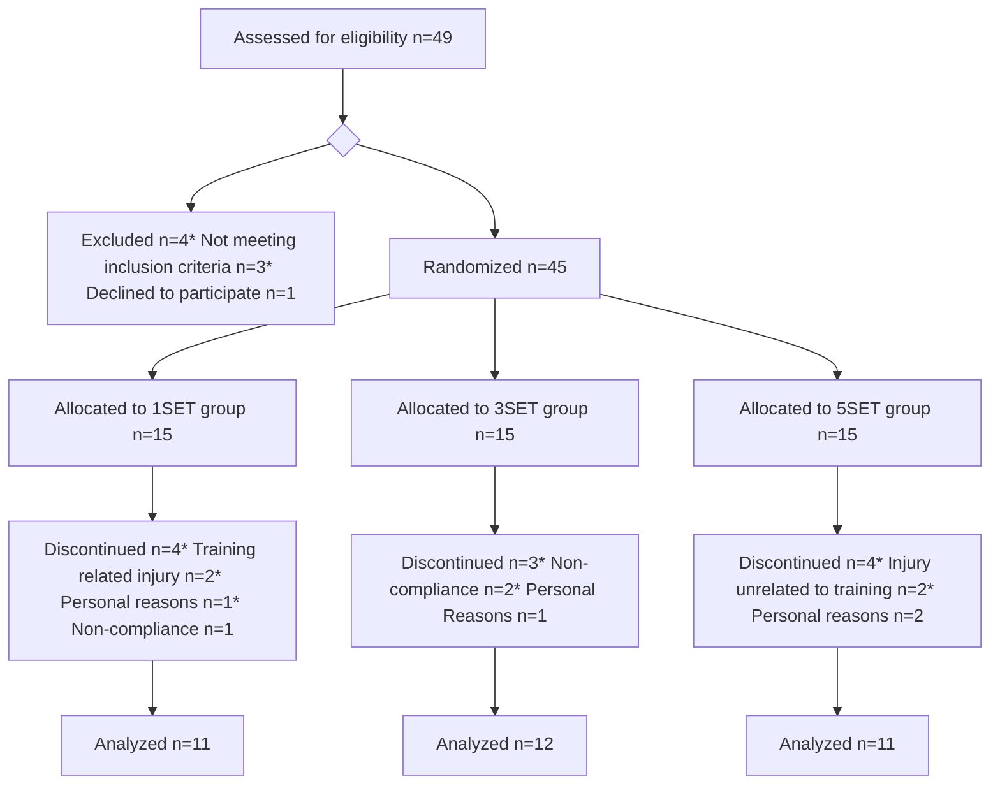

# Resistance Training Volume Enhances Muscle Hypertrophy but Not Strength in Trained Men

BRAD J. SCHOENFELD¹, BRET CONTRERAS², JAMES KRIEGER³, JOZO GRGIC⁴, KENNETH DELCASTILLO¹, RAMON BELLIARD¹, and ANDREW ALTO¹

*¹Department of Health Sciences, CUNY Lehman College, Bronx, NY; ²Sport Performance Research Institute, AUT University, Auckland, NEW ZEALAND; ³Weightology, LLC, Redmond, WA; and ⁴Institute for Health and Sport (IHES), Victoria University, Melbourne, AUSTRALIA*

### ABSTRACT

SCHOENFELD, B. J., B. CONTRERAS, J. KRIEGER, J. GRGIC, K. DELCASTILLO, R. BELLIARD, and A. ALTO. Resistance Training Volume Enhances Muscle Hypertrophy but Not Strength in Trained Men. *Med. Sci. Sports Exerc.*, Vol. 51, No. 1, pp. 94–103, 2019. **Purpose**: The purpose of this study was to evaluate muscular adaptations between low-, moderate-, and high-volume resistance training protocols in resistance-trained men. **Methods**: Thirty-four healthy resistance-trained men were randomly assigned to one of three experimental groups: a low-volume group performing one set per exercise per training session (*n* = 11), a moderate-volume group performing three sets per exercise per training session (*n* = 12), or a high-volume group performing five sets per exercise per training session (*n* = 11). Training for all routines consisted of three weekly sessions performed on nonconsecutive days for 8 wk. Muscular strength was evaluated with one repetition maximum (RM) testing for the squat and bench press. Upper-body muscle endurance was evaluated using 50% of subjects bench press 1RM performed to momentary failure. Muscle hypertrophy was evaluated using B-mode ultrasonography for the elbow flexors, elbow extensors, mid-thigh, and lateral thigh. **Results**: Results showed significant preintervention to postintervention increases in strength and endurance in all groups, with no significant between-group differences. Alternatively, while all groups increased muscle size in most of the measured sites from preintervention to postintervention, significant increases favoring the higher-volume conditions were seen for the elbow flexors, mid-thigh, and lateral thigh. **Conclusions**: Marked increases in strength and endurance can be attained by resistance-trained individuals with just three 13-min weekly sessions over an 8-wk period, and these gains are similar to that achieved with a substantially greater time commitment. Alternatively, muscle hypertrophy follows a dose–response relationship, with increasingly greater gains achieved with higher training volumes. **Key Words**: VOLUME, DOSE–RESPONSE RELATIONSHIP, STRENGTH TRAINING, HYPERTROPHY, SINGLE SET

Resistance training (RT) is the primary exercise intervention for increasing muscle mass in humans. It is theorized that the volume of training performed in a RT bout—herein determined by the formula: repetitions /$\times$/ sets (1)—plays a significant role in chronic muscular adaptations such as muscle size and strength (2). As compared with single-set routines, acute studies indicate that performing

multiple sets augments the phosphorylation of p70S6 kinase and muscle protein synthesis (MPS), suggesting that higher volumes of training are warranted for maximizing the hypertrophic response (3,4). However, although acute signaling and MPS studies can help to generate hypotheses as to potential long-term RT responses, longitudinal studies directly assessing hallmark adaptations, such as muscular strength and muscle hypertrophy, are necessary to draw evidence-based conclusions for exercise prescription (5).

When evaluating the results of longitudinal research on the topic, many of the studies have failed to show statistically significant differences in hypertrophy between lower and higher RT volumes. However, low sample sizes in these studies raise the potential for type II errors, invariably confounding the ability to draw conclusive inferences regarding probability. A recent meta-analysis showed a dose–response relationship between the total number of weekly sets and increases in muscle growth (6). However, the analysis was only able to determine dose–response effects up to 10 total weekly sets per muscle group due to the paucity of research on higher-volume RT programs. Thus, it remains unclear whether training with even higher volumes would continue to enhance hypertrophic

<page_header>
APPLIED SCIENCES
</page_header>

Address for correspondence: Brad J. Schoenfeld, Ph.D., CUNY Lehman College, 250 Bedford Park Blvd West, Bronx, NY 10468; E-mail: brad@workout911.com.

Submitted for publication June 2018.
Accepted for publication August 2018.

0195-9131/19/5101-0094/0

MEDICINE & SCIENCE IN SPORTS & EXERCISE®

Copyright © 2018 The Author(s). Published by Wolters Kluwer Health, Inc. on behalf of the American College of Sports Medicine. This is an open-access article distributed under the terms of the Creative Commons Attribution-Non Commercial-No Derivatives License 4.0 (CCBY-NC-ND), where it is permissible to download and share the work provided it is properly cited. The work cannot be changed in any way or used commercially without permission from the journal.

DOI: 10.1249/MSS.0000000000001764

94

APPLIED SCIENCES

adaptations and, if so, at what point these results would plateau. An added limitation to these findings is that only two of the 15 studies that met inclusion criteria were carried out in individuals with previous RT experience. There is compelling evidence that resistance-trained individuals respond differently than those who are new to RT (7). A "ceiling effect" makes it progressively more difficult for trained lifters to increase muscle mass, thereby necessitating more demanding RT protocols to elicit further muscular gains. Indeed, there is emerging evidence that consistent RT can alter anabolic intracellular signaling (8), indicating an attenuated hypertrophic response. Thus, findings from untrained individuals cannot necessarily be generalized to a resistance-trained population.

A dose–response pattern has also been proposed for RT volume and muscular strength gains. A recent meta-analysis on the topic by Ralston et al. (9) showed that moderate to high weekly training volumes (defined as set volume) are more effective for strength gains as compared with lower training volumes. It should be noted, however, that only two of the included studies used a dose–response study design among trained individuals. In a sample of 32 resistance-trained men, Marshall et al. (10) demonstrated that higher-volume training produces both faster and greater strength gains as compared with lower-volume training. In contrast to these results, Ostrowski et al. (11) conducted a study among 27 trained men and reported similar changes in muscular strength between low-, moderate-, and high-volume training groups. Both of these studies included resistance-trained men, yet they observed different findings. It, therefore, is evident that further work among trained individuals is warranted to better elucidate this topic.

Given the existing gaps in the current literature, the purpose of this study was to evaluate muscular adaptations between low-, moderate-, and high-volume RT protocols in resistance-trained men. This design afforded the ability to glean insight into the benefits of the respective training protocols while taking into account the time efficiency of training. Based on previous research and meta-analytical data, we hypothesized that there would be a graded response to outcomes, with increasing gains in muscular strength and hypertrophy seen in low-, moderate-, and high-volume programs, respectively.

# METHODS

## Subjects

Subjects were 45 healthy male volunteers (height, 175.0 ± 7.9 cm; weight, 82.5 ± 13.8 kg; age, 23.8 ± 3.8 yr; RT experience, 4.4 ± 3.9 yr) recruited from a university population. This sample size was justified by a *priori* power analysis in G*power using a target effect size (ES) of $f = 0.25$, alpha of 0.05 and power of 0.80, which determined that 36 subjects were required for participation; the additional recruitment accounted for the possibility of dropouts. Subjects were required to meet the following inclusion criteria: 1) males between the ages of 18 to 35 yr, 2) no existing

musculoskeletal disorders, 3) claimed to be free from consumption of anabolic steroids or any other legal or illegal agents known to increase muscle size for the previous year, 4) experienced with RT, defined as consistently lifting weights at least three times per week for a minimum of 1 yr.

Subjects were randomly assigned to one of three experimental groups: a low-volume group (1SET) performing one set per exercise per training session ($n = 15$), a moderate-volume group (3SET) performing three sets per exercise per training session ($n = 15$), or a high-volume group (5SET) performing five sets per exercise per training session ($n = 15$). Using previously established criteria (12), this translated into a total weekly number of sets per muscle group of six and nine sets for 1SET, 18 and 27 sets for 3SET, and 30 and 45 sets for 5SET in the upper and lower limbs, respectively. The number of sets was greater for the lower-body musculature as compared to the upper-body musculature. Such a training program was designed based on the claim that lower-body muscles might require more training volume (as compared with the upper body) to optimize muscular adaptations with RT (13). Approval for the study was obtained from the Lehman College Institutional Review Board (2017-0778). Informed consent was obtained from all subjects before beginning the study.

## RT Procedures

The RT protocol consisted of seven exercises per session targeting all major muscle groups of the body. The exercises performed were: flat barbell bench press, barbell military press, wide grip lateral pulldown, seated cable row, barbell back squat, machine leg press, and unilateral machine leg extension. These exercises were chosen based on their common inclusion in bodybuilding- and strength-type RT programs (14,15). To prevent confounding, subjects were instructed to refrain from performing any additional resistance-type or high-intensity aerobic training for the duration of the study.

Training for all routines consisted of three weekly sessions performed on nonconsecutive days for 8 wk. Sets consisted of 8 to 12 repetitions carried out to the point of momentary concentric failure, that is, the inability to perform another concentric repetition while maintaining proper form. The cadence of repetitions was carried out in a controlled fashion, with a concentric action of approximately 1 s and an eccentric action of approximately 2 s. Subjects were afforded 90-s rest between sets. The time between exercises was prolonged to approximately 120 s given the additional time required for the setup of the equipment used in the subsequent resistance exercise. The load was adjusted for each exercise as needed on successive sets to ensure that subjects achieved momentary failure in the target repetition range. Thus, if a subject completed more than 12 repetitions to momentary failure in a given set, the load was increased based on the supervising researcher’s assessment of what would be required to reach momentary failure in the desired loading range; if less than eight repetitions were

VOLUME DOSE–RESPONSE RELATIONSHIP Medicine & Science in Sports & Exercise® 95

APPLIED SCIENCES

accomplished, the load was similarly decreased. All routines were directly supervised by the research team to ensure proper performance of the respective routines. Attempts were made to progressively increase the loads lifted each week to ensure that the subjects were exercising with as much resistance as possible within the confines of maintaining the target repetition range. Before training, subjects underwent 10 repetition maximum (RM) testing to determine individual initial training loads for each exercise. Repetition maximum testing was consistent with recognized guidelines as established by the National Strength and Conditioning Association (14).

## Dietary Adherence

To avoid potential dietary confounding of results, subjects were advised to maintain their customary nutritional regimen and to avoid taking any supplements other than those provided in the course of the study. Dietary adherence was assessed by self-reported food records using a nutritional tracking application (http://www.myfitnesspal.com), which was collected for 5-d periods twice during the study: 1 wk before the first training session (i.e., baseline) and during the final week of the training protocol. Subjects were instructed on how to properly record all food items and their respective portion sizes consumed for the designated period of interest. Each item of food was individually entered into the program, and the program provided relevant information as to total energy consumption, as well as amount of energy derived from proteins, fats, and carbohydrates for each time period analyzed. To help ensure that dietary protein needs were met, subjects consumed a supplement on training days containing 24 g protein and 1 g carbohydrate (Iso100 Hydrolyzed Whey Protein Isolate; Dymatize Nutrition, Dallas, TX) under the supervision of the research staff.

## Measurements

**Anthropometry.** Subjects were told to refrain from eating for 12 h before testing, eliminate alcohol consumption for 24 h, abstain from strenuous exercise for 24 h, and void immediately before the test. Height was measured to the nearest 0.1 cm using a stadiometer. Body mass was measured to the nearest 0.1 kg on a calibrated scale (InBody 770; Biospace Co. Ltd., Seoul, Korea).

**Muscle thickness.** Ultrasound imaging was used to obtain measurements of muscle thickness (MT), which shows a high correlation with RT-induced changes in muscle cross-sectional area as determined by the ‘‘gold standard’’ magnetic resonance imaging (16). As reported by others, correlations between magnetic resonance imaging and ultrasound measurements amount to 0.89, 0.73, and 0.91 for elbow flexors, elbow extensors, and quadriceps MT, respectively (17,18). The lead researcher, a trained ultrasound technician, performed all testing using a B-mode ultrasound imaging unit (ECO3; Chison Medical Imaging, Ltd, Jiang Su Province, China). The technician applied a water-soluble transmission gel (Aquasonic 100 Ultrasound Transmission

gel; Parker Laboratories Inc., Fairfield, NJ) to each measurement site, and a 5- to 10-MHz ultrasound probe was placed perpendicular to the tissue interface without depressing the skin. When the quality of the image was deemed satisfactory, the technician saved the image to hard drive and obtained MT dimensions by measuring the distance from the subcutaneous adipose tissue–muscle interface to the muscle–bone interface. Measurements were taken on the right side of the body at four sites: 1) elbow flexors, 2) elbow extensors, 3) mid-thigh (a composite of the rectus femoris and vastus intermedius), and 4) lateral thigh (a composite of the vastus lateralis and vastus intermedius). For the anterior and posterior upper arm, measurements were taken 60% distal between the lateral epicondyle of the humerus and the acromion process of the scapula; mid- and lateral thigh measurements were taken 50% between the lateral condyle of the femur and greater trochanter for the quadriceps femoris. In an effort to ensure that swelling in the muscles from training did not obscure results, images were obtained 48 to 72 h before commencement of the study, as well as after the final RT session. This is consistent with research showing that acute increases in MT return to baseline within 48 h after an RT session (19). To further ensure accuracy of measurements, three images were obtained for each site and then averaged to obtain a final value. The between-day repeatability of ultrasound tests was assessed in a pilot study in a sample of 10 young resistance-trained men. The test–retest intraclass correlation coefficient (ICC) from our lab for thickness measurement of the elbow flexors, elbow extensors, mid-thigh and lateral thigh as assessed on consecutive days are 0.976, 0.950, 0.944 and 0.998, respectively. The standard error of the measurement (SEM) for elbow flexor, elbow extensor, mid-thigh, and lateral thigh MT was 0.70, 0.83, and 1.09, and 0.34 mm, respectively.

## Maximal Strength Assessments

**Muscle strength.** Upper- and lower-body strength was assessed by 1RM testing in the barbell parallel back squat (1RMSQUAT) and flat barbell bench press (1RMBENCH) exercises. These exercises were chosen because they are well established as measures of maximal strength. Subjects reported to the laboratory having refrained from any exercise other than activities of daily living for at least 48 h before baseline testing and at least 48 h before testing at the conclusion of the study. RM testing was consistent with recognized guidelines established by the National Strength and Conditioning Association (14). In brief, subjects performed a general warm-up before testing that consisted of light cardiovascular exercise lasting approximately 5 to 10 min. A specific warm-up set of the given exercise of 8 to 10 repetitions was performed at ~50% of subjects’ perceived 1RM followed by one to two sets of two to three repetitions at a load corresponding to approximately 60% to 80% 1RM. Subjects then performed sets of one repetition of increasing weight for 1RM determination. Three- to 5-min rest was provided between each

96 Official Journal of the American College of Sports Medicine http://www.acsm-msse.org

APPLIED SCIENCES

successive attempt. All 1RM determinations were made within five trials. Subjects were required to reach parallel in the 1RMSQUAT for the attempt to be considered successful as determined by a squat beeper (SquatRight); confirmation of squat depth was obtained by a research assistant positioned laterally to the subject to ensure accuracy. Successful 1RMBENCH was achieved if the subject displayed a five-point body contact position (head, upper back, and buttocks firmly on the bench with both feet flat on the floor) and executed full-elbow extension. 1RMSQUAT testing was conducted before 1RMBENCH with a 5-min rest period separating tests. Recording of foot and hand placement was made during baseline 1RM testing and then used for poststudy performance. All testing sessions were supervised by the research team to achieve a consensus for success on each trial. The repeatability of strength tests was assessed on two nonconsecutive days in a pilot study of six young, resistance-trained men. The ICC for the 1RMBENCH and 1RMSQUAT was 0.98 and 0.93, respectively. The SEM for these measures are 2.0 and 2.4 kg, respectively.

**Muscle endurance.** Upper-body muscular endurance was assessed by performing the bench press using 50% of the subject's initial 1RM in the bench press (50% BP) for as many repetitions as possible to momentary failure with proper form. Successful performance was achieved if the subject displayed a five-point body contact position (head, upper back, and buttocks firmly on the bench with both feet flat on the floor) and executed a full lock-out. Muscular endurance testing was carried out after assessment of muscular strength to minimize effects of metabolic stress interfering with performance of the latter. The repeatability of the muscular endurance test was assessed on two nonconsecutive days in a pilot study of seven young resistance-trained men. The ICC for the 50% BP was 0.93, and the SEM was 0.99 repetitions.

## Statistical Analyses

Data were modeled using both a frequentist and Bayesian approach. The frequentist approach involved a using an ANCOVA on the change scores, with group (one, three, or five sets) as the factor and with the baseline value as a covariate. The Bayesian approach involved a JZS Bayes Factor ANCOVA with default prior scales. In the case of a significant ANCOVA effect, control for the familywise error rate of multiple testing was performed using a Holm–Bonferroni correction. In the Bayes Factor ANCOVA, the posterior odds were corrected for multiple testing by fixing to 0.5 the prior probability that the null hypothesis holds across all comparisons. Analyses were performed using JASP 0.8.6 (Amsterdam, The Netherlands). Effects were considered significant at $P \le 0.05$. Bayes factors for effects were interpreted as "weak," "positive," "strong," or "very strong" according to Raftery (20). Data are reported as $\bar{x} \pm \text{SD}$ unless otherwise specified.

## RESULTS

Eleven subjects dropped out during the course of the study, resulting in a total sample of 34 subjects (1SET, $n = 11$; 3SET, $n = 12$; 5SET, $n = 11$). Reasons for dropouts were as follows: personal reasons, 4; noncompliance, 3; training-related injury, 2; injury unrelated to training, 2. Thus, the study was slightly underpowered based on initial power analysis. All subjects included in the final statistical analysis completed >80% of sessions with an overall average attendance of 94%. Average training time per session was approximately 13 min for 1SET, approximately 40 min for 3SET, and approximately 68 min for 5SET. Figure 1 depicts the data collection process in flowchart format.

**Squat 1RM.** We were unable to gauge successful 1RM in one of the subjects from 1SET and one of the subjects from 3SET in the allotted number of trials, and thus had to exclude their data from analysis. There was no significant difference between groups in squat 1RM improvement, and evidence favored the null model ($P = 0.22$; $\text{BF}_{10} < 1$; Table 1; Figure 2A).

**Bench 1RM.** There was no significant difference between groups in bench 1RM improvement, and there was weak evidence favoring a difference in pretest bench 1RM over a group difference in bench press improvement ($P = 0.15$; $\text{BF}_{10} < 1$ for group differences; Table 1; Figure 2B).

**Bench endurance.** There was no significant difference between groups in bench endurance improvement, and evidence favored the null model ($P = 0.52$; $\text{BF}_{10} < 1$; Table 1; Figure 2C).

**Elbow flexor thickness.** There was a significant difference between groups in improvements in bicep thickness, and positive evidence in favor of a group effect over the null ($P = 0.02$; $\text{BF}_{10} = 3.04$; Table 1; Figure 3A). Post hoc comparisons showed a significant difference between one and five sets (Table 1). There was positive evidence in favor of five sets compared with one set ($\text{BF}_{10} = 4.71$) and weak evidence in favor of three sets compared with one set ($\text{BF}_{10} = 1.30$). Evidence did not favor three sets versus five sets ($\text{BF}_{10} = 0.60$).

**Elbow extensor thickness.** We were unable to achieve satisfactory imaging in one of the subjects from 3SET, and thus had to exclude his data from analysis. There was no significant difference between groups in the improvement in triceps thickness, and evidence favored the null model ($P = 0.19$; $\text{BF}_{10} < 1$; Table 1; Figure 3B).

**Mid-thigh thickness.** We were unable to achieve satisfactory imaging in three of the subjects from 3SET and two of the subjects from 5SET, and thus had to exclude their data from analysis. There was a significant difference between groups in improvements in rectus femoris thickness, and positive evidence in favor of a group effect over the null ($P = 0.02$; $\text{BF}_{10} = 8.51$; Table 1; Figure 3C). Post hoc comparisons showed a significant difference between one and five sets (Table 1). There was positive evidence in favor of five sets compared to one set ($\text{BF}_{10} = 13.65$) and weak evidence in favor of five sets compared with three sets ($\text{BF}_{10} = 2.34$). Evidence did not favor one set versus three sets ($\text{BF}_{10} = 0.51$).

**Lateral thigh thickness.** There was a significant difference between groups in improvements in vastus lateralis thickness, and strong evidence in favor of both a group

VOLUME DOSE–RESPONSE RELATIONSHIP
Medicine & Science in Sports & Exercise®
97

APPLIED SCIENCES

FIGURE 1—Flowchart of data collection process.

effect and pretest effect over the null ($P = 0.006$; $BF_{10} = 63.87$; Table 1; Figure 3D). Post hoc comparisons showed a significant difference between one and five sets (Table 1). There was strong evidence in favor of five sets compared to one set ($BF_{10} = 38.14$) and weak evidence in favor of three sets compared with one set ($BF_{10} = 1.42$) and five sets compared to three sets ($BF_{10} = 2.25$).

**Diet.** There were no significant differences between groups in changes in self-reported kilocalorie or macronutrient intake (Table 1). There was positive evidence in favor

TABLE 1. Data of study outcomes.

<table>
  <thead>
    <tr>
        <th>Outcomes</th>
        <th>Group</th>
        <th>Pre, Mean ± SD</th>
        <th>Post, Mean ± SD</th>
        <th>Unadjusted, Δ (± SD)</th>
        <th>P (Group)</th>
        <th>BF₁₀ (Group)</th>
        <th>BF₁₀ (Pre)</th>
        <th>BF₁₀ (Group + Pre)</th>
        <th>Baseline Adjusted Δ (CI)*</th>
    </tr>
  </thead>
  <tbody>
    <tr>
        <td rowspan="3">Squat 1RM (kg)</td>
        <td>1</td>
        <td>104.5 ± 14.2</td>
        <td>123.4 ± 12.9</td>
        <td>18.9 ± 6.0</td>
        <td>0.22</td>
        <td>0.78</td>
        <td>0.82</td>
        <td>0.53</td>
        <td>18.6 (13.7 to 23.4)</td>
    </tr>
    <tr>
        <td>3</td>
        <td>114.9 ± 26.0</td>
        <td>128.5 ± 24.7</td>
        <td>13.6 ± 5.4</td>
        <td> </td>
        <td> </td>
        <td> </td>
        <td> </td>
        <td>14.1 (9.5 to 18.7)</td>
    </tr>
    <tr>
        <td>5</td>
        <td>106.6 ± 24.0</td>
        <td>126.2 ± 25.0</td>
        <td>19.6 ± 10.0</td>
        <td> </td>
        <td> </td>
        <td> </td>
        <td> </td>
        <td>19.5 (14.9 to 24.0)</td>
    </tr>
    <tr>
        <td rowspan="3">Bench 1RM (kg)</td>
        <td>1</td>
        <td>93.6 ± 16.1</td>
        <td>102.9 ± 15.2</td>
        <td>9.3 ± 4.4</td>
        <td>0.15</td>
        <td>0.71</td>
        <td>1.35**</td>
        <td>0.99</td>
        <td>9.3 (6.9 to 11.9)</td>
    </tr>
    <tr>
        <td>3</td>
        <td>96.4 ± 21.2</td>
        <td>102.1 ± 20.1</td>
        <td>5.7 ± 5.8</td>
        <td> </td>
        <td> </td>
        <td> </td>
        <td> </td>
        <td>5.9 (3.4 to 8.4)</td>
    </tr>
    <tr>
        <td>5</td>
        <td>91.1 ± 20.9</td>
        <td>97.9 ± 20.0</td>
        <td>6.8 ± 2.3</td>
        <td> </td>
        <td> </td>
        <td> </td>
        <td> </td>
        <td>6.6 (4.0 to 9.2)</td>
    </tr>
    <tr>
        <td rowspan="3">Bench endurance</td>
        <td>1</td>
        <td>25.1 ± 3.6</td>
        <td>28.2 ± 4.6</td>
        <td>3.1 ± 3.9</td>
        <td>0.52</td>
        <td>0.30</td>
        <td>0.37</td>
        <td>0.11</td>
        <td>3.1 (0.8 to 5.4)</td>
    </tr>
    <tr>
        <td>3</td>
        <td>23.7 ± 5.2</td>
        <td>28.0 ± 5.6</td>
        <td>4.3 ± 4.1</td>
        <td> </td>
        <td> </td>
        <td> </td>
        <td> </td>
        <td>4.2 (2.0 to 6.4)</td>
    </tr>
    <tr>
        <td>5</td>
        <td>26.2 ± 4.3</td>
        <td>31.0 ± 6.1</td>
        <td>4.8 ± 2.9</td>
        <td> </td>
        <td> </td>
        <td> </td>
        <td> </td>
        <td>4.9 (2.6 to 7.3)ᵃ</td>
    </tr>
    <tr>
        <td rowspan="3">Biceps thickness (mm)</td>
        <td>1</td>
        <td>42.6 ± 4.3</td>
        <td>43.3 ± 5.1</td>
        <td>0.7 ± 2.0</td>
        <td>0.02***</td>
        <td>3.04**</td>
        <td>0.33</td>
        <td>1.03</td>
        <td>0.7 (−0.4 to 1.8)ᵃ</td>
    </tr>
    <tr>
        <td>3</td>
        <td>44.6 ± 5.9</td>
        <td>46.7 ± 5.8</td>
        <td>2.1 ± 1.6</td>
        <td> </td>
        <td> </td>
        <td> </td>
        <td> </td>
        <td>2.1 (1.1 to 3.2)ᵃᵇ</td>
    </tr>
    <tr>
        <td>5</td>
        <td>41.9 ± 3.6</td>
        <td>44.8 ± 4.1</td>
        <td>2.9 ± 1.7</td>
        <td> </td>
        <td> </td>
        <td> </td>
        <td> </td>
        <td>2.9 (1.8 to 4.0)ᵇ</td>
    </tr>
    <tr>
        <td rowspan="3">Triceps thickness (mm)</td>
        <td>1</td>
        <td>47.2 ± 4.5</td>
        <td>47.7 ± 4.6</td>
        <td>0.6 ± 2.0</td>
        <td>0.19</td>
        <td>0.66</td>
        <td>0.35</td>
        <td>0.33</td>
        <td>0.5 (−1.0 to 2.1)</td>
    </tr>
    <tr>
        <td>3</td>
        <td>48.4 ± 6.2</td>
        <td>49.8 ± 6.3</td>
        <td>1.4 ± 3.1</td>
        <td> </td>
        <td> </td>
        <td> </td>
        <td> </td>
        <td>1.4 (−0.1 to 3.0)</td>
    </tr>
    <tr>
        <td>5</td>
        <td>47.1 ± 3.5</td>
        <td>49.7 ± 4.9</td>
        <td>2.6 ± 2.3</td>
        <td> </td>
        <td> </td>
        <td> </td>
        <td> </td>
        <td>2.6 (1.0 to 4.1)</td>
    </tr>
    <tr>
        <td rowspan="3">Rectus femoris thickness (mm)</td>
        <td>1</td>
        <td>59.7 ± 6.7</td>
        <td>61.7 ± 5.5</td>
        <td>2.0 ± 2.6</td>
        <td>0.02***</td>
        <td>8.51**</td>
        <td>1.74</td>
        <td>6.75</td>
        <td>2.2 (0.3 to 4.2)ᵃ</td>
    </tr>
    <tr>
        <td>3</td>
        <td>57.9 ± 8.1</td>
        <td>61.0 ± 8.7</td>
        <td>3.0 ± 3.1</td>
        <td> </td>
        <td> </td>
        <td> </td>
        <td> </td>
        <td>3.1 (1.0 to 5.2)ᵃᵇ</td>
    </tr>
    <tr>
        <td>5</td>
        <td>54.4 ± 3.4</td>
        <td>61.2 ± 4.5</td>
        <td>6.8 ± 3.6</td>
        <td> </td>
        <td> </td>
        <td> </td>
        <td> </td>
        <td>6.4 (4.2 to 8.6)ᵇ</td>
    </tr>
    <tr>
        <td rowspan="3">Vastus lateralis thickness (mm)</td>
        <td>1</td>
        <td>57.5 ± 6.0</td>
        <td>60.4 ± 6.3</td>
        <td>2.9 ± 1.9</td>
        <td>0.006***</td>
        <td>38.14</td>
        <td>5.81</td>
        <td>63.87**</td>
        <td>3.1 (1.6 to 4.5)ᵃ</td>
    </tr>
    <tr>
        <td>3</td>
        <td>57.9 ± 8.0</td>
        <td>62.5 ± 7.0</td>
        <td>4.6 ± 2.3</td>
        <td> </td>
        <td> </td>
        <td> </td>
        <td> </td>
        <td>4.9 (3.5 to 6.3)ᵃᵇ</td>
    </tr>
    <tr>
        <td>5</td>
        <td>52.4 ± 6.2</td>
        <td>59.6 ± 5.8</td>
        <td>7.2 ± 3.0</td>
        <td> </td>
        <td> </td>
        <td> </td>
        <td> </td>
        <td>6.8 (5.2 to 8.3)ᵇ</td>
    </tr>
  </tbody>
</table>

Values are in mean ± SD.

*Adjusted means are significantly different if superscript letters are different, based on all pairwise comparisons with a Holm adjustment.

**Preferred model based on highest $BF_{10} \ge 1$.

***Significant at $P \le 0.05$.

95% CI, 95% confidence interval.

98 Official Journal of the American College of Sports Medicine http://www.acsm-msse.org

APPLIED SCIENCES

FIGURE 2—Prestudy to poststudy changes in muscle strength and endurance for each condition. (A) 1RM bench press; (B) 1RM squat; (C) upper body muscular endurance. Values for 1RMBENCH and RMSQUAT are in kilograms; values for 50%BP are in repetitions.

of baseline differences in self-reported kilocalorie intake (BF10 = 10.26; Table 1), but only weak evidence in favor of baseline differences in self-reported macronutrient intake (1 < BF10 < 3, Table 2).

muscular adaptations in resistance-trained individuals. Specifically, changes in muscle strength and muscle endurance were similar regardless of the volume performed when training in a moderate loading range (8–12 repetitions per set); alternatively, higher volumes of training in this loading range were associated with greater increases in markers of muscle hypertrophy. We discuss the particulars of these findings, as well as the study's limitations, in the subheadings below.

# DISCUSSION

The present study provided several important findings that further our knowledge of the effect of RT volume on

FIGURE 3—Prestudy to poststudy changes in MT for each condition. (A) Elbow flexors; (B) elbow extensors; (C) mid-thigh; (D) lateral thigh. All values are in millimeters.

VOLUME DOSE–RESPONSE RELATIONSHIP
Medicine & Science in Sports & Exercise®
99

APPLIED SCIENCES

# TABLE 2. Nutritional data.

<table>
  <thead>
    <tr>
        <th>Outcome</th>
        <th>Groups</th>
        <th>Pre, Mean ± SD</th>
        <th>Post, Mean ± SD</th>
        <th>Unadjusted Δ (± SD)</th>
        <th>P (Group)</th>
        <th>BF₁₀ (Group)</th>
        <th>BF₁₀ (Pre)</th>
        <th>BF₁₀ (Group + Pre)</th>
        <th>Baseline Adjusted Δ (CI)*</th>
    </tr>
  </thead>
  <tbody>
    <tr>
        <td rowspan="3">Kcal</td>
        <td>1</td>
        <td>1752 ± 608</td>
        <td>1790 ± 601</td>
        <td>38 ± 445</td>
        <td rowspan="3">0.31</td>
        <td rowspan="3">0.48</td>
        <td rowspan="3">10.26**</td>
        <td rowspan="3">4.70</td>
        <td>−75 (−417 to 268)</td>
    </tr>
    <tr>
        <td>3</td>
        <td>2041 ± 642</td>
        <td>2198 ± 356</td>
        <td>157 ± 703</td>
        <td>175 (−130 to 479)</td>
    </tr>
    <tr>
        <td>5</td>
        <td>2190 ± 617</td>
        <td>1961 ± 812</td>
        <td>−229 ± 535</td>
        <td>−144 (−468 to 179)</td>
    </tr>
    <tr>
        <td rowspan="3">Protein (g)</td>
        <td>1</td>
        <td>114 ± 48</td>
        <td>120 ± 49</td>
        <td>7 ± 40</td>
        <td rowspan="3">0.94</td>
        <td rowspan="3">0.23</td>
        <td rowspan="3">1.06**</td>
        <td rowspan="3">0.23</td>
        <td>3 (−28 to 34)</td>
    </tr>
    <tr>
        <td>3</td>
        <td>128 ± 46</td>
        <td>127 ± 48</td>
        <td>−1 ± 48</td>
        <td>0 (−28 to 28)</td>
    </tr>
    <tr>
        <td>5</td>
        <td>131 ± 48</td>
        <td>125 ± 71</td>
        <td>−6 ± 56</td>
        <td>−4 (−33 to 25)</td>
    </tr>
    <tr>
        <td rowspan="3">Carbohydrate (g)</td>
        <td>1</td>
        <td>195 ± 101</td>
        <td>148 ± 103</td>
        <td>−47 ± 79</td>
        <td rowspan="3">0.24</td>
        <td rowspan="3">0.31</td>
        <td rowspan="3">2.94**</td>
        <td rowspan="3">1.38</td>
        <td>−55 (−100 to −11)</td>
    </tr>
    <tr>
        <td>3</td>
        <td>227 ± 91</td>
        <td>205 ± 74</td>
        <td>−22 ± 82</td>
        <td>−20 (−60 to 20)</td>
    </tr>
    <tr>
        <td>5</td>
        <td>239 ± 128</td>
        <td>229 ± 119</td>
        <td>−10 ± 63</td>
        <td>−4 (−47 to 38)</td>
    </tr>
    <tr>
        <td rowspan="3">Fat (g)</td>
        <td>1</td>
        <td>60 ± 30</td>
        <td>75 ± 51</td>
        <td>14 ± 53</td>
        <td rowspan="3">0.16</td>
        <td rowspan="3">0.52</td>
        <td rowspan="3">1.39**</td>
        <td rowspan="3">0.96</td>
        <td>13 (−9 to 35)</td>
    </tr>
    <tr>
        <td>3</td>
        <td>67 ± 40</td>
        <td>89 ± 39</td>
        <td>22 ± 33</td>
        <td>23 (3 to 44)</td>
    </tr>
    <tr>
        <td>5</td>
        <td>60 ± 27</td>
        <td>57 ± 24</td>
        <td>−4 ± 14</td>
        <td>−5 (−26 to 16)</td>
    </tr>
  </tbody>
</table>

Values are in mean ± SD.

*Adjusted means are significantly different if superscript letters are different, based on all pairwise comparisons with a Holm adjustment.

**Preferred model based on highest BF₁₀ ≥ 1.

**Muscle strength.** Contrary to our initial hypothesis, gains in muscular strength were strikingly similar across conditions, with volume showing no differential effects on 1RMSQUAT or 1RMBENCH. Indeed, the results presented herein indicate that the 1SET training condition may be similarly effective at increasing muscular strength as performing three or five sets per exercise. These findings indicate that resistance-trained individuals can markedly enhance levels of strength by performing only ~39 min of weekly RT, with gains equal to that achieved in a fivefold greater time commitment.

Our results are somewhat in contrast to the meta-analysis by Ralston et al. (9). The authors reported that for strength in multijoint exercises (as used in this study), moderate-to-high weekly set volume routines (defined as six or more sets per week) are more effective than low weekly set volume routines (defined as five sets or less per week). Albeit, it should be made clear that the ES difference was rather small (ES, 0.18; 95% confidence interval, 0.01–0.34). Although in this study, the 1SET group did perform the least amount of volume, their total weekly volume of six to nine sets per muscle group would be classified as a moderate volume in the Ralston et al. (9) review. To allow direct comparison of our results with the meta-analysis mentioned-above an additional group that trained with five or fewer sets per week would need to be included. Also, it needs to be pointed out that the studies included in the meta-analysis by Ralston et al. (9) used exercise prescriptions and loading schemes that were different to those used in the present study. Given the differences in the weekly set configurations, it is difficult to compare these results with the meta-analysis by Ralston et al. (9).

Three individual studies thus far have used a comparable study design. Radaelli et al. (21) compared the effects of 6, 18, and 30 weekly sets per muscle group. All groups increased strength postintervention in all four tested exercises. However, for the bench press and lat-pulldown exercises, the 30 weekly set group experienced greater increases than the two other groups. Given that their subjects did not have any RT experience it might be that the greater strength gains in the 30 weekly set group are due to the greater opportunities to practice the exercise and thus an enhanced ‘‘learning’’ effect (22). Also, their

intervention lasted 6 months, whereas the present study had a duration of 8 wk. It might be that higher training volumes become of greater importance for strength gains over longer time courses; future studies exploring this topic using longer duration interventions are needed to confirm this hypothesis.

Marshall et al. (10) examined the effects of three different doses of volume on barbell back squat strength. The authors compared the effect of 2, 8, and 16 weekly sets of squats (the only resistance exercise for lower-body) and reported that the 16 weekly sets group increased strength significantly greater than the two weekly sets group. Although the authors did include trained men, the main part of the training intervention lasted 6 wk with a twice-weekly frequency, which differs from the present study design. The authors used midpoint testing after 3 wk of training and found that the 8 and 16 weekly set volume groups increased strength from baseline while the two-weekly set group did not. Following the remaining 3 wk, all groups increased strength from their baseline values. However, the 16 weekly set group had greater increases than the 2, but not the eight set group. Although we did not use midpoint testing, it remains possible that the higher-volume groups increased strength to a greater point during the initial phases (e.g., in the first 4 wk), and that these gains then leveled off between the groups by the end of the intervention. Furthermore, it might be that subjects in the high-volume group approached an overtraining (i.e., nonfunctional overreaching) status toward the end of the training program, which might have impacted their levels of strength at the postassessment. Future studies done on this topic might consider using multiple strength testing points during the intervention to explore if there are any differences in the time course of muscular strength accrual between different volumes of training.

Ostrowski et al. (11) reported that after 10 wk of training, all groups increased upper and lower-body strength with no significant between-group differences. Taken together with the findings of Ostrowski et al. (11), our results would imply that for strength improvements, there is a certain threshold of volume that can be used in a training program, over which further increases in volume are not advantageous, and might only delay recovery from exercise. From a strength perspective,

100
Official Journal of the American College of Sports Medicine
http://www.acsm-msse.org

APPLIED SCIENCES

the findings would imply that a lower training volume routine is equally effective to a higher training volume routine. Furthermore, a lower-volume approach would be a more time-efficient way of training, which might ultimately facilitate better adherence given that time is commonly purported as a factor influencing training adherence (23,24). Indeed, the subjects in the 1SET group, on average, trained approximately 13 min per training session, whereas the 3SET and 5SET groups trained approximately 40 and 68 min, respectively. It should be made clear that our results are specific to training in the 8 to 12 RM range. It is possible that a different pattern would emerge if the subjects trained with higher (or lower) loads. For instance, training in the 1 to 5 RM zone might require more volume, given that there would be less ‘‘practice’’ with a lower repetition range. Future studies, therefore, might consider using a more strength-specific repetition range to further explore this topic.

**Muscle hypertrophy.** The results of the present study show a graded dose–response relationship between training volume and muscle hypertrophy in a sample of resistance-trained men. Our findings essentially mirror recent meta-analytic data showing a dose–response relationship between volume and hypertrophy (6). The present study indicates that substantially greater training volumes may be beneficial in enhancing muscle growth in those with previous RT experience, at least over an 8-wk training period. Hypertrophy for three of the four measured muscles was significantly greater for the highest versus lowest volume condition. Only the elbow extensors did not show statistically greater increases in MT between conditions. However, only the 5SET condition showed a significant prestudy to poststudy increase in elbow extensor growth, whereas measures of hypertrophy in the lower volume conditions (i.e., 1SET and 3SET groups) were not statistically different. Moreover, a dose–response relationship was seen for the magnitude of effect in elbow extensor thickness changes, with ES values of 0.12, 0.30, and 0.55 for the low-, moderate-, and high-volume conditions, respectively.

Most previous researches investigating the effects of varying RT volumes on muscular adaptations have been carried out in those without RT experience. Only one previous study endeavored to examine the dose–response relationship (i.e., a minimum of three different set volumes) between training volume and muscle growth in resistance-trained individuals using site-specific measures of hypertrophy (11). In the 10-wk study, resistance-trained men were allocated either to a: (a) low-volume group (three to seven sets per muscle group per week); (b) moderate-volume group (6–14 sets per muscle group per week); or (c) high-volume group (12–28 sets per muscle group per week). Results showed that percent changes and ES for muscle growth in the elbow extensors and quadriceps femoris favored the high-volume group. However, no statistically significant differences were noted between groups. When comparing the results of Ostrowski et al. (11) to the present study, there were notable similarities that lend support to the

role of volume as a potent driver of hypertrophy. Changes in triceps brachii MT in Ostrowski et al. (11) study were 2.2% for the lowest volume condition (seven sets per muscle per week) and 4.7% for the highest-volume condition (28 sets per muscle per week). Similarly, our study showed changes in elbow extensor MT of 1.1% versus 5.5% for the lowest (six sets per muscle per week) versus highest (30 sets per muscle per week) volume conditions, respectively. Regarding lower-body hypertrophy, Ostrowski et al. (11) showed an increase of 6.8% in quadriceps MT for the lowest volume condition (three sets per muscle per week) while growth in the highest volume condition (12 sets per muscle per week) was 13.1%. Again, these findings are fairly consistent with those of the present study, which found an increase in mid-thigh hypertrophy of 3.4% versus 12.5% and lateral thigh hypertrophy of 5.0% versus 13.7% in the lowest and highest volume conditions, respectively. It should be noted that the lower-body volume was substantially greater in our study for all conditions compared to Ostrowski et al. (11). Interestingly, the group performing the lowest volume for the lower-body performed nine sets in our study, which approaches the highest volume condition in Ostrowski et al. (11), yet much greater levels of volume were required to achieve similar hypertrophic responses in the quadriceps. The reason for these discrepancies remains unclear.

**Muscle endurance.** All conditions showed similar improvements in the test used for assessing muscular endurance (i.e., the 50%BP test). To the best of our knowledge, this is the first study that investigated the dose–response effects of training volume on muscular endurance adaptations in trained men. Similar to the findings presented for strength, all groups increased muscular endurance from pre-to-post with no significant between-group differences. These findings indicate that training for improvements in muscular abilities such as strength and muscular endurance warrants a different volume prescription than when the training goal is muscular hypertrophy. These differences in the dose–response curves might be because muscular abilities such as endurance have a significant skill component to it. In other words, adaptations such as muscular endurance, are, to a certain extent, influenced by motor learning (i.e., individuals learn the specific patterns of muscle recruitment associated with performance of a given task) (25). Indeed, studies that utilized training programs in which one group trained with a repetition range that mimics the strength test, while the other group trained with a repetition range which was more similar to the endurance test, show that the latter had greater improvements in muscular endurance; albeit, not in all tested muscle groups (22). Furthermore, it is also relevant to emphasize that the participants in all of the three training groups trained used similar loading conditions. Therefore, although we did not directly assess this variable, all of the participants did likely experience similar levels of discomfort associated with exercise (26). Level of discomfort might be an important variable to consider given that the ability to better tolerate discomfort may contribute to the

VOLUME DOSE–RESPONSE RELATIONSHIP
Medicine & Science in Sports & Exercise®
101

APPLIED SCIENCES

increase in high-intensity exercise tolerance (exercise such as the 50%BP test) (27). Thus, given that the discomfort with training was likely similar between the groups, this might explain the comparable increases in muscular endurance in all three groups. Future studies done on this topic may wish to explore this hypothesis further.

To the best of our knowledge, only one study examined the dose–response effects between volume and muscular endurance adaptations; albeit, this work was done in untrained individuals. In their study, Radaelli et al. (21) reported the 16-set and 30-set groups increased muscular endurance pre-to-post intervention as assessed by the 20 RM bench press test. The increases in the 30-set group were greater than in the 16-set group, and also, the increase in the 16-set group was greater than the values observed in the 6-set group. For lower-body, there was a significant increase in muscular endurance in all groups, and the greatest increase was seen in the 30-set group. Again, as with strength, it might be that more practice in the higher-volume group resulted in greater gains in muscular endurance. Given that the Radaelli et al. (21) study included untrained individuals and their training program lasted for 6 months, the comparison of their results with the results of the present study remains limited. Also, in the present study, we assessed only upper-body muscular endurance. Therefore, these results cannot necessarily be generalized to the lower-body musculature. Future work among trained individuals on this topic is warranted.

**Limitations.** The study had several limitations that must be taken into account when attempting to draw evidence-based inferences. First, all subjects reported performing multiset routines before the onset of the study and a majority did not regularly train to momentary failure. It is unclear how the novelty of altering these variables affected the respective groups. Second, the upper-body musculature was trained exclusively with multijoint exercises. These exercises involve extensive involvement of the elbow flexors and elbow extensors, as shown in the significant arm muscle hypertrophy achieved with their consistent use (28,29). Indeed, research indicates similar changes both in upper arm MT and circumference when performing multijoint versus single-joint exercises in untrained and trained individuals, respectively (30,31). That said, it remains possible that single-joint exercises for the arm musculature may become more important to hypertrophy when training with low volumes; further study on the topic is warranted. Third, measurements of MT were obtained only at the mid-portion of the muscle belly. Although this region is often used as a proxy of the overall growth of a given muscle, research indicates that hypertrophy manifests in a regional-specific manner, with greater gains sometimes seen at the proximal and/or distal aspects (32,33). Although it is possible that differences in

training volumes may have resulted in differential segmental hypertrophy of a given muscle that was not detected by our assessment method, there does not appear to be a sound rationale by which this would occur from manipulating volume, making it unlikely that this confounded results. Fourth, although subjects were instructed not to perform any additional exercise training during the study, we cannot entirely rule out that they failed to follow our guidelines. Fifth, the study had a relatively small sample size and thus may have been somewhat underpowered to detect significant changes between groups in certain outcomes. Sixth, while ultrasound is a well-established method of assessing changes in markers of muscle hypertrophy, it is not clear how the magnitude of the reported changes impact aesthetic appearance. Finally, findings of our study are specific to young resistance-trained men and, therefore, cannot necessarily be generalized to other populations, including adolescents, women, and older adults.

## CONCLUSIONS

The present study shows that marked increases in strength can be attained by resistance-trained individuals with just three 13-min sessions per week, and that gains are similar to that achieved with a substantially greater time commitment when training in a moderate loading range (8–12 repetitions per set). This finding has important implications for those who are time-pressed, allowing the ability to get stronger in an efficient manner, and may help to promote greater exercise adherence in the general public. Alternatively, we show that increases in muscle hypertrophy follow a dose–response relationship, with increasingly greater gains achieved with higher training volumes. Thus, those seeking to maximize muscular growth need to allot a greater amount of weekly time to achieve this goal. Further research is warranted to determine how these findings apply to resistance individuals in other populations, such as women and the elderly. Volume does not appear to have any differential effects on measures of upper-body muscular endurance.

The authors would like to extend our heartfelt thanks to the following research assistants, without whom this study could not have taken place: Patricia Fuentes, Shamel Jaime, Andriy Karp, Francis Turbi, Christian Morales, Paco Almanzar, Chris Morrison, Lexis Beato, Chaochi Lee, Elisha Edwards, Shailyn Mock, Leila Nasr, Antoine Steward, Miguel Villafone, Solyi Lee, Joseph Ohmer, Marisela Santana, Chicneccu Forde, Jonathan Mejia, Martin Bueno, Kevin Carranza, MaChris Dampor, Mark Cells, Jason Abas, Abdul Pressley, Jonathan Davila, Griselda Acevedo and Maria Hernandez. The authors also wish to thank Dymatize Nutrition for supplying the protein supplements used in the study. Finally, the authors are grateful to Andrew Vigotsky for his advice and recommendations on the statistical analyses. The results of this study are presented clearly, honestly, and without fabrication, falsification, or inappropriate data manipulation, and do not constitute endorsement by ACSM.

This study was supported by a PSC CUNY grant from the State of New York.

The authors declare no conflicts of interest.

### REFERENCES

1. Dankel SJ, Jessee MB, Mattocks KT, et al. Training to fatigue: the answer for standardization when assessing muscle hypertrophy? *Sports Med.* 2017;47(6):1021–7.

2. Kraemer WJ, Ratamess NA. Fundamentals of resistance training: progression and exercise prescription. *Med Sci Sports Exerc.* 2004;36(4):674–88.

102 Official Journal of the American College of Sports Medicine http://www.acsm-msse.org

APPLIED SCIENCES

3. Burd NA, Holwerda AM, Selby KC, et al. Resistance exercise volume affects myofibrillar protein synthesis and anabolic signalling molecule phosphorylation in young men. *J Physiol*. 2010;588(Pt 16):3119–30.

4. Terzis G, Spengos K, Mascher H, Georgiadis G, Manta P, Blomstrand E. The degree of p70 S6k and S6 phosphorylation in human skeletal muscle in response to resistance exercise depends on the training volume. *Eur J Appl Physiol*. 2010;110(4):835–43.

5. Halperin I, Vigotsky AD, Foster C, Pyne DB. Strengthening the practice of exercise and sport science. *Int J Sports Physiol Perform*. 2017;1–26.

6. Schoenfeld BJ, Ogborn D, Krieger JW. Dose–response relationship between weekly resistance training volume and increases in muscle mass: a systematic review and meta-analysis. *J Sports Sci*. 2016;1–10.

7. Peterson MD, Rhea MR, Alvar BA. Applications of the dose–response for muscular strength development: a review of meta-analytic efficacy and reliability for designing training prescription. *J Strength Cond Res*. 2005;19(4):950–8.

8. Coffey VG, Zhong Z, Shield A, et al. Early signaling responses to divergent exercise stimuli in skeletal muscle from well-trained humans. *FASEB J*. 2006;20(1):190–2.

9. Ralston GW, Kilgore L, Wyatt FB, Baker JS. The effect of weekly set volume on strength gain: a meta-analysis. *Sports Med*. 2017;47(12):2585–601.

10. Marshall PW, McEwen M, Robbins DW. Strength and neuromuscular adaptation following one, four, and eight sets of high intensity resistance exercise in trained males. *Eur J Appl Physiol*. 2011;111(12):3007–16.

11. Ostrowski K, Wilson GJ, Weatherby R, Murphy PW, Little AD. The effect of weight training volume on hormonal output and muscular size and function. *J Strength Cond Res*. 1997;11:149–54.

12. Schoenfeld BJ, Ogborn D, Krieger JW. Dose–response relationship between weekly resistance training volume and increases in muscle mass: a systematic review and meta-analysis. *J Sports Sci*. 2017;35(11):1073–82.

13. Wernbom M, Augustsson J, Thomeé R. The influence of frequency, intensity, volume and mode of strength training on whole muscle cross-sectional area in humans. *Sports Med*. 2007;37(3):225–64.

14. Baechle TR, Earle RW. *Essentials of Strength Training and Conditioning*. 2008.

15. Coburn JW, Malek MH. *NSCA’s Essentials of Personal Training*. 2011.

16. Franchi MV, Longo S, Mallinson J, et al. Muscle thickness correlates to muscle cross-sectional area in the assessment of strength training-induced hypertrophy. *Scand J Med Sci Sports*. 2018;28(3):846–53.

17. Miyatani M, Kanehisa H, Ito M, Kawakami Y, Fukunaga T. The accuracy of volume estimates using ultrasound muscle thickness measurements in different muscle groups. *Eur J Appl Physiol*. 2004;91(2–3):264–72.

18. Abe T, Kawakami Y, Suzuki Y, Gunji A, Fukunaga T. Effects of 20 days bed rest on muscle morphology. *J Gravit Physiol*. 1997;4(1):S10–4.

19. Ogasawara R, Thiebaud RS, Loenneke JP, Loftin M, Abe T. Time course for arm and chest muscle thickness changes following bench press training. *Interv Med Appl Sci*. 2012;4(4):217–20.

20. Raftery AE. Bayesian model selection in social research. In: Marsden PV, editor. *Sociological Methodology*. Cambridge, MA: Blackwell; 1995. pp. 111–96.

21. Radaelli R, Fleck SJ, Leite T, et al. Dose-response of 1, 3, and 5 sets of resistance exercise on strength, local muscular endurance and hypertrophy. *J Strength Cond Res*. 2015;29(5):1349–58.

22. Mattocks KT, Buckner SL, Jessee MB, Dankel SJ, Mouser JG, Loenneke JP. Practicing the test produces strength equivalent to higher volume training. *Med Sci Sports Exerc*. 2017;49(9):1945–54.

23. Gibala MJ. High-intensity interval training: a time-efficient strategy for health promotion? *Curr Sports Med Rep*. 2007;6(4):211–3.

24. Siddiqi Z, Tiro JA, Shuval K. Understanding impediments and enablers to physical activity among African American adults: a systematic review of qualitative studies. *Health Educ Res*. 2011;26(6):1010–24.

25. Carroll TJ, Riek S, Carson RG. Neural adaptations to resistance training: implications for movement control. *Sports Med*. 2001;31(12):829–40.

26. Stuart C, Steele J, Gentil P, Giessing J, Fisher JP. Fatigue and perceptual responses of heavier- and lighter-load isolated lumbar extension resistance exercise in males and females. *PeerJ*. 2018;6:e4523.

27. O’Leary TJ, Collett J, Howells K, Morris MG. High but not moderate-intensity endurance training increases pain tolerance: a randomised trial. *Eur J Appl Physiol*. 2017;117(11):2201–10.

28. Schoenfeld BJ, Peterson MD, Ogborn D, Contreras B, Sonmez GT. Effects of low- vs. high-load resistance training on muscle strength and hypertrophy in well-trained men. *J Strength Cond Res*. 2015;29(10):2954–63.

29. Schoenfeld BJ, Contreras B, Vigotsky AD, Peterson M. Differential effects of heavy versus moderate loads on measures of strength and hypertrophy in resistance-trained men. *J Sports Sci Med*. 2016;15(4):715–22.

30. Gentil P, Soares S, Bottaro M. Single vs. multi-joint resistance exercises: effects on muscle strength and hypertrophy. *Asian J Sports Med*. 2015;6(2):e24057.

31. de França HS, Branco PA, Guedes Junior DP, Gentil P, Steele J, Teixeira CV. The effects of adding single-joint exercises to a multi-joint exercise resistance training program on upper body muscle strength and size in trained men. *Appl Physiol Nutr Metab*. 2015;40(8):822–6.

32. Wakahara T, Fukutani A, Kawakami Y, Yanai T. Nonuniform muscle hypertrophy: its relation to muscle activation in training session. *Med Sci Sports Exerc*. 2013;45(11):2158–65.

33. Wakahara T, Miyamoto N, Sugisaki N, et al. Association between regional differences in muscle activation in one session of resistance exercise and in muscle hypertrophy after resistance training. *Eur J Appl Physiol*. 2012;112(4):1569–76.

VOLUME DOSE–RESPONSE RELATIONSHIP Medicine & Science in Sports & Exercise® 103